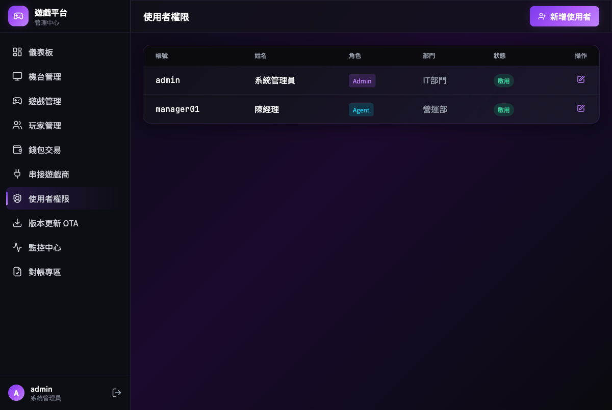

# UI 設計詳細說明文件

## 集中式後台 + 單機本地後台整合版

| 屬性         | 內容               |
| ------------ | ------------------ |
| **版本**     | v8.2               |
| **日期**     | 2026 年 2 月 25 日 |
| **適用系統** | 遊戲平台管理系統   |
| **文件類型** | UI 設計規格        |
| **版本說明** | 標準版 標準進階版   |

---

## 目錄

1. [文件概述](#1-文件概述)
2. [設計系統規格](#2-設計系統規格)
3. [集中式後台頁面規格](#3-集中式後台頁面規格)
4. [單機本地後台頁面規格](#4-單機本地後台頁面規格)
5. [介面設計文字框](#5-介面設計文字框)
6. [詳細操作流程與UseCase](#6-詳細操作流程與usecase)
7. [共用元件規範](#7-共用元件規範)
8. [路由結構](#8-路由結構)
9. [響應式設計規範](#9-響應式設計規範)
10. [附錄](#10-附錄)

---

## 1. 文件概述

本文件詳細闡述遊戲平台管理系統的 UI 設計規格，包含集中式後台與單機本地後台兩個層次的頁面設計，元件規範、路由結構、響應式設計等內容。

---

## 2. 設計系統規格

### 2.1 設計風格

採用「**Corporate Precision**」設計風格，強調清晰、秩序與專業感。純白底色搭配靛藍主色（`#4F46E5`），適合長時間操作不易疲勞。

### 2.2 色彩系統

| 語意色彩               | 色彩代碼  | 用途               |
| ---------------------- | --------- | ------------------ |
| **Primary（主色）**    | `#4F46E5` | 按鈕、標題、強調   |
| **Secondary（次色）**  | `#F3F4F6` | 背景、邊框         |
| **Success（成功）**    | `#10B981` | 成功狀態、綠色標籤 |
| **Warning（警告）**    | `#F59E0B` | 警告狀態、黃色標籤 |
| **Danger（危險）**     | `#EF4444` | 錯誤狀態、紅色標籤 |
| **Info（資訊）**       | `#3B82F6` | 資訊狀態、藍色標籤 |
| **Muted（淡化）**      | `#6B7280` | 次要文字、禁用狀態 |
| **Background（背景）** | `#FFFFFF` | 頁面背景           |

### 2.3 字體系統

- **標題字體**：DM Sans（粗體）。
- **正文字體**：Noto Sans TC（中文）。
- **資料字體**：IBM Plex Mono（等寬）。
- **標題尺寸**：32px（一級）、24px（二級）、18px（三級）。
- **正文尺寸**：16px（標準）、14px（次要）、12px（輔助）。

### 2.4 間距與圓角

- **間距系統**：4px, 8px, 12px, 16px, 24px, 32px, 48px。
- **圓角規範**：小（4px）、中（8px）、大（12px）。

---

## 3. 集中式後台頁面規格

### 3.1 頁面清單

| 頁面名稱         | 主要功能                            |
| ---------------- | ----------------------------------- |
| **登入頁面**     | 管理員帳號密碼登入                  |
| **儀表板**       | 全平台 KPI、營收趨勢圖、機台狀態圓餅圖 |
| **機台管理**     | 機台列表、狀態監控（心跳）、遠端操作 |
| **遊戲管理**     | 遊戲列表、新增/編輯/刪除、版本管理  |
| **玩家管理**     | 玩家列表、詳情檢視、狀態管理        |
| **錢包交易**     | 交易紀錄、統計分析、對帳            |
| **串接遊戲管理** | 遊戲商 API 管理、連線監控          |
| **使用者權限**   | 帳號管理、角色權限設定（三層）      |
| **多帳號管理**   | 多帳號列表、樹狀結構                |

### 3.2 視覺化 Dashboard

- 中央後台加入首頁戰情室
- 具備昨日/今日營收長條圖
- 活躍機台圓餅圖
- 熱門遊戲排行

### 3.3 Heartbeat 即時監控

- 機台狀態一覽表
- 顯示 🟢在線 / 🔴斷線 狀態
- 即時掌握設備異常

---

## 4. 單機本地後台頁面規格

### 4.1 頁面清單

| 頁面名稱         | 主要功能                            |
| ---------------- | ----------------------------------- |
| **登入頁面**     | PIN 碼登入                          |
| **儀表板**       | 本機 KPI、快速操作按鈕             |
| **機台管理**     | 機台資訊、硬體狀態                 |
| **遊戲管理**     | 遊戲列表、啟用/停用                |
| **交易管理**     | 交易紀錄、本地統計                 |
| **錢包管理**     | 中心錢包餘額、轉入/轉出            |
| **系統設定**     | 本機設定、網路設定                 |

### 4.2 中心錢包功能

- 玩家在機台端的「中心錢包」概念
- 支援第三方遊戲 API 轉入/轉出
- 點數自動扣補

---

## 5. 介面設計文字框

### 5.1 集中式後台 - 登入頁面

#### [畫面] Dashboard 戰情室

#### [畫面] 多帳號管理

#### [畫面] 遊戲商串接管理

### 5.2 單機本地後台 - 錢包轉入/轉出

---

## 6. 詳細操作流程與UseCase

### Use Case 1: 多帳號分級權限操作

**【情境說明】** 多帳號登入系統，只能看到自己名下的機台營收和狀態。

**【主要角色】** 多帳號

1. 多帳號輸入帳號密碼登入中央後台。
2. 系統根據 RBAC 權限，只顯示該多帳號相關的機台資料。
3. 多帳號可以查看自己機台的營收統計，但無法修改系統設定。
4. 多帳號可以建立下線操作員帳號。

---

### Use Case 2: 第三方遊戲轉入/轉出

**【情境說明】** 玩家在機台上玩第三方遊戲（如百家樂），需要將中心錢包點數轉入遊戲。

**【主要角色】** 玩家、機台本地伺服器、遊戲商 API

1. 玩家在遊戲大廳選擇「百家樂」。
2. 系統顯示轉入頁面，玩家輸入轉入金額。
3. 本地後台呼叫中央 API 扣減中心錢包餘額。
4. 中央 API 調用遊戲商 API 建立遊戲帳戶並轉入點數。
5. 遊戲商回傳成功訊息，本地顯示遊戲畫面。
6. 遊戲結束後，點數自動轉回中心錢包。

---

## 7. 共用元件規範

### 7.1 按鈕元件

| 類型 | 样式 | 使用場景 |
|------|------|----------|
| Primary | 靛藍色背景，白色文字 | 主要動作（提交、儲存） |
| Secondary | 灰色背景 | 次要動作（取消、返回） |
| Danger | 紅色背景 | 危險動作（刪除、停權） |
| Ghost | 透明背景，邊框 | 輔助動作 |

### 7.2 圖表元件

- 營收趨勢圖（長條圖）
- 機台狀態圓餅圖
- 熱門遊戲排行（橫條圖）

---

## 8. 路由結構

### 8.1 集中式後台路由

| 路徑 | 頁面 | 權限 |
|------|------|------|
| `/login` | 登入頁 | 公開 |
| `/dashboard` | 儀表板（含圖表） | Admin/Agent/Operator |
| `/machines` | 機台管理 | Admin/Agent/Operator |
| `/games` | 遊戲管理 | Admin |
| `/players` | 玩家管理 | Admin/Agent/Operator |
| `/transactions` | 交易紀錄 | Admin/Agent/Operator |
| `/providers` | 串接遊戲管理 | Admin |
| `/agents` | 多帳號管理 | Admin |
| `/users` | 使用者權限 | Admin |

### 8.2 單機本地後台路由

| 路徑 | 頁面 | 權限 |
|------|------|------|
| `/login` | PIN 登入 | 公開 |
| `/dashboard` | 儀表板 | Operator |
| `/machine` | 機台管理 | Operator |
| `/games` | 遊戲管理 | Operator |
| `/wallet` | 錢包管理 | Operator |
| `/transactions` | 交易管理 | Operator |
| `/settings` | 系統設定 | Engineer |

---

## 9. 響應式設計規範

### 9.1 斷點設計

| 斷點 | 寬度 | 布局 |
|------|------|------|
| Mobile | < 640px | 單欄，漢堡選單 |
| Tablet | 640-1024px | 雙欄，折疊側邊欄 |
| Desktop | > 1024px | 完整側邊欄導航 |

### 9.2 觸控優化

- 點擊區域最小 44x44px
- 支援滑動操作
- 大型按鈕適合平板操作

---

## 10. 附錄

### 10.1 術語表

| 術語 | 定義 |
|------|------|
| RBAC | 基於角色的存取控制 |
| Agent | 多帳號 |
| PIN | 個人識別碼 |
| Wallet | 中心錢包 |
| Deposit | 轉入（遊戲） |
| Withdraw | 轉出（遊戲） |
| Heartbeat | 心跳監控 |

### 10.2 版本歷史

| 版本 | 日期 | 變更說明 |
|------|------|----------|
| v8.2 | 2026-02-25 | 整合 UI設計 + 文字框 + UseCase，三層權限 |
