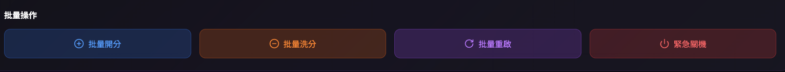
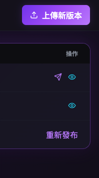

# **Central**

儀表板- 下方「操作」按下後沒有畫面

機台管理-> 1. 「操作」 眼睛按下去跑到遠端遙控頁面 2. 新增機台的方式是怎麼運作的（local and central）

機台管理->遠端遙控 遠端遙控的操作方式跟批量操作尚未定義

遊戲管理->遊戲列表 連結錯誤

遊戲管理->遊戲測試 「新增測試」按下後沒有畫面

交易紀錄管理->交易列表 1. 按下去是代理商管理 2.「新增代理商」按下後沒有畫面

交易紀錄管理->對帳中心 「產生沖銷記錄並結案」按下後沒有畫面

報表中心->營收報表 匯出報表會長怎樣

報表中心->統計報表 按下後沒有畫面

報表中心->遊戲排行榜  按下去左邊的menu會消失

串接遊戲->API日誌 「匯出日誌」會長怎樣

使用者權限->角色管理 「新增角色」按下後沒有畫面

版本更新->版本管理 後續動作如何

介面設定->公告管理 「新增公告」按下後沒有畫面

介面設定->發送廣播 有兩個發送廣播

介面設定->遊戲分類 連結錯誤

監控中心->告警管理 1. 按下去左邊的menu會消失 2. 裡面文字是告警通知

監控中心->告警管理 「通知設定」按下後沒有畫面

同步對帳->同步狀態 連結錯誤 跑出遊戲管理

同步對帳->衝突處理 「自動解決規則」按下後沒有畫面
