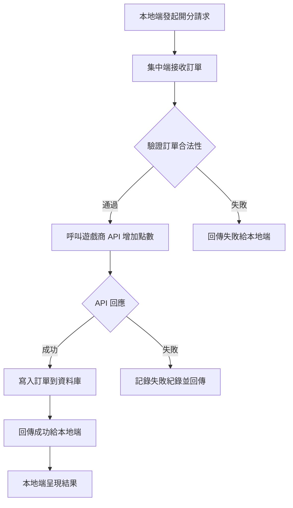

# [C11] 開分洗分

**功能代碼**: C11  
**所屬模組**: [CM02]機台管理  
**最後更新**: 2026-03-08  

---

## 功能概述

開分洗分是機台管理的核心功能之一，支援現場現金交易處理。集中端接收本地端傳來的開洗分訂單，與遊戲 API 互動完成點數增減，並記錄交易紀錄。

### 功能特性
- **開分**：從遊戲 API 為玩家帳戶增加點數
- **洗分**：從玩家帳戶扣除點數，兌換現金
- **API 整合**：與遊戲商 API 互動完成點數交易
- **訂單管理**：開洗分訂單統一儲存與查詢
- **審計紀錄**：所有交易皆完整紀錄

---

## 流程圖

---

## API 對應

| 操作 | Method | Endpoint | 說明 |
|------|--------|----------|------|
| 開分 | POST | `/api/v1/machines/{instanceId}/credit/add` | 增加機台點數 |
| 洗分 | POST | `/api/v1/machines/{instanceId}/credit/deduct` | 扣除機台點數 |
| 查詢餘額 | GET | `/api/v1/machines/{instanceId}/credit/balance` | 取得機台目前點數 |
| 查詢訂單 | GET | `/api/v1/orders` | 查詢開洗分訂單列表 |
| 訂單詳情 | GET | `/api/v1/orders/{orderId}` | 查詢單筆訂單詳情 |

---

## 資料表

### orders 訂單表
| 欄位 | 類型 | 說明 |
|------|------|------|
| order_id | UUID | 訂單唯一識別碼 |
| machine_id | UUID | 機台 ID |
| game_id | UUID | 遊戲 ID |
| order_type | ENUM | 'add' 開分, 'deduct' 洗分 |
| amount | DECIMAL | 金額 |
| status | ENUM | 'pending', 'success', 'failed' |
| created_at | TIMESTAMP | 創建時間 |
| completed_at | TIMESTAMP | 完成時間 |
| error_message | VARCHAR | 錯誤訊息 |

---

## 重要提醒

1. **本地端先行**：開洗分由本地端發起，集中端只處理訂單
2. **API 串接**：集中端需與遊戲商 API 整合
3. **訂單紀錄**：所有交易皆需儲存訂單
4. **失敗處理**：API 调用失敗需記錄並回傳給本地端
