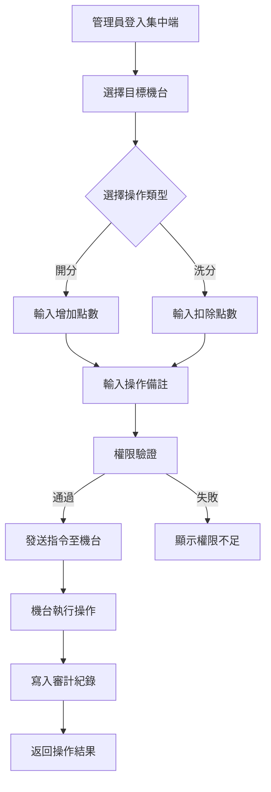

# [C11] 開分洗分

**功能代碼**: C11  
**所屬模組**: [M02]機台管理  
**最後更新**: 2026-03-07  

---

## 功能概述

開分洗分是機台管理的核心功能之一，允許管理員透過集中式後台遠端為機台增加（開分）或減少（洗分）玩家點數。此功能需配合嚴格的操作紀錄審計，確保所有交易都有完整軌跡可追蹤。

### 功能特性
- **開分**：為玩家帳戶增加點數，用於儲值或贈點
- **洗分**：從玩家帳戶扣除點數，用於退分或兌換
- **操作審計**：所有操作皆有完整紀錄，包含操作人員、時間、金額等
- **權限控管**：需具備特定權限方可執行

---

## 流程圖

---

## API 對應

| 操作 | Method | Endpoint | 說明 |
|------|--------|----------|------|
| 開分 | POST | `/api/v1/machines/{instanceId}/credit/add` | 增加機台點數 |
| 洗分 | POST | `/api/v1/machines/{instanceId}/credit/deduct` | 扣除機台點數 |
| 查詢餘額 | GET | `/api/v1/machines/{instanceId}/credit/balance` | 取得機台目前點數 |
| 操作紀錄 | GET | `/api/v1/machines/{instanceId}/credit/logs` | 查詢開洗分紀錄 |

---

## 資料表

### `credit_transactions` - 點數交易紀錄表

| 欄位名稱 | 資料型態 | 說明 |
|----------|----------|------|
| `id` | BIGINT | 交易流水號（PK）|
| `instance_id` | VARCHAR(64) | 機台唯一識別碼 |
| `transaction_type` | ENUM | 交易類型（CREDIT/DEBIT）|
| `amount` | DECIMAL(18,2) | 交易金額 |
| `balance_before` | DECIMAL(18,2) | 交易前餘額 |
| `balance_after` | DECIMAL(18,2) | 交易後餘額 |
| `operator_id` | VARCHAR(64) | 操作人員 ID |
| `remark` | TEXT | 操作備註 |
| `created_at` | TIMESTAMP | 交易時間 |

### `machines` - 機台主表（相關欄位）

| 欄位名稱 | 資料型態 | 說明 |
|----------|----------|------|
| `instance_id` | VARCHAR(64) | 機台唯一識別碼（PK）|
| `current_credit` | DECIMAL(18,2) | 目前點數餘額 |

---

## 欄位說明

### `transaction_type` 交易類型
- `CREDIT`：開分，增加點數
- `DEBIT`：洗分，扣除點數

### `amount` 交易金額
- 正整數，表示交易的點數數量
- 開分時為正數，洗分時為正數（系統自動處理正負）

### `operator_id` 操作人員 ID
- 執行操作的管理員帳號
- 用於審計追蹤

---

## 注意事項

1. **權限要求**：執行開洗分需具備 `MACHINE_CREDIT_MANAGE` 權限
2. **金額限制**：單次交易金額有上下限設定，依系統配置而定
3. **餘額檢查**：洗分時會檢查餘額是否足夠
4. **審計軌跡**：所有操作紀錄不可刪除，僅供查詢

---

*文件更新時間：2026-03-07*