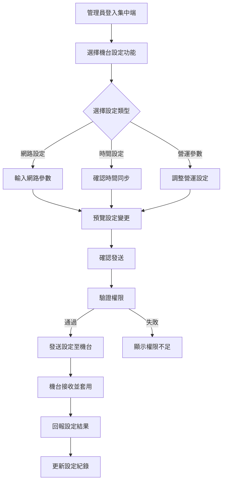

# [C14] 機台設定

**功能代碼**: C14  
**所屬模組**: [M02]機台管理  
**最後更新**: 2026-03-07  

---

## 功能概述

機台設定功能允許管理員透過集中式後台，對遠端機台的網路參數、系統時間、營運參數等進行基礎覆寫設定。此功能確保所有機台可統一管理，降低現場維護成本。

### 功能特性
- **網路參數設定**：設定機台的 IP、Gateway、DNS 等網路配置
- **系統時間同步**：強制同步機台系統時間，確保交易時間正確
- **營運參數調整**：調整機台的營運相關設定，如最大投注額等
- **批量設定**：支援對多台機台同時進行相同設定

---

## 流程圖

---

## API 對應 (依據 Config Sync Protocol 1.0.0)

| 操作 | Method | Endpoint | 說明 |
|------|--------|----------|------|
| 取得設定 | GET | `/api/v1/machines/{id}/config` | 取得機台目前設定 ([L05]) |
| 更新設定 | PUT | `/api/v1/machines/{id}/config` | 更新機台配置 ([C101]) |
| 取得同步狀態 | GET | `/api/v1/machines/{id}/config/status` | 取得同步狀態 ([L34]) |
| 批量設定 | POST | `/api/v1/machines/settings/batch` | 批量更新多台機台設定 |

---

## 資料表

### `machine_settings` - 機台設定表

| 欄位名稱 | 資料型態 | 說明 |
|----------|----------|------|
| `id` | BIGINT | 設定 ID（PK）|
| `instance_id` | VARCHAR(64) | 機台唯一識別碼 |
| `setting_type` | ENUM | 設定類型（NETWORK/TIME/OPERATION）|
| `setting_key` | VARCHAR(128) | 設定鍵值 |
| `setting_value` | TEXT | 設定值 |
| `updated_by` | VARCHAR(64) | 更新人員 ID |
| `updated_at` | TIMESTAMP | 更新時間 |

### `machine_network_config` - 網路配置表

| 欄位名稱 | 資料型態 | 說明 |
|----------|----------|------|
| `id` | BIGINT | 配置 ID（PK）|
| `instance_id` | VARCHAR(64) | 機台唯一識別碼 |
| `ip_address` | VARCHAR(45) | IP 位址 |
| `subnet_mask` | VARCHAR(45) | 子網路遮罩 |
| `gateway` | VARCHAR(45) | 預設閘道 |
| `dns_primary` | VARCHAR(45) | 主要 DNS |
| `dns_secondary` | VARCHAR(45) | 次要 DNS |

---

## 欄位說明

### `setting_type` 設定類型
- `NETWORK`：網路相關設定
- `TIME`：時間同步設定
- `OPERATION`：營運參數設定

### `setting_key` 設定鍵值
常用設定鍵值範例：
- `max_bet_amount`：最大投注額
- `session_timeout`：連線逾時時間
- `idle_timeout`：閒置逾時時間

### `setting_value` 設定值
- 以 JSON 格式或純文字儲存
- 依 `setting_key` 不同有對應格式規範

---

## 注意事項

1. **權限要求**：執行機台設定需具備 `MACHINE_CONFIG_MANAGE` 權限
2. **設定生效**：部分設定需機台重新啟動方能生效
3. **設定備份**：更新前系統會自動備份原設定
4. **網路中斷風險**：修改網路設定可能導致暫時連線中斷

---

*文件更新時間：2026-03-07*