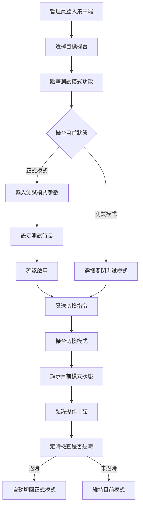

# [C15] 測試模式

**功能代碼**: C15  
**所屬模組**: [M02]機台管理  
**最後更新**: 2026-03-07  

---

## 功能概述

測試模式功能允許管理員將機台切換至測試環境，進行不扣除實際餘額的測試遊玩。此功能主要用於機台維護、遊戲驗證、新人員培訓等場景，確保在測試過程中不會影響真實帳務。

### 功能特性
- **虛擬點數**：測試模式下使用虛擬點數，不影響真實餘額
- **狀態識別**：機台會清楚顯示目前處於測試模式
- **操作紀錄**：測試模式的操作會獨立記錄，與正式交易分開
- **時間限制**：可設定測試模式的最長啟用時間
- **自動還原**：逾時自動切回正式模式

---

## 流程圖

---

## API 對應

| 操作 | Method | Endpoint | 說明 |
|------|--------|----------|------|
| 啟用測試模式 | POST | `/api/v1/machines/{instanceId}/test-mode/enable` | 切換機台至測試模式 |
| 關閉測試模式 | POST | `/api/v1/machines/{instanceId}/test-mode/disable` | 切回正式模式 |
| 查詢模式狀態 | GET | `/api/v1/machines/{instanceId}/test-mode/status` | 取得目前模式狀態 |
| 設定測試點數 | POST | `/api/v1/machines/{instanceId}/test-mode/credit` | 設定測試用虛擬點數 |
| 測試紀錄查詢 | GET | `/api/v1/machines/{instanceId}/test-mode/logs` | 查詢測試模式操作紀錄 |

---

## 資料表

### `machine_test_mode` - 測試模式狀態表

| 欄位名稱 | 資料型態 | 說明 |
|----------|----------|------|
| `id` | BIGINT | 記錄 ID（PK）|
| `instance_id` | VARCHAR(64) | 機台唯一識別碼 |
| `is_test_mode` | BOOLEAN | 是否處於測試模式 |
| `test_credit` | DECIMAL(18,2) | 測試用虛擬點數 |
| `started_at` | TIMESTAMP | 測試模式啟用時間 |
| `expires_at` | TIMESTAMP | 測試模式到期時間 |
| `activated_by` | VARCHAR(64) | 啟用人員 ID |

### `machine_test_transactions` - 測試交易紀錄表

| 欄位名稱 | 資料型態 | 說明 |
|----------|----------|------|
| `id` | BIGINT | 交易流水號（PK）|
| `instance_id` | VARCHAR(64) | 機台唯一識別碼 |
| `game_id` | VARCHAR(64) | 遊戲 ID |
| `bet_amount` | DECIMAL(18,2) | 投注金額 |
| `win_amount` | DECIMAL(18,2) | 派彩金額 |
| `balance_before` | DECIMAL(18,2) | 交易前餘額 |
| `balance_after` | DECIMAL(18,2) | 交易後餘額 |
| `created_at` | TIMESTAMP | 交易時間 |

---

## 欄位說明

### `is_test_mode` 測試模式狀態
- `true`：機台目前處於測試模式
- `false`：機台目前處於正式營運模式

### `test_credit` 測試用虛擬點數
- 測試模式下使用的虛擬點數餘額
- 與真實餘額完全獨立

### `expires_at` 測試模式到期時間
- 設定測試模式的最長啟用時間
- 逾時後系統自動切回正式模式

---

## 注意事項

1. **權限要求**：啟用測試模式需具備 `MACHINE_TEST_MODE` 權限
2. **狀態顯示**：測試模式下機台畫面會顯示「測試模式」標識
3. **交易隔離**：測試交易不會計入正式帳務報表
4. **時間限制**：預設最長 8 小時，可依需求調整
5. **自動還原**：逾時或異常斷線會自動切回正式模式

---

*文件更新時間：2026-03-07*