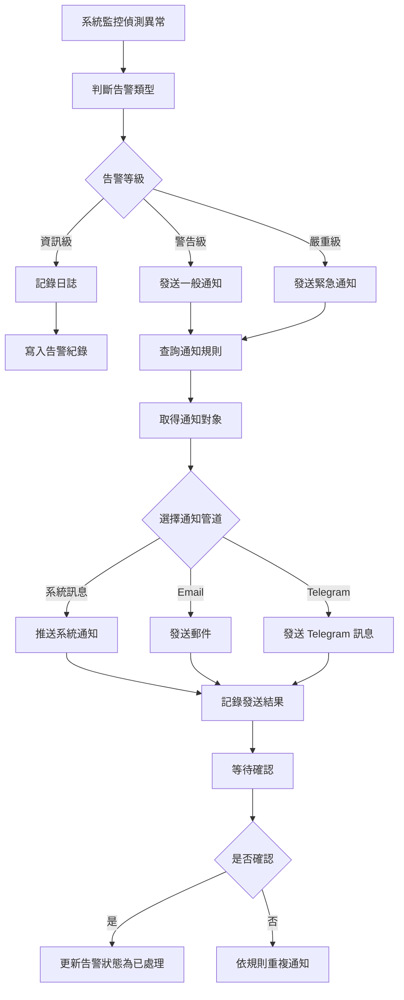

# [C82] 告警通知

**功能代碼**: C82  
**所屬模組**: [M10]監控中心  
**最後更新**: 2026-03-07  

---

## 功能概述

告警通知功能提供多通道的即時告警推送機制，當系統偵測到異常狀況（如機台離線、交易異常、硬體故障等）時，可透過多種通知管道第一時間通知相關人員，確保問題能被快速發現與處理。

### 功能特性
- **多通道通知**：支援系統訊息、Email、Telegram 等多種通知管道
- **告警分級**：依嚴重程度分為資訊、警告、嚴重等級
- **自訂規則**：可依需求設定告警觸發條件與通知對象
- **通知群組**：可建立通知群組，批次管理通知對象
- **告警確認**：支援告警確認機制，追蹤處理狀態

---

## 流程圖



---

## API 對應

| 操作 | Method | Endpoint | 說明 |
|------|--------|----------|------|
| 告警列表 | GET | `/api/v1/alerts` | 取得告警列表 |
| 告警詳情 | GET | `/api/v1/alerts/{alertId}` | 取得特定告警詳情 |
| 確認告警 | POST | `/api/v1/alerts/{alertId}/acknowledge` | 確認告警已處理 |
| 通知規則列表 | GET | `/api/v1/alerts/rules` | 取得通知規則列表 |
| 建立通知規則 | POST | `/api/v1/alerts/rules` | 建立新的通知規則 |
| 更新通知規則 | PUT | `/api/v1/alerts/rules/{ruleId}` | 更新通知規則 |
| 通知群組列表 | GET | `/api/v1/alerts/groups` | 取得通知群組列表 |
| 建立通知群組 | POST | `/api/v1/alerts/groups` | 建立通知群組 |
| 測試通知 | POST | `/api/v1/alerts/test` | 發送測試通知 |

---

## 資料表

### `alerts` - 告警紀錄表

| 欄位名稱 | 資料型態 | 說明 |
|----------|----------|------|
| `id` | BIGINT | 告警 ID（PK）|
| `alert_type` | VARCHAR(64) | 告警類型 |
| `severity` | ENUM | 嚴重等級（INFO/WARNING/CRITICAL）|
| `title` | VARCHAR(256) | 告警標題 |
| `message` | TEXT | 告警訊息內容 |
| `source` | VARCHAR(128) | 告警來源（機台 ID/服務名稱）|
| `status` | ENUM | 狀態（NEW/ACKNOWLEDGED/RESOLVED）|
| `acknowledged_by` | VARCHAR(64) | 確認人員 ID |
| `acknowledged_at` | TIMESTAMP | 確認時間 |
| `created_at` | TIMESTAMP | 建立時間 |

### `alert_rules` - 通知規則表

| 欄位名稱 | 資料型態 | 說明 |
|----------|----------|------|
| `id` | BIGINT | 規則 ID（PK）|
| `name` | VARCHAR(128) | 規則名稱 |
| `alert_type` | VARCHAR(64) | 適用的告警類型 |
| `severity_filter` | VARCHAR(64) | 嚴重等級過濾條件 |
| `channels` | JSON | 通知管道設定 |
| `group_id` | BIGINT | 通知群組 ID |
| `is_enabled` | BOOLEAN | 是否啟用 |

### `alert_notification_groups` - 通知群組表

| 欄位名稱 | 資料型態 | 說明 |
|----------|----------|------|
| `id` | BIGINT | 群組 ID（PK）|
| `name` | VARCHAR(128) | 群組名稱 |
| `members` | JSON | 群組成員（含聯絡資訊）|
| `created_at` | TIMESTAMP | 建立時間 |

---

## 欄位說明

### `severity` 嚴重等級
- `INFO`：資訊級，一般通知，無需立即處理
- `WARNING`：警告級，需要注意，建議儘快處理
- `CRITICAL`：嚴重級，緊急問題，需立即處理

### `status` 告警狀態
- `NEW`：新建告警，尚未處理
- `ACKNOWLEDGED`：已確認，處理中
- `RESOLVED`：已解決

### `channels` 通知管道設定
JSON 格式範例：
```json
{
  "system": true,
  "email": ["admin@example.com"],
  "telegram": ["@alert_group_1"]
}
```

### `alert_type` 常見告警類型
- `MACHINE_OFFLINE`：機台離線
- `MACHINE_HARDWARE_ERROR`：硬體故障
- `TRANSACTION_ANOMALY`：交易異常
- `SYSTEM_ERROR`：系統錯誤
- `SECURITY_ALERT`：安全告警

---

## 通知管道說明

### 系統訊息
- 在集中式後台顯示通知
- 適合一般操作人員查看

### Email
- 發送郵件至指定信箱
- 適合需要詳細紀錄的告警

### Telegram
- 透過 Telegram Bot 發送即時訊息
- 適合緊急告警，確保即時送達

---

## 注意事項

1. **權限要求**：管理告警規則需具備 `ALERT_MANAGE` 權限
2. **通知頻率**：避免通知疲勞，可設定通知頻率限制
3. **確認機制**：嚴重告警需人員確認後才會關閉
4. **備援機制**：主要管道失敗時會嘗試備援管道

---

*文件更新時間：2026-03-07*