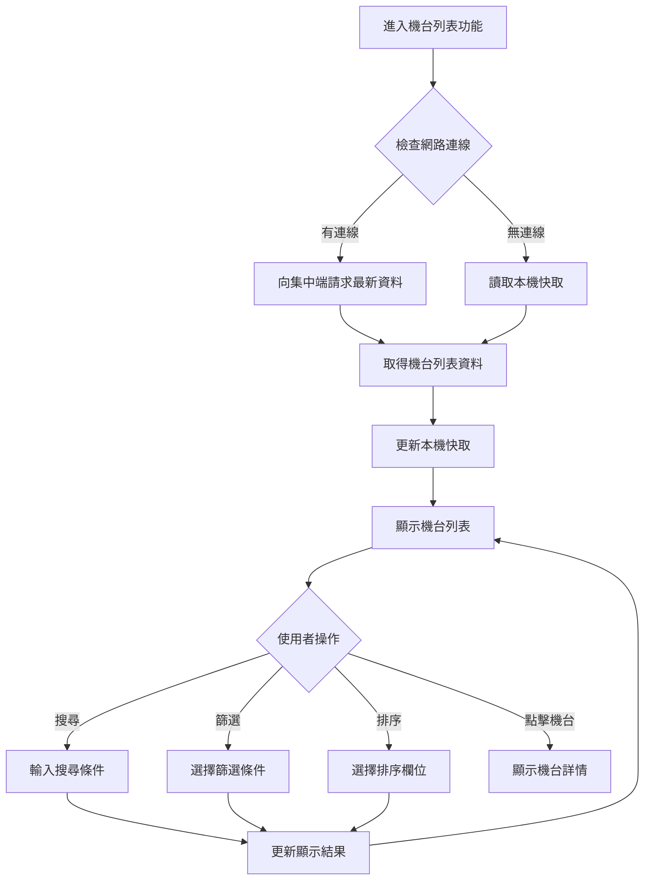

# [L05] 機台列表檢視

**功能代碼**: L05  
**所屬模組**: [M02]機台管理  
**最後更新**: 2026-03-07  

---

## 功能概述

機台列表檢視功能提供本機端的機台資訊瀏覽介面，顯示所有已註冊機台的基本資訊。此功能支援本機快取機制，確保即使網路中斷時，仍可離線檢視機台資訊，維持現場營運需求。

### 功能特性
- **機台清單**：顯示所有機台的基本資訊列表
- **本機快取**：資料快取至本機，支援離線檢視
- **搜尋篩選**：依機台名稱、狀態等條件進行篩選
- **排序功能**：依不同欄位進行排序
- **狀態識別**：以圖示顯示機台目前狀態

---

## 流程圖

---

## API 對應

| 操作 | Method | Endpoint | 說明 |
|------|--------|----------|------|
| 機台列表 | GET | `/api/v1/machines` | 取得所有機台列表 |
| 機台詳情 | GET | `/api/v1/machines/{instanceId}` | 取得特定機台詳細資訊 |
| 搜尋機台 | GET | `/api/v1/machines/search` | 依條件搜尋機台 |
| 同步快取 | POST | `/api/v1/machines/sync-cache` | 強制同步本機快取 |

---

## 資料表

### `machines` - 機台主表（本地快取）

| 欄位名稱 | 資料型態 | 說明 |
|----------|----------|------|
| `instance_id` | VARCHAR(64) | 機台唯一識別碼（PK）|
| `name` | VARCHAR(128) | 機台名稱 |
| `mac_address` | VARCHAR(17) | MAC 位址 |
| `model` | VARCHAR(64) | 硬體型號 |
| `software_version` | VARCHAR(32) | 軟體版本 |
| `status` | ENUM | 機台狀態 |
| `store_id` | VARCHAR(64) | 所屬門市 ID |
| `last_sync_at` | TIMESTAMP | 最後同步時間 |
| `cached_at` | TIMESTAMP | 快取時間 |

### `machine_cache_meta` - 快取元資料表

| 欄位名稱 | 資料型態 | 說明 |
|----------|----------|------|
| `id` | BIGINT | 記錄 ID（PK）|
| `cache_type` | VARCHAR(64) | 快取類型 |
| `last_update` | TIMESTAMP | 最後更新時間 |
| `record_count` | INT | 記錄數量 |

---

## 欄位說明

### `status` 機台狀態
- `ONLINE`：線上，正常運作中
- `OFFLINE`：離線，無法連線
- `MAINTENANCE`：維護中
- `ERROR`：異常，需檢修

### `model` 硬體型號
常見型號：
- `STANDARD`：標準版機台
- `PREMIUM`：旗艦版機台
- `LITE`：精簡版機台

### `cached_at` 快取時間
- 記錄本機快取的時間戳記
- 用於判斷快取是否需要更新

---

## 列表顯示欄位

| 欄位 | 說明 | 排序支援 |
|------|------|----------|
| 機台名稱 | 顯示機台識別名稱 | ✓ |
| 狀態 | 圖示 + 文字顯示目前狀態 | ✓ |
| 版本 | 目前軟體版本 | ✓ |
| 最後上線 | 最後一次連線時間 | ✓ |
| 門市 | 所屬門市名稱 | ✓ |

---

## 注意事項

1. **快取更新**：預設每 5 分鐘自動更新快取
2. **離線模式**：離線時顯示快取資料，並標示「離線模式」
3. **資料一致性**：重新連線後會自動同步最新資料
4. **效能考量**：大量機台時建議使用篩選功能

---

*文件更新時間：2026-03-07*