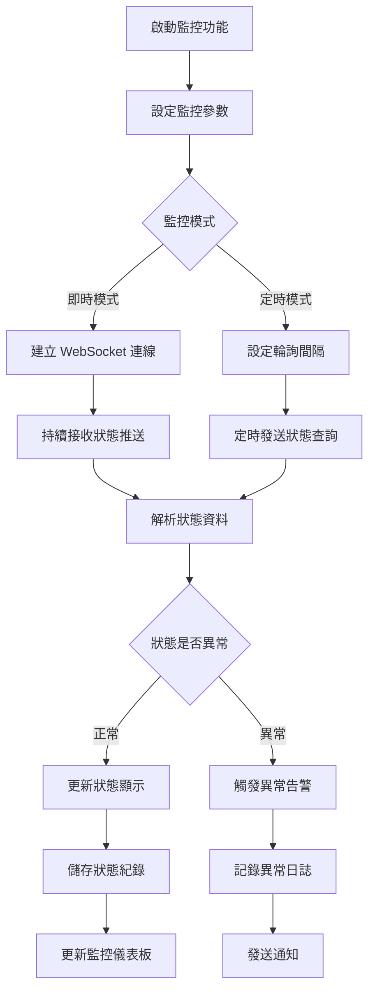

# [L06] 機台狀態監控

**功能代碼**: L06  
**所屬模組**: [M02]機台管理  
**最後更新**: 2026-03-07  

---

## 功能概述

機台狀態監控功能提供即時或定時的機台狀態回報機制，監控機台的連線狀況與硬體健康狀態。此功能讓現場人員能即時掌握機台運作情形，快速發現並處理異常狀況。

### 功能特性
- **即時監控**：即時顯示機台連線狀態
- **定時回報**：依設定間隔定期回報狀態
- **硬體監控**：監控 CPU、記憶體、磁碟等硬體資源
- **異常告警**：狀態異常時發出警示
- **歷史紀錄**：保存狀態變化歷史供查詢

---

## 流程圖

---

## API 對應

| 操作 | Method | Endpoint | 說明 |
|------|--------|----------|------|
| 取得狀態 | GET | `/api/v1/machines/{instanceId}/status` | 取得機台目前狀態 |
| 狀態歷史 | GET | `/api/v1/machines/{instanceId}/status/history` | 取得狀態歷史紀錄 |
| 硬體資訊 | GET | `/api/v1/machines/{instanceId}/hardware` | 取得硬體資源狀態 |
| WebSocket 狀態串流 | WS | `/ws/machines/{instanceId}/status` | 即時狀態推送 |
| 批量狀態 | GET | `/api/v1/machines/status/batch` | 取得多台機台狀態 |

---

## 資料表

### `machine_status` - 機台狀態表

| 欄位名稱 | 資料型態 | 說明 |
|----------|----------|------|
| `id` | BIGINT | 記錄 ID（PK）|
| `instance_id` | VARCHAR(64) | 機台唯一識別碼 |
| `connection_status` | ENUM | 連線狀態 |
| `operation_status` | ENUM | 營運狀態 |
| `last_heartbeat` | TIMESTAMP | 最後心跳時間 |
| `uptime_seconds` | BIGINT | 累計運作時間（秒）|
| `updated_at` | TIMESTAMP | 更新時間 |

### `machine_hardware_status` - 硬體狀態表

| 欄位名稱 | 資料型態 | 說明 |
|----------|----------|------|
| `id` | BIGINT | 記錄 ID（PK）|
| `instance_id` | VARCHAR(64) | 機台唯一識別碼 |
| `cpu_usage` | DECIMAL(5,2) | CPU 使用率（%）|
| `memory_usage` | DECIMAL(5,2) | 記憶體使用率（%）|
| `disk_usage` | DECIMAL(5,2) | 磁碟使用率（%）|
| `temperature` | DECIMAL(5,2) | 機台溫度（°C）|
| `network_latency_ms` | INT | 網路延遲（毫秒）|
| `recorded_at` | TIMESTAMP | 記錄時間 |

### `machine_status_history` - 狀態歷史表

| 欄位名稱 | 資料型態 | 說明 |
|----------|----------|------|
| `id` | BIGINT | 記錄 ID（PK）|
| `instance_id` | VARCHAR(64) | 機台唯一識別碼 |
| `status_type` | VARCHAR(32) | 狀態類型 |
| `old_value` | VARCHAR(64) | 變更前值 |
| `new_value` | VARCHAR(64) | 變更後值 |
| `changed_at` | TIMESTAMP | 變更時間 |

---

## 欄位說明

### `connection_status` 連線狀態
- `CONNECTED`：已連線
- `DISCONNECTED`：已斷線
- `UNSTABLE`：連線不穩定
- `UNKNOWN`：無法取得狀態

### `operation_status` 營運狀態
- `IDLE`：閒置中
- `IN_GAME`：遊戲中
- `MAINTENANCE`：維護中
- `ERROR`：異常

### `cpu_usage` / `memory_usage` / `disk_usage`
- 數值範圍：0.00 ~ 100.00
- 超過閾值時觸發告警

---

## 監控儀表板顯示

| 項目 | 說明 | 警示閾值 |
|------|------|----------|
| 連線狀態 | 綠/紅/黃燈號顯示 | 斷線即告警 |
| CPU 使用率 | 百分比顯示 | > 80% 警告 |
| 記憶體使用率 | 百分比顯示 | > 85% 警告 |
| 磁碟使用率 | 百分比顯示 | > 90% 嚴重 |
| 網路延遲 | 毫秒顯示 | > 500ms 警告 |
| 機台溫度 | 攝氏顯示 | > 60°C 警告 |

---

## 注意事項

1. **心跳間隔**：預設每 30 秒發送一次心跳
2. **逾時判定**：超過 90 秒未收到心跳視為斷線
3. **歷史保留**：狀態歷史預設保留 30 天
4. **資源監控**：硬體資源每分鐘記錄一次

---

*文件更新時間：2026-03-07*