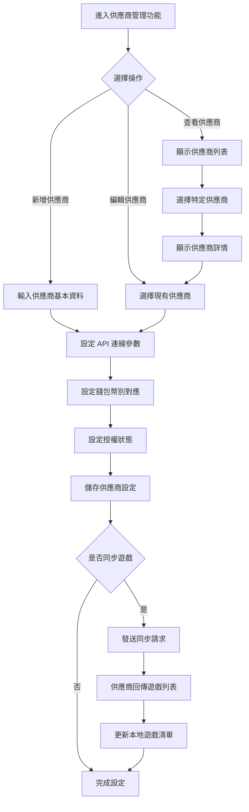

# [L29] 遊戲供應商管理

**功能代碼**: L29  
**所屬模組**: [M03]遊戲管理  
**最後更新**: 2026-03-07  

---

## 功能概述

遊戲供應商管理功能用於設定與管理各家遊戲供應商的基礎資料、錢包幣別設定及授權狀態。透過此功能，系統可整合多家遊戲供應商，並統一管理其連線設定與營運參數。

### 功能特性
- **供應商註冊**：新增遊戲供應商的基本資料
- **連線設定**：設定供應商 API 端點與認證資訊
- **幣別對應**：設定供應商支援的錢包幣別
- **授權管理**：控制供應商的啟用/停用狀態
- **遊戲清單同步**：從供應商同步可用的遊戲列表

---

## 流程圖



---

## API 對應

| 操作 | Method | Endpoint | 說明 |
|------|--------|----------|------|
| 供應商列表 | GET | `/api/v1/providers` | 取得所有供應商列表 |
| 供應商詳情 | GET | `/api/v1/providers/{providerId}` | 取得特定供應商資訊 |
| 新增供應商 | POST | `/api/v1/providers` | 新增遊戲供應商 |
| 更新供應商 | PUT | `/api/v1/providers/{providerId}` | 更新供應商設定 |
| 刪除供應商 | DELETE | `/api/v1/providers/{providerId}` | 刪除供應商 |
| 切換狀態 | POST | `/api/v1/providers/{providerId}/toggle` | 啟用/停用供應商 |
| 同步遊戲 | POST | `/api/v1/providers/{providerId}/sync-games` | 同步供應商遊戲列表 |
| 測試連線 | POST | `/api/v1/providers/{providerId}/test-connection` | 測試供應商連線 |

---

## 資料表

### `game_providers` - 遊戲供應商主表

| 欄位名稱 | 資料型態 | 說明 |
|----------|----------|------|
| `id` | BIGINT | 供應商 ID（PK）|
| `code` | VARCHAR(32) | 供應商代碼（唯一）|
| `name` | VARCHAR(128) | 供應商名稱 |
| `description` | TEXT | 供應商描述 |
| `api_endpoint` | VARCHAR(256) | API 端點 URL |
| `api_key` | VARCHAR(256) | API 金鑰（加密儲存）|
| `api_secret` | VARCHAR(256) | API 密鑰（加密儲存）|
| `status` | ENUM | 供應商狀態 |
| `sync_enabled` | BOOLEAN | 是否啟用遊戲同步 |
| `last_sync_at` | TIMESTAMP | 最後同步時間 |
| `created_at` | TIMESTAMP | 建立時間 |
| `updated_at` | TIMESTAMP | 更新時間 |

### `provider_currencies` - 供應商幣別設定表

| 欄位名稱 | 資料型態 | 說明 |
|----------|----------|------|
| `id` | BIGINT | 記錄 ID（PK）|
| `provider_id` | BIGINT | 供應商 ID（FK）|
| `currency_code` | VARCHAR(8) | 幣別代碼 |
| `provider_currency` | VARCHAR(8) | 供應商對應幣別 |
| `exchange_rate` | DECIMAL(18,6) | 匯率 |
| `is_enabled` | BOOLEAN | 是否啟用 |

### `provider_games` - 供應商遊戲表

| 欄位名稱 | 資料型態 | 說明 |
|----------|----------|------|
| `id` | BIGINT | 記錄 ID（PK）|
| `provider_id` | BIGINT | 供應商 ID（FK）|
| `game_code` | VARCHAR(64) | 遊戲代碼 |
| `game_name` | VARCHAR(128) | 遊戲名稱 |
| `game_type` | ENUM | 遊戲類型 |
| `is_enabled` | BOOLEAN | 是否啟用 |
| `synced_at` | TIMESTAMP | 同步時間 |

---

## 欄位說明

### `status` 供應商狀態
- `ACTIVE`：啟用中，可正常使用
- `INACTIVE`：停用，暫停所有服務
- `MAINTENANCE`：維護中
- `SUSPENDED`：暫停，授權問題

### `game_type` 遊戲類型
- `SLOT`：電子老虎機
- `TABLE`：桌遊
- `LIVE`：真人遊戲
- `LOTTERY`：彩票
- `CARD`：卡牌遊戲

### `code` 供應商代碼
- 唯一識別碼，用於 API 呼叫時識別供應商
- 格式：大寫英文字母 + 數字，如 `PGSOFT`, `EVO`

### `provider_currency` 供應商對應幣別
- 供應商系統使用的幣別代碼
- 可能與本系統幣別不同，需透過匯率轉換

---

## 供應商設定檔範例

```json
{
  "code": "PGSOFT",
  "name": "PG Soft",
  "api_endpoint": "https://api.pgsoft.com/v1",
  "status": "ACTIVE",
  "currencies": [
    {
      "currency_code": "TWD",
      "provider_currency": "TWD",
      "exchange_rate": 1.0
    }
  ],
  "sync_enabled": true
}
```

---

## 注意事項

1. **權限要求**：管理供應商需具備 `PROVIDER_MANAGE` 權限
2. **API 金鑰安全**：API 金鑰與密鑰需加密儲存
3. **連線測試**：新增或更新供應商後建議執行連線測試
4. **遊戲同步**：同步前確認供應商 API 可正常連線
5. **幣別設定**：新增供應商時需至少設定一種支援幣別

---

*文件更新時間：2026-03-07*