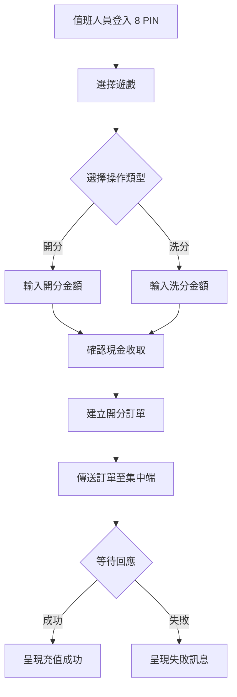

# [L45] 遊戲開分/洗分

**功能代碼**: L45  
**所屬模組**: [LM04]交易紀錄管理  
**最後更新**: 2026-03-09  

---

## 功能概述

本地端的開洗分功能為現場現金交易處理。值班人員收取客戶現金後，透過本系統為客戶開分（充值點數）。系統將訂單傳送至集中端處理。

### 功能特性
- **現金交易**：現場收取現金後操作
- **8 PIN 驗證**：值班人員需輸入 8 位元 PIN 登入驗證
- **選擇遊戲**：可選擇要充值的遊戲
- **訂單傳送**：開分請求傳送至集中端處理
- **結果呈現**：顯示充值結果給值班人員

---

## 流程圖

---

## 訂單格式

本地端傳送給集中端的訂單包含以下資訊：

| 欄位 | 說明 |
|------|------|
| machine_id | 本地機台 ID |
| game_id | 遊戲 ID |
| order_type | 'add' 或 'deduct' |
| amount | 金額 |
| staff_id | 值班人員 ID |
| local_timestamp | 本地時間戳記 |

---

## 權限說明

- 需要 **8 位元 PIN** 登入驗證
- 僅支援**現金交易**（現場）
- 無法直接餘額查詢（由集中端回傳）

---

## 注意事項

1. **現金收取**：值班人員需先收取現金才能操作
2. **PIN 驗證**：每次開洗分皆需 PIN 驗證
3. **網路依賴**：需連線至集中端才能完成交易
4. **離線無法**：本地端無法獨立完成開洗分
