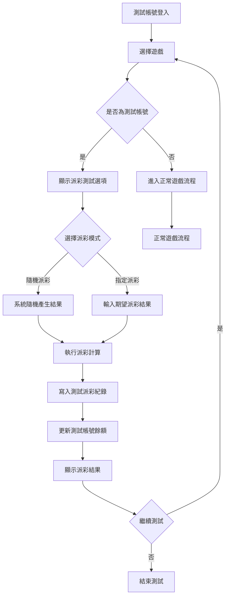

# [L46] 遊戲派彩

**功能代碼**: L46  
**所屬模組**: [M04]交易紀錄管理  
**最後更新**: 2026-03-07  

---

## 功能概述

遊戲派彩功能專為測試帳號設計，允許在不影響真實帳務的情況下進行派彩測試。此功能主要用於驗證遊戲邏輯、測試派彩結果、以及訓練操作人員，確保正式營運時的穩定性。

### 功能特性
- **測試帳號專用**：僅測試帳號可使用派彩功能
- **模擬派彩**：模擬真實遊戲的派彩結果
- **帳務隔離**：派彩結果不影響真實帳務
- **結果可調整**：可設定特定派彩結果用於測試
- **完整紀錄**：所有測試派彩皆有完整紀錄

---

## 流程圖



---

## API 對應

| 操作 | Method | Endpoint | 說明 |
|------|--------|----------|------|
| 取得測試帳號狀態 | GET | `/api/v1/test-accounts/{accountId}/status` | 確認是否為測試帳號 |
| 執行測試派彩 | POST | `/api/v1/test-accounts/{accountId}/payout` | 執行測試派彩 |
| 查詢派彩紀錄 | GET | `/api/v1/test-accounts/{accountId}/payout/logs` | 取得測試派彩紀錄 |
| 設定派彩參數 | POST | `/api/v1/test-accounts/{accountId}/payout/config` | 設定派彩測試參數 |
| 重置測試餘額 | POST | `/api/v1/test-accounts/{accountId}/reset-balance` | 重置測試帳號餘額 |

---

## 資料表

### `test_accounts` - 測試帳號表

| 欄位名稱 | 資料型態 | 說明 |
|----------|----------|------|
| `id` | BIGINT | 帳號 ID（PK）|
| `account_code` | VARCHAR(64) | 帳號代碼 |
| `account_name` | VARCHAR(128) | 帳號名稱 |
| `balance` | DECIMAL(18,2) | 測試餘額 |
| `payout_mode` | ENUM | 派彩模式 |
| `is_active` | BOOLEAN | 是否啟用 |
| `created_at` | TIMESTAMP | 建立時間 |
| `expires_at` | TIMESTAMP | 到期時間 |

### `test_payout_records` - 測試派彩紀錄表

| 欄位名稱 | 資料型態 | 說明 |
|----------|----------|------|
| `id` | BIGINT | 紀錄 ID（PK）|
| `test_account_id` | BIGINT | 測試帳號 ID（FK）|
| `game_id` | VARCHAR(64) | 遊戲 ID |
| `round_id` | VARCHAR(64) | 遊戲回合 ID |
| `bet_amount` | DECIMAL(18,2) | 投注金額 |
| `payout_amount` | DECIMAL(18,2) | 派彩金額 |
| `balance_before` | DECIMAL(18,2) | 派彩前餘額 |
| `balance_after` | DECIMAL(18,2) | 派彩後餘額 |
| `payout_type` | ENUM | 派彩類型 |
| `created_at` | TIMESTAMP | 建立時間 |

### `test_payout_configs` - 測試派彩設定表

| 欄位名稱 | 資料型態 | 說明 |
|----------|----------|------|
| `id` | BIGINT | 設定 ID（PK）|
| `test_account_id` | BIGINT | 測試帳號 ID（FK）|
| `game_id` | VARCHAR(64) | 遊戲 ID（NULL 表示全域）|
| `payout_rate` | DECIMAL(5,2) | 派彩率設定（%）|
| `max_payout` | DECIMAL(18,2) | 單次最大派彩 |
| `force_result` | JSON | 強制派彩結果 |

---

## 欄位說明

### `payout_mode` 派彩模式
- `RANDOM`：隨機派彩，模擬真實遊戲結果
- `FIXED`：固定派彩，按設定值派彩
- `CUSTOM`：自訂派彩，每次手動輸入

### `payout_type` 派彩類型
- `WIN`：中獎派彩
- `LOSE`：未中獎（派彩為 0）
- `JACKPOT`：彩金派彩
- `BONUS`：獎勵派彩

### `force_result` 強制派彩結果
JSON 格式，用於指定特定的派彩結果：

```json
{
  "symbols": ["A", "A", "A"],
  "multiplier": 10,
  "win_lines": [1, 5]
}
```

### `payout_rate` 派彩率
- 設定測試時的期望派彩率
- 數值範圍：0 ~ 200（%）
- 用於驗證遊戲邏輯

---

## 測試流程說明

### 1. 帳號驗證
- 確認登入帳號為測試帳號
- 檢查帳號是否在有效期內

### 2. 派彩設定
- 選擇派彩模式（隨機/固定/自訂）
- 設定派彩參數（如適用）

### 3. 執行派彩
- 進行遊戲投注
- 依設定模式計算派彩
- 更新測試餘額

### 4. 結果記錄
- 寫入測試派彩紀錄
- 提供查詢與分析

---

## 注意事項

1. **帳號識別**：測試帳號需有明確標識，避免與正式帳號混淆
2. **資料隔離**：測試派彩紀錄與正式交易紀錄完全分開
3. **餘額限制**：測試餘額有上限設定，可隨時重置
4. **期限管理**：測試帳號有有效期，逾期自動停用
5. **操作日誌**：所有測試操作皆有完整日誌

---

*文件更新時間：2026-03-07*