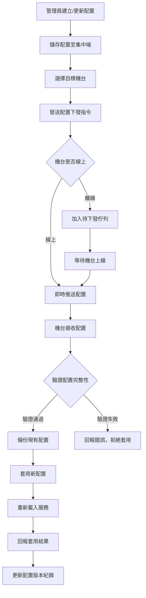

# [L07] 機台配置接收

**功能代碼**: L07  
**所屬模組**: [M05]系統  
**最後更新**: 2026-03-08  

---

## 功能概述

機台配置接收功能實現從集中式後端接收並套用組態檔案的機制。機台接收配置後自動套用，確保與集中端設定保持一致，降低現場維護複雜度。

### 功能特性
- **集中管理**：統一在集中端管理所有機台的配置檔
- **版本控制**：支援配置版本管理，可追蹤變更歷史
- **自動套用**：機台接收配置後自動生效
- **回滾機制**：支援配置回滾至前一版本
- **批量接收**：支援多台機台同時接收相同配置

---

## 流程圖



---

## 🔄 配置接收流程 (依據 Config Sync Protocol 1.0.0)

> **中央集權架構**：本地機台為雲端配置的「快取端點」，接收規則遵循 **Push-Pull-Status** 迴圈。

### 1. 核心接收機制
- **即時通知**：透過 WebSocket (SignalR) 監聽 `CONFIG_UPDATE` 事件。
- **配置下載**：接收到通知後，調用 `GET /api/v1/configs/{id}` 取得內容。
- **狀態回報**：完成套用/重啟後，調用 `POST /api/v1/machines/{id}/config/status` 回報結果。

### 2. 本地驗證與套用
- **簽名校驗**：使用 HMAC-SHA256 驗證配置來源合法性。
- **快取備份**：套用新配置前，自動備份上一份有效配置至本地 SQLite。
- **回滾機制**：若新配置套用導致服務異常，自動回滾並上報失敗日誌。

---

## 🔌 API 調用清單

| 操作 | Method | Endpoint | 說明 |
|------|--------|----------|------|
| 配置內容 | GET | `/api/v1/configs/{id}` | 取得特定配置內容 ([L07]) |
| 配置列表 | GET | `/api/v1/configs` | 取得所有配置列表 |
| 建立配置 | POST | `/api/v1/configs` | 建立新配置 |
| 回報套用狀態 | POST | `/api/v1/machines/{id}/config/status` | 回報配置套用結果 ([L07]) |
| 接收歷史 | GET | `/api/v1/machines/{id}/config/history` | 取得配置變更歷史 |
| 主動同步 | POST | `/api/v1/sync/download` | 機台主動拉取更新 (含配置) |

---

## 資料表

### `machine_configs` - 配置主表

| 欄位名稱 | 資料型態 | 說明 |
|----------|----------|------|
| `id` | BIGINT | 配置 ID（PK）|
| `name` | VARCHAR(128) | 配置名稱 |
| `config_type` | ENUM | 配置類型 |
| `content` | TEXT | 配置內容（JSON 格式）|
| `version` | INT | 版本號 |
| `created_by` | VARCHAR(64) | 建立人員 ID |
| `created_at` | TIMESTAMP | 建立時間 |
| `updated_at` | TIMESTAMP | 更新時間 |

### `machine_config_receives` - 配置接收紀錄表

| 欄位名稱 | 資料型態 | 說明 |
|----------|----------|------|
| `id` | BIGINT | 接收 ID（PK）|
| `config_id` | BIGINT | 配置 ID（FK）|
| `instance_id` | VARCHAR(64) | 機台唯一識別碼 |
| `version_before` | INT | 接收前版本 |
| `version_after` | INT | 接收後版本 |
| `status` | ENUM | 接收狀態 |
| `received_at` | TIMESTAMP | 接收時間 |
| `applied_at` | TIMESTAMP | 套用時間 |
| `error_message` | TEXT | 錯誤訊息 |

### `machine_config_local` - 機台本地配置表

| 欄位名稱 | 資料型態 | 說明 |
|----------|----------|------|
| `id` | BIGINT | 記錄 ID（PK）|
| `instance_id` | VARCHAR(64) | 機台唯一識別碼 |
| `config_type` | ENUM | 配置類型 |
| `current_version` | INT | 目前版本 |
| `content` | TEXT | 配置內容 |
| `applied_at` | TIMESTAMP | 套用時間 |

---

## 欄位說明

### `config_type` 配置類型
- `GAME_LIST`：遊戲列表配置
- `NETWORK`：網路參數配置
- `SYSTEM`：系統參數配置
- `SECURITY`：安全設定配置
- `DISPLAY`：顯示設定配置

### `status` 接收狀態
- `PENDING`：待接收
- `SENT`：已發送
- `APPLIED`：已套用
- `FAILED`：套用失敗
- `ROLLBACK`：已回滾

### `content` 配置內容
JSON 格式儲存，依 `config_type` 有不同結構。

範例 - 遊戲列表配置：
```json
{
  "games": [
    {"id": "G001", "name": "Game A", "enabled": true},
    {"id": "G002", "name": "Game B", "enabled": false}
  ],
  "update_interval": 3600
}
```

---

## 接收流程說明

### 1. 配置準備階段
- 管理員在集中端建立或更新配置
- 系統自動遞增版本號
- 儲存配置內容與中繼資料

### 2. 接收執行階段
- 選擇目標機台（單台或多台）
- 發送接收指令
- 機台接收並驗證配置

### 3. 套用階段
- 備份現有配置
- 套用新配置
- 重新載入相關服務
- 回報套用結果

### 4. 確認階段
- 集中端收到套用成功回報
- 更新機台配置版本紀錄

---

## 注意事項

1. **權限要求**：接收配置需具備 `CONFIG_RECEIVE` 權限
2. **備份機制**：套用前自動備份現有配置
3. **驗證機制**：接收前會驗證配置格式正確性
4. **離線處理**：機台離線時配置會加入佇列，上線後自動接收
5. **回滾限制**：僅能回滾至前一版本
6. **同步協定**：具體通訊與驗證細節請參閱 [本地與集中端配置同步協定](file:///Users/carlos/Library/CloudStorage/GoogleDrive-dimx9173@gmail.com/My%20Drive/%E8%80%81%E5%85%AC%E8%88%87%E8%80%81%E5%A9%86%E5%88%86%E4%BA%AB/%E5%B0%88%E6%A1%88/%E9%81%8A%E6%88%B2%E5%B9%B3%E5%8F%B0%E7%AE%A1%E7%90%86/md/v8/tech_specs/local_central_config_protocol.md)

---

*文件更新時間：2026-03-07*