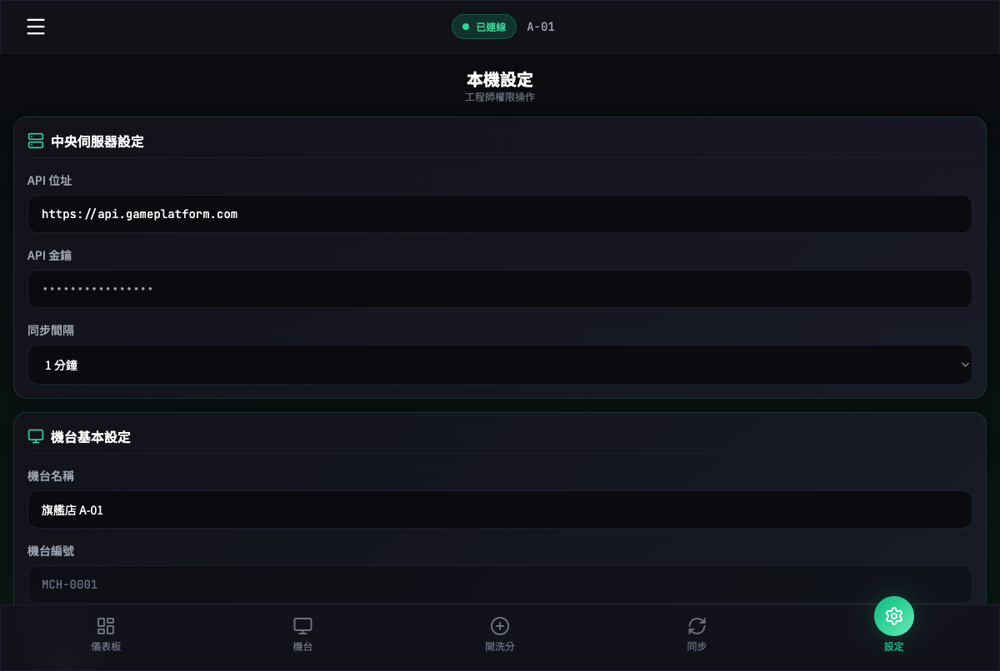

# [L47] 基本設定

**功能代碼**: L47  
**所屬模組**: [LM05] 系統  
**最後更新**: 2026-03-08  

---

## 功能說明

**功能說明**：
基本設定主要用於配置單機本地端的基礎識別資訊與系統運行參數。這些設定僅影響本機台的顯示與行為。

**操作流程**：

```plaintext
1. 進入「系統設定」>「基本設定」
2. 填寫或修改機台基本資訊
3. 設定系統參數（如語言、心跳頻率）
4. 點擊「儲存」並應用設定
```

**屬性/輸入欄位**：

| 欄位名稱 | 類型 | 說明 | 範例 |
| :--- | :--- | :--- | :--- |
| **機台 ID**  | 文字     | 本機台唯一識別碼（由系統產生，唯讀）   | MAC-001              |
| **機台名稱** | 文字     | 本地端顯示的友善名稱                   | 門市 A-01 號機       |
| **所在位置** | 文字     | 標註機台實際擺放的實體位置             | 台北市大安區忠孝門市 |
| **機台類型** | 下拉選單 | 標記機台硬體類型（如：旗艦機、掌上型） | 旗艦機               |
| **語系設定** | 下拉選單 | 切換後台管理介面的顯示語言             | 繁體中文             |
| **時區設定** | 下拉選單 | 設定本地端報表與記錄的顯示時區         | UTC+8                |
| **備註**     | 文字     | 其他補充資訊                           | 無                   |

**畫面 Mockup**：


---
