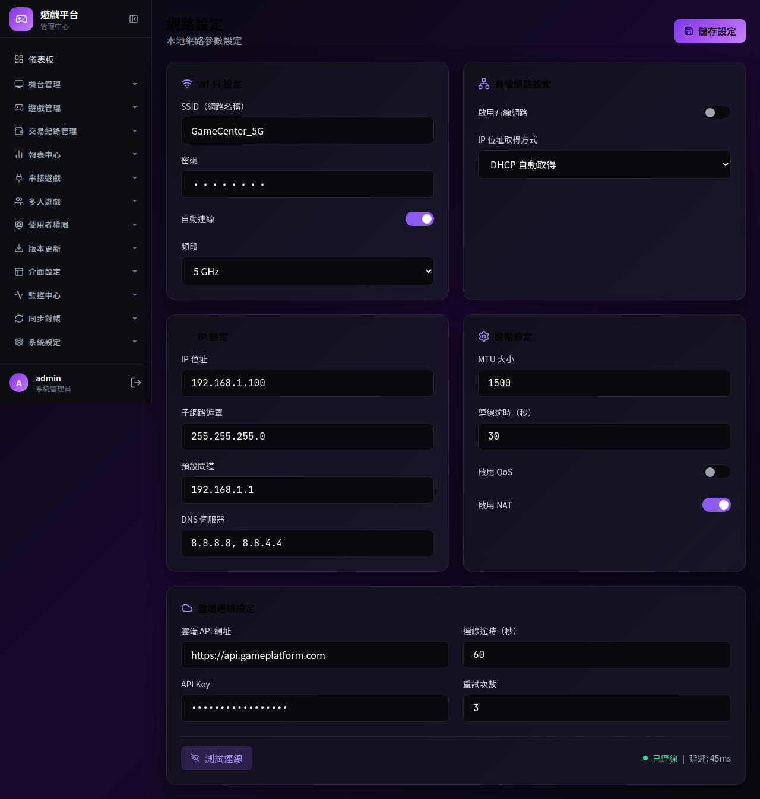

# [L48] 網路設定

**功能代碼**: L48  
**所屬模組**: [LM05] 系統  
**最後更新**: 2026-03-08  

---

## 功能說明

**功能說明**：
配置機台本地端的網路連線參數，確保能正確連線至中央伺服器及本地區域網路。

**操作流程**：

```plaintext
1. 進入「系統設定」>「網路設定」
2. 設定伺服器位址 (Server URL)
3. 進行連線測試 (Ping Test)
4. 儲存設定
```

**屬性/輸入欄位**：

| 欄位名稱 | 類型 | 說明 | 範例 |
| :--- | :--- | :--- | :--- |
| **伺服器位址** | 文字     | 中央後台伺服器的 API 終端位址         | https://api.central.com |
| **通訊埠**     | 數字     | 通訊使用的 Port 號                    | 443                     |
| **連線狀態**   | 狀態顯示 | 顯示目前與中央伺服器的通訊狀態 (唯讀) | 已連線                  |

**畫面 Mockup**：


---

## 3.14 錢包管理操作
