# UI 設計詳細說明文件

## 集中式後台 + 單機本地後台整合版

| 屬性         | 內容                           |
| ------------ | ------------------------------ |
| **版本**     | v1.0                          |
| **日期**     | 2026 年 3 月 2 日              | 
| **適用系統** | 遊戲平台管理系統               |
| **文件類型** | UI 設計規格                   |
| **版本說明** | Premium Dark + Cyber Purple    |
| **風格**     | Glassmorphism + Neon Glow     |
| **技術**     | Blazor Server + Radzen Blazor |

---

## 目錄

1. [文件概述](#1-文件概述)
2. [設計系統規格](#2-設計系統規格)
3. [集中式後台頁面規格](#3-集中式後台頁面規格)
4. [單機本地後台頁面規格](#4-單機本地後台頁面規格)
5. [介面設計文字框](#5-介面設計文字框)
6. [詳細操作流程與UseCase](#6-詳細操作流程與usecase)
7. [共用元件規範](#7-共用元件規範)
8. [路由結構](#8-路由結構)
9. [響應式設計規範](#9-響應式設計規範)
10. [附錄](#10-附錄)

---

## 1. 文件概述

本文件詳細闡述遊戲平台管理系統的 UI 設計規格，包含集中式後台與單機本地後台兩個層次的頁面設計、元件規範、路由結構、響應式設計等內容。

---

## 2. 設計系統規格

### 2.1 設計風格

採用「**Premium Dark + Glassmorphism**」設計風格，結合：
- 深色背景減少眼睛疲勞
- 玻璃擬態效果創造層次感
- 霓虹紫色點綴創造科技感
- 流暢動畫提升使用者體驗

### 設計原則

1. **視覺層次**：透過透明度與模糊創造深度
2. **霓虹點綴**：使用紫色漸層作為品牌焦點
3. **資料導向**：數據使用等寬字體，易於閱讀
4. **狀態明確**：顏色與圖示結合，快速識別狀態

### 2.2 色彩系統

#### 主要色彩

| 色彩名稱     | 代碼      | 用途                     |
| ------------ | --------- | ------------------------ |
| **背景黑**   | `#0a0a0f` | 頁面主背景               |
| **卡片深色** | `#12121a` | 卡片背景                 |
| **側邊欄**   | `#0d0d14` | 側邊欄與導航背景        |
| **邊框**     | `#1e1e2e` | 分隔線與邊框            |
| **紫色主色** | `#7c3aed` | 主要按鈕、強調文字      |
| **紫色亮**   | `#a855f7` | 懸停狀態、活躍項目      |
| **紫色 Glow**| `#c084fc` | 發光效果、焦點狀態      |

#### 語意色彩

| 語意         | 色彩代碼  | 用途                     |
| ------------ | --------- | ------------------------ |
| **成功/線上** | `#10b981` | 成功狀態、正常運行      |
| **警告**      | `#f59e0b` | 警告、需要關注          |
| **危險/錯誤** | `#ef4444` | 錯誤、刪除、斷線        |
| **資訊**      | `#3b82f6` | 資訊、一般狀態          |
| **紫色**      | `#8b5cf6` | 主要互動元素            |
| **青色**      | `#06b6d4` | 次要強調、圖表          |

#### 漸層色彩

```css
/* 主要漸層 - 用於按鈕與圖示 */
gradient-purple: linear-gradient(135deg, #7c3aed 0%, #a855f7 50%, #c084fc 100%)

/* 背景漸層 */
gradient-bg: linear-gradient(135deg, #0a0a0f 0%, #1a0a2e 50%, #0a0a0f 100%)
```

### 2.3 字體系統

#### 字體選擇

- **正文字體**：Noto Sans TC（中文支援）
- **標題字體**：Noto Sans TC Bold
- **資料字體**：JetBrains Mono（等寬，方便對齊數字）

#### 字體大小

| 類型     | 大小   | 用途           |
| -------- | ------ | -------------- |
| H1       | 24px   | 頁面標題       |
| H2       | 20px   | 區塊標題       |
| H3       | 18px   | 次級標題       |
| 正文     | 14px   | 一般內容       |
| 輔助文字 | 12px   | 標籤、說明     |
| 資料     | 14-24px| 數字、金額     |

### 2.4 間距與圓角

- **間距系統**：4px, 8px, 12px, 16px, 24px, 32px, 48px。
- **圓角規範**：小（4px）、中（8px）、大（12px）。

### 2.5 玻璃擬態效果

#### 基礎玻璃效果

```css
.glass {
    background: rgba(18, 18, 26, 0.7);
    backdrop-filter: blur(20px);
    -webkit-backdrop-filter: blur(20px);
    border: 1px solid rgba(255, 255, 255, 0.08);
}
```

#### 卡片玻璃效果

```css
.glass-card {
    background: linear-gradient(135deg, rgba(18, 18, 26, 0.9) 0%, rgba(30, 30, 46, 0.6) 100%);
    backdrop-filter: blur(20px);
    border: 1px solid rgba(168, 85, 247, 0.15);
    box-shadow: 0 8px 32px rgba(0, 0, 0, 0.4), inset 0 1px 0 rgba(255, 255, 255, 0.05);
}

.glass-card:hover {
    border-color: rgba(168, 85, 247, 0.4);
    box-shadow: 0 8px 32px rgba(0, 0, 0, 0.4), 0 0 30px rgba(168, 85, 247, 0.2), inset 0 1px 0 rgba(255, 255, 255, 0.1);
}
```

#### 霓虹發光效果

```css
.neon-text {
    text-shadow: 0 0 10px rgba(168, 85, 247, 0.5),
                 0 0 20px rgba(168, 85, 247, 0.3),
                 0 0 30px rgba(168, 85, 247, 0.2);
}

.shadow-glow {
    box-shadow: 0 0 30px rgba(168, 85, 247, 0.3);
}
```

---

## 3. 集中式後台頁面規格

### 3.1 頁面清單

| 頁面名稱               | 主要功能                           |
| ---------------------- | ---------------------------------- |
| **登入頁面**     | 管理員帳號密碼登入                 |
| **儀表板**       | 全平台 KPI、營收趨勢圖、機台狀態   |
| **機台管理**     | 機台列表、心跳監控、遠端操作       |
| **遊戲管理**     | 遊戲列表、新增/編輯/刪除、版本管理 |
| **錢包交易**     | 交易紀錄、統計分析、對帳           |
| **營收報表**     | 多維度營收查詢、圖表分析、資料匯出 |
| **串接遊戲管理** | 遊戲商 API 管理、連線監控          |
| **多人遊戲**    | 牌桌管理、牌局歷史、荷官操作       |
| **使用者權限**   | 帳號管理、角色權限設定（三層）     |
| **多帳號管理**   | 多帳號列表、樹狀結構               |
| **版本更新**     | OTA 版本管理、更新任務下發         |
| **監控中心**     | 硬體監控、告警設定                 |
| **對帳專區**     | 錯帳爭議處理、沖銷憑證             |

### 3.2 OTA 遠端版本派送

- 中央後台可上傳編譯好的單機程式壓縮檔 (`.zip`) 或可執行檔
- 賦予新版號
- 機台自動偵測新版本並下載更新
- MD5 比對確保完整性

### 3.3 進階硬體監控

- CPU 負載監控
- 記憶體佔用率
- 現場網路封包延遲
- 設備健康度儀表板

### 3.4 錯帳與爭議帳單管理

- 爭議款追蹤專區
- Audit 標記
- 沖銷憑證產生
- 符合正規金流系統的會計核銷邏輯

---

## 4. 單機本地後台頁面規格

> **設計原則**：單機本地後台為雲端快取端點，資料由集中式統一管理，本地無法直接修改。

### 4.1 頁面清單

> **本地端權限**：⚠️ 唯讀 = 雲端快取 | 📝 佇列 = 本地暫存→上傳 | ⚙️ 局部 = 僅基本設定

| 頁面名稱           | 主要功能                | 本地權限 |
| ------------------ | ----------------------- | -------- |
| **登入頁面** | PIN 碼登入              | - |
| **儀表板**   | 本機 KPI、快速操作按鈕  | ⚠️ 唯讀 |
| **機台管理** | 機台資訊、硬體狀態      | ⚠️ 唯讀 |
| **遊戲管理** | 遊戲列表（唯讀）       | ⚠️ 唯讀 |
| **交易管理** | 交易紀錄、本地統計      | 📝 佇列 |
| **錢包管理** | 中心錢包餘額（唯讀）    | ⚠️ 唯讀 |
| **系統設定** | 本機網路參數            | ⚙️ 局部 |
| **同步對帳** | 同步狀態檢視           | ⚠️ 唯讀 |
| **監控**     | 硬體狀態、網路延遲      | ⚠️ 唯讀 |

---

## 5. 介面設計

### 5.1 集中式後台 - 登入頁面

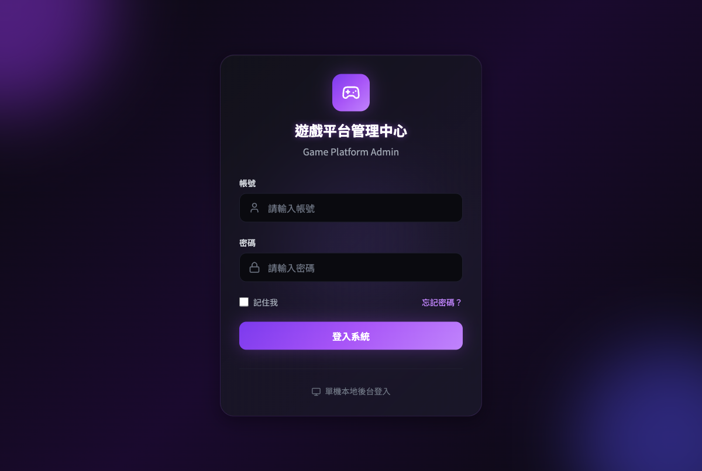

### 5.2 集中式後台 - 儀表板

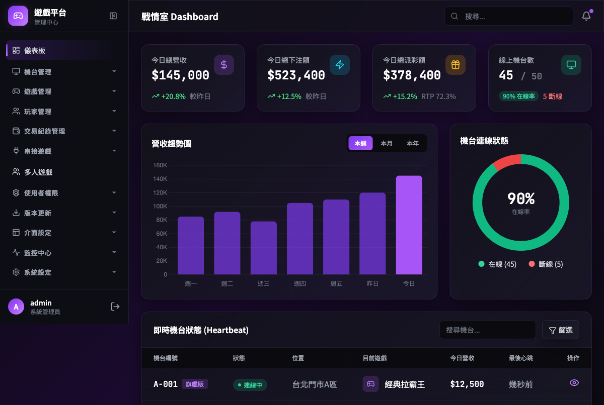

### 5.3 集中式後台 - 機台管理

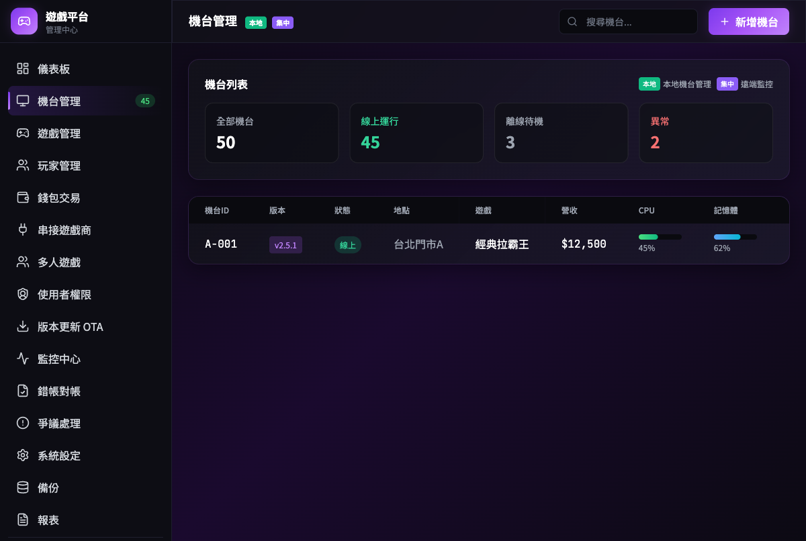

### 5.4 集中式後台 - 遊戲管理

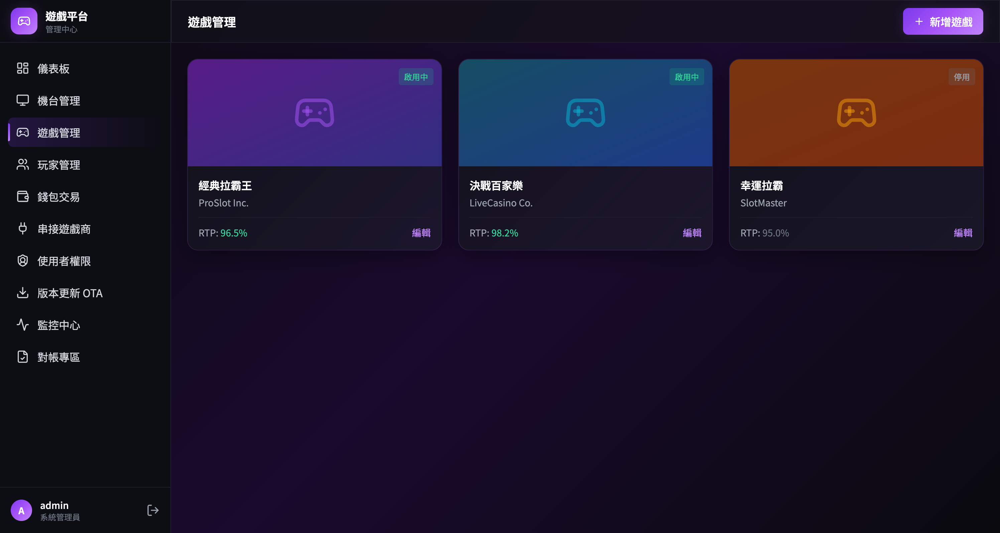

### 5.5 集中式後台 - 錢包交易

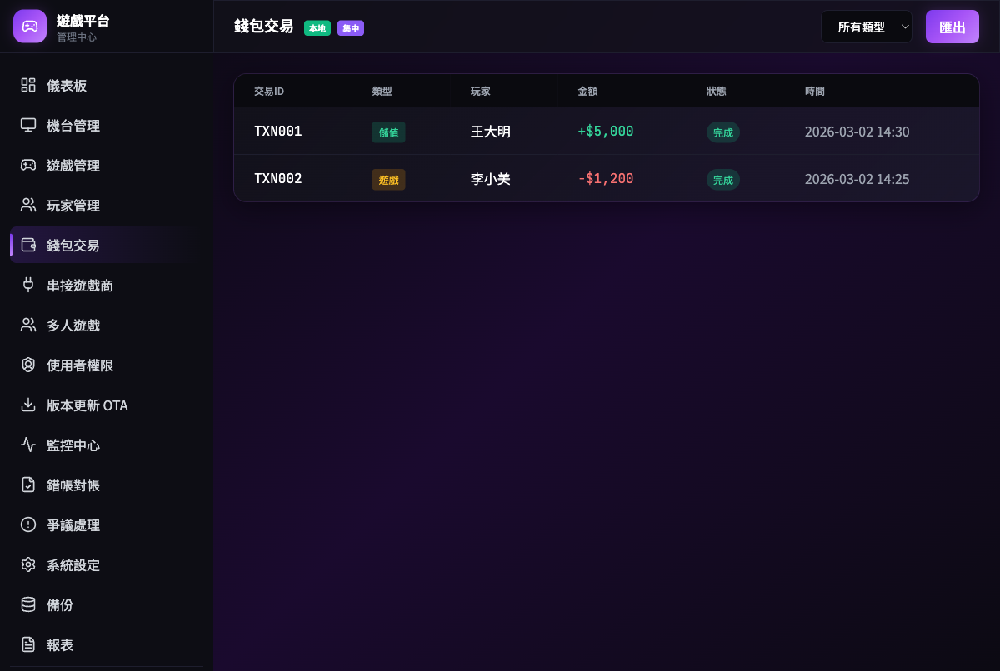

### 5.6 集中式後台 - 營收報表

- **版面配置**：
  - **頂部操作區**：多維度交叉篩選器（時間區間、店家/代理商、機台編號、遊戲分類等）。
  - **中段視覺區**：資料 KPI 卡片（總下注、總派彩、總營收），搭配動態折線圖與長條圖呈現營收趨勢與佔比。
  - **底部資料區**：詳細數據表格（Data Grid），顯示各維度匯總明細，支援按欄位排序與分頁。
- **核心操作**：
  - 條件選單變更時即時重繪圖表與表格資料。
  - 提供帶有霓虹發光樣式（Primary）的「匯出 CSV/Excel」功能按鈕。

### 5.7 集中式後台 - 串接遊戲商

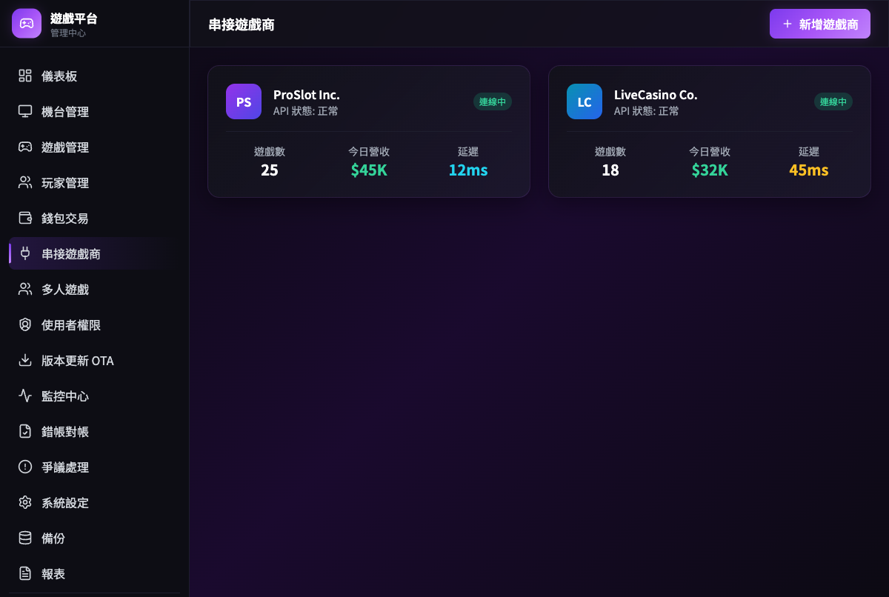

### 5.8 集中式後台 - 使用者權限

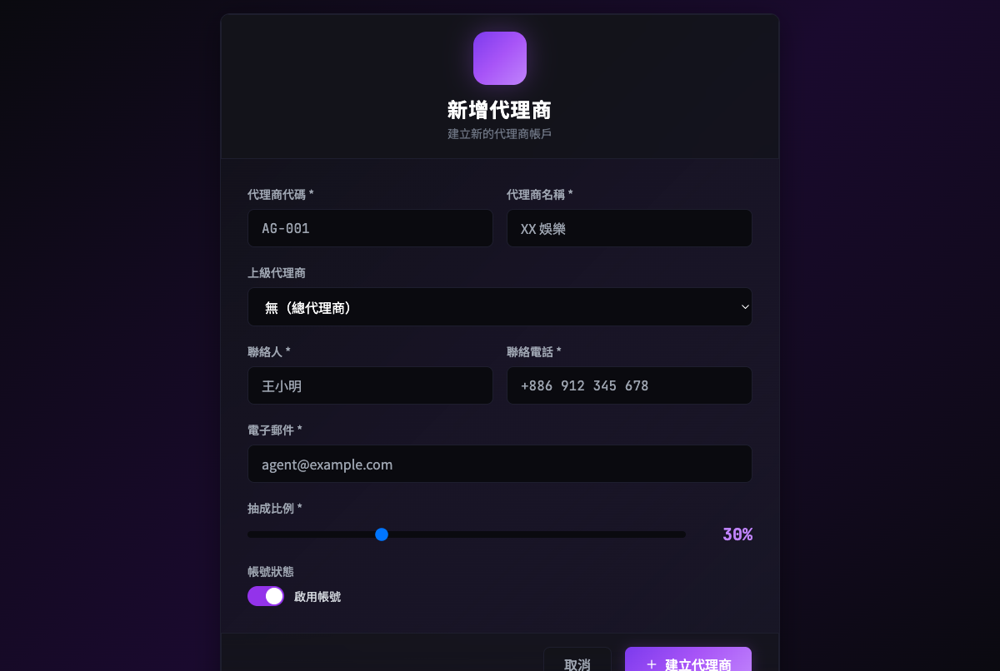

### 5.10 集中式後台 - OTA 版本管理

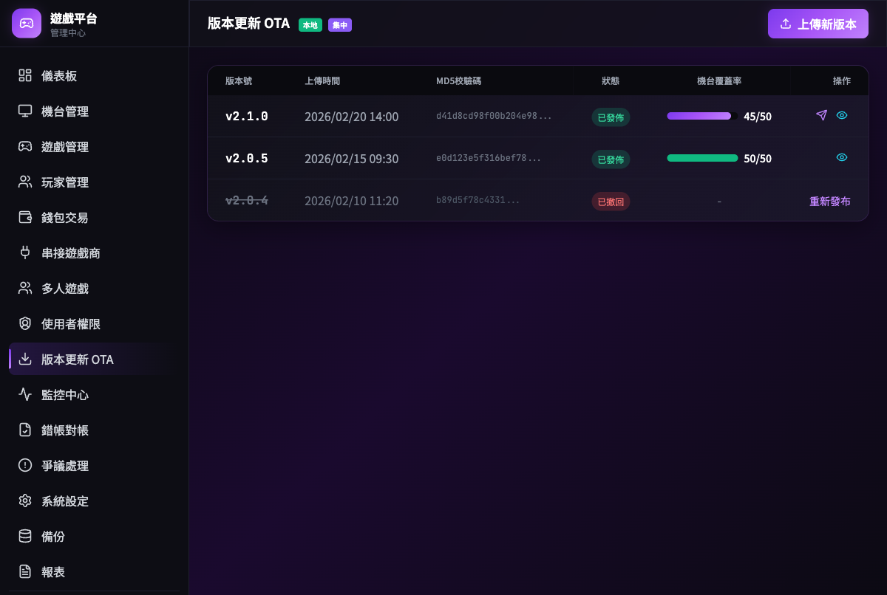

### 5.11 集中式後台 - 硬體監控中心

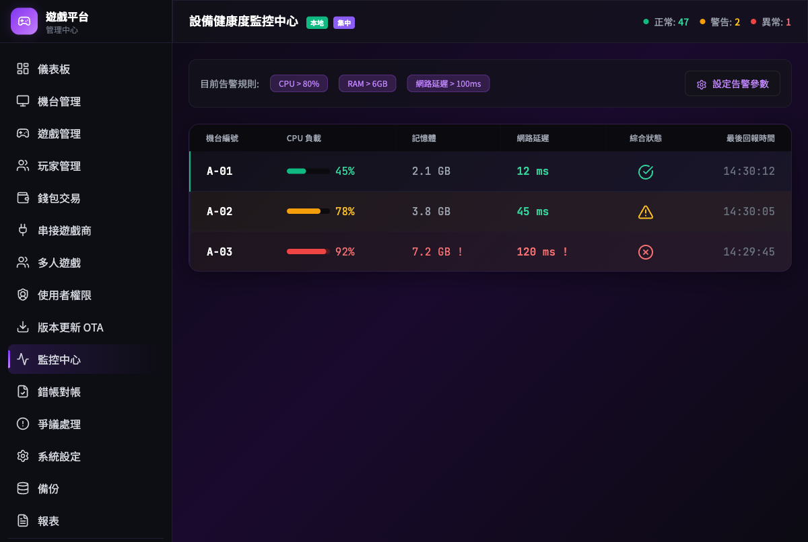

### 5.12 集中式後台 - 對帳與爭議處理

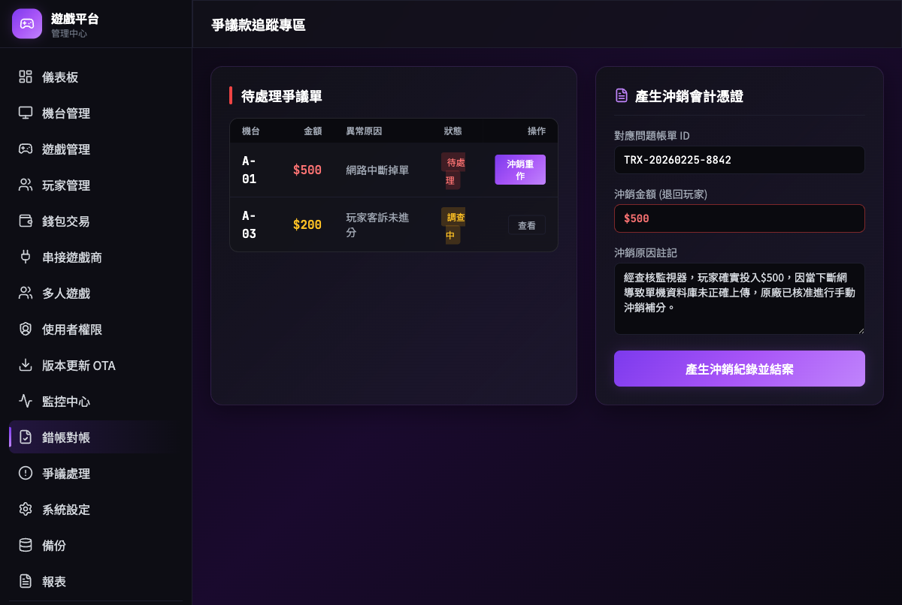

### 5.13 單機本地後台 - 開洗分介面

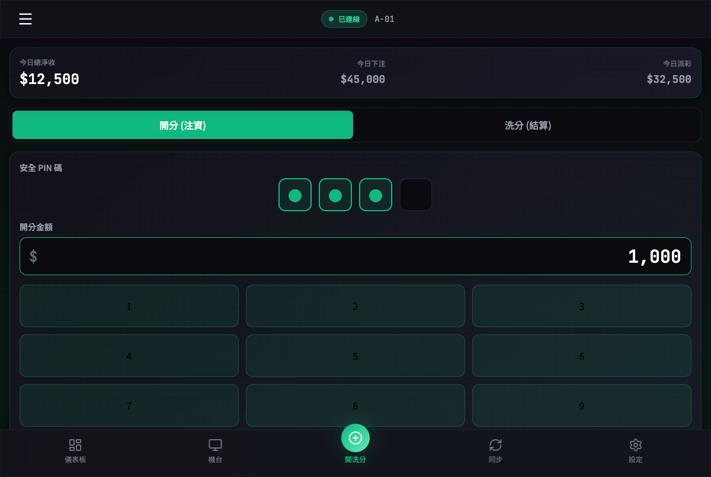

### 5.14 單機本地後台 - 本機設定

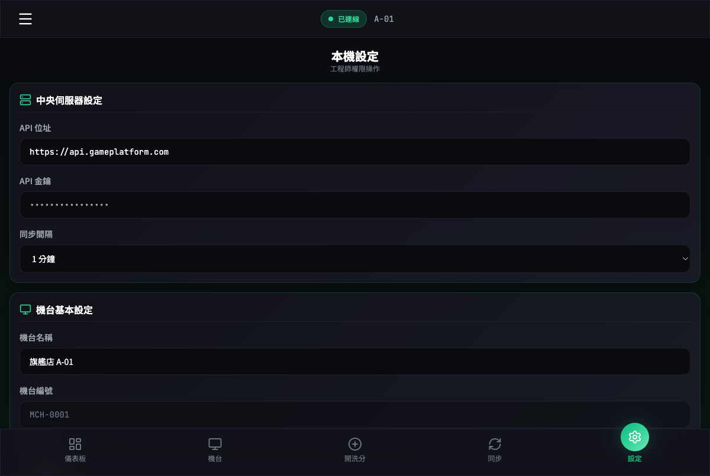

---

## 6. 詳細操作流程與UseCase

### Use Case 1: OTA 遠端更新

**【情境說明】** 中央管理員發布新版本，機台自動下載並更新。

**【主要角色】** 中央管理員、機台

1. 中央管理員上傳新版程式碼（.zip 或 .exe）。
2. 系統產生 MD5 校驗碼並儲存。
3. 機台於 Heartbeat 中偵測到新版本。
4. 機台於閒置時自動下載並比對 MD5。
5. 下載完成後，自動解壓縮覆蓋並重啟服務。
6. 中央後台顯示更新進度與結果。

---

### Use Case 2: 錯帳沖銷處理

**【情境說明】** 管理員針對爭議帳款進行沖銷處理。

**【主要角色】**
- 高階管理員（Admin）
- 系統（Reconciliation Service）

**【前置條件】**
1. 高階管理員已登入系統
2. 帳單已進入「爭議款追蹤專區」

**【操作流程】**
1. 系統偵測到重發失敗的帳單或客戶反映。
2. 帳單自動進入「爭議款追蹤專區」。
3. 高階管理員審核帳單資料。
4. 確認無誤後，點擊「產生沖銷憑證」。
5. 系統產生沖銷紀錄（不改原始資料）。
6. 帳單標記為「已完成」並關閉。

**【後置條件】**
- 沖銷紀錄已產生並儲存
- 原始交易資料保持不變
- 稽核日誌已記錄操作

**【Business Rules】**
- 沖銷僅能產生新紀錄，不可修改原始資料
- 需記錄沖銷原因與操作者
- 沖銷金額不得超過原始交易金額

---

### Use Case 3: 機台遠端指令發送

**【情境說明】** 中央管理員對機台發送遠端操作指令。

**【主要角色】**
- 中央管理員（Admin/Operator）
- 機台（Machine Agent）
- 系統（Command Service）

**【前置條件】**
1. 管理員已登入系統
2. 機台處於 online 狀態
3. 機台已建立 WebSocket 連線

**【操作流程】**
1. 管理員選擇目標機台。
2. 系統顯示可用指令列表（restart/shutdown/cash_in/cash_out）。
3. 管理員選擇指令並填寫參數（如適用）。
4. 系統發送指令至機台。
5. 機台接收指令並執行。
6. 機台回傳執行結果。
7. 系統顯示執行狀態與結果。

**【後置條件】**
- 指令執行結果已記錄
- 機台狀態已更新（如需要）

**【例外處理】**
- 機台離線：指令進入排程，機台上線後執行
- 指令逾時（30秒）：顯示逾時訊息，可重試

---

### Use Case 4: 機台餘額調整

**【情境說明】** 管理員手動調整機台錢包餘額（所有交易匿名綁定機台）。

**【主要角色】**
- 管理員（Admin/Agent）
- 系統（Wallet Service）

**【前置條件】**
1. 管理員已登入系統
2. 機台已註冊並綁定

**【操作流程】**
1. 管理員搜尋並選擇目標機台。
2. 點擊「調整餘額」按鈕。
3. 選擇調整類型（儲值/提現/調整）。
4. 輸入調整金額與原因備註。
5. 系統驗證餘額充足（提款時）。
6. 系統更新機台餘額並記錄交易。
7. 顯示調整結果。

**【後置條件】**
- 機台餘額已更新
- 交易紀錄已建立（含簽名）
- 稽核日誌已記錄

**【Business Rules】**
- 提款金額不得超過可用餘額
- 所有調整需留下備註說明
- 調整金額需記錄至小數點第二位

---

### Use Case 5: 遊戲商餘額查詢與轉帳

**【情境說明】** 管理員查詢遊戲商餘額並進行轉帳操作。

**【主要角色】**
- 中央管理員（Admin）
- 遊戲商（Provider）

**【前置條件】**
1. 管理員已登入系統
2. 遊戲商 API 連線正常

**【操作流程】**
1. 管理員進入「串接遊戲管理」頁面。
2. 選擇目標遊戲商。
3. 點擊「查詢餘額」按鈕。
4. 系統呼叫遊戲商 API 取得即時餘額。
5. 顯示餘額資訊（中央紀錄 vs 遊戲商回傳）。
6. 如需轉帳，輸入金額並確認。
7. 系統執行轉帳並驗證結果。

**【後置條件】**
- 轉帳紀錄已建立
- 雙方餘額已同步更新

**【Business Rules】**
- 轉帳前需二次確認
- 轉帳金額需為正整數
- 轉帳失敗需自動沖銷中央紀錄

---

### Use Case 6: 代理商樹狀結構管理

**【情境說明】** 管理員建立與管理代理商的多層級架構。

**【主要角色】**
- 中央管理員（Admin）
- 代理商（Agent）

**【前置條件】**
1. 管理員已登入系統
2. 系統已啟用「多帳號管理」模組

**【操作流程】**
1. 管理員進入「代理商管理」頁面。
2. 點擊「新增代理商」按鈕。
3. 填寫代理商基本資料（上層、權限、抽成比例）。
4. 系統建立代理商帳號。
5. 代理商可自行建立下層代理商。
6. 系統自動計算各層級的分潤與營收統計。

**【後置條件】**
- 代理商帳號已建立
- 權限繼承關係已設定
- 營收統計已更新

**【Business Rules】**
- 代理商層級最多 3 層
- 下層代理商的抽成比例不得高於上層
- 刪除代理商時需轉移其下層

---

### Use Case 7: 單機本地資料同步

> **中央集權架構**：單機本地後台為雲端快取端點，本地僅上傳交易資料，下載雲端快取，無法直接修改資料表。

**【情境說明】** 單機後台與集中式後台進行資料同步。

**【主要角色】**
- 單機系統（Local Agent）- 僅能上傳/下載
- 集中式系統（Central Server）- 統一管理

**【前置條件】**
1. 單機已連線至網路
2. 單機 PIN 驗證通過
3. 單機已向集中式註冊

**【操作流程】**
1. 單機發起同步請求（自動或手動）。
2. **單機上傳**：本地交易佇列上傳至集中式處理。
3. 中央系統接收並驗證資料（MD5 + 簽名）。
4. 中央系統處理交易（更新餘額、記錄帳務）。
5. **單機下載**：下載雲端快取（遊戲列表、機台資料、設定檔案）。
6. 單機接收並更新本地快取。
7. 雙方產生同步日誌。

**【後置條件】**
- 交易資料已上傳至集中式處理
- 雲端快取已下載至本地
- 同步日誌已建立

**【資料流向】**
```
本地 → 上傳 → 集中式（交易處理、餘額更新）
本地 ← 下載 ← 集中式（遊戲、機台、設定快取）
```

**【衝突解決策略】**
- **交易處理**：由集中式統一處理，UUID 去重
- **人工介入**：餘額衝突 → 進入「爭議對帳處理專區」

⚠️ **核心原則**：本地端資料為雲端快取，**無法直接修改**，所有資料變更由集中式統一管理。

---

## 7. 共用元件規範

### 7.1 按鈕元件

| 類型 | 樣式 | 使用場景 |
|------|------|----------|
| Primary | 紫色漸層背景 + 發光陰影 | 主要動作（登入、儲存） |
| Secondary | 透明背景 + 玻璃邊框 | 次要動作（取消、返回） |
| Danger | 紅色半透明背景 | 危險動作（刪除、停權） |
| Ghost | 透明背景 + 懸停效果 | 輔助動作 |

### 7.2 輸入框

```css
.input-focus:focus {
    box-shadow: 0 0 0 3px rgba(168, 85, 247, 0.3),
                0 0 20px rgba(168, 85, 247, 0.2);
}
```

### 7.3 狀態標籤

```css
/* 線上狀態 */
bg-emerald-500/20 text-emerald-400

/* 離線/錯誤狀態 */
bg-red-500/20 text-red-400

/* 警告狀態 */
bg-amber-500/20 text-amber-400
```

### 7.4 動畫與互動

#### 過渡時間

- **快速互動**：150ms（按鈕懸停、狀態變化）
- **中等動畫**：300ms（頁面切換、彈出）
- **慢速背景**：8s+（背景浮動效果）

#### 動畫類型

```css
/* 浮動動畫 */
@keyframes float {
    0%, 100% { transform: translateY(0); }
    50% { transform: translateY(-10px); }
}

/* 發光脈衝 */
@keyframes pulse-dot {
    0%, 100% { transform: scale(1); opacity: 0.4; }
    50% { transform: scale(1.5); opacity: 0; }
}

/* 淡入效果 */
@keyframes fadeIn {
    from { opacity: 0; transform: translateY(10px); }
    to { opacity: 1; transform: translateY(0); }
}
```

#### 互動回饋

1. **按鈕點擊**：scale(0.95) 收縮效果
2. **卡片懸停**：border 發光 + 輕微放大
3. **狀態點**：脈衝動畫指示即時狀態

### 7.2 監控元件

- 即時數據儀表板
- 歷史趨勢圖
- 告警狀態燈號

---

## 8. 路由結構

### 8.1 集中式後台路由

| 路徑                | 頁面         | 權限                 |
| ------------------- | ------------ | -------------------- |
| `/login`          | 登入頁       | 公開                 |
| `/dashboard`      | 儀表板       | Admin/Agent/Operator |
| `/machines`       | 機台管理     | Admin/Agent/Operator |
| `/games`          | 遊戲管理     | Admin                |
| `/transactions`   | 交易紀錄     | Admin/Agent/Operator |
| `/reports/revenue`| 營收報表     | Admin/Agent/Operator |
| `/providers`      | 串接遊戲管理 | Admin                |
| `/agents`         | 多帳號管理   | Admin                |
| `/users`          | 使用者權限   | Admin                |
| `/versions`       | 版本更新 OTA | Admin                |
| `/monitor`        | 監控中心     | Admin                |
| `/reconciliation` | 對帳專區     | Admin                |

### 8.2 單機本地後台路由

| 路徑              | 頁面     | 權限     |
| ----------------- | -------- | -------- |
| `/login`        | PIN 登入 | 公開     |
| `/dashboard`    | 儀表板   | Operator |
| `/machine`      | 機台管理 | Operator |
| `/games`        | 遊戲管理 | Operator |
| `/wallet`       | 錢包管理 | Operator |
| `/transactions` | 交易管理 | Operator |
| `/monitor`      | 監控     | Operator |
| `/settings`     | 系統設定 | Engineer |

---

## 9. 響應式設計規範

### 9.1 斷點設計

| 斷點    | 寬度       | 布局             |
| ------- | ---------- | ---------------- |
| Mobile  | < 640px    | 單欄，漢堡選單   |
| Tablet  | 640-1024px | 雙欄，折疊側邊欄 |
| Desktop | > 1024px   | 完整側邊欄導航   |

### 9.2 觸控優化

- 點擊區域最小 44x44px
- 支援滑動操作
- 大型按鈕適合平板操作

---

## 10. 附錄

### 10.1 術語表

| 術語           | 定義                           |
| -------------- | ------------------------------ |
| OTA            | Over-The-Air，遠端應用程式派發 |
| MD5            | 檔案完整性校驗碼               |
| Reconciliation | 對帳                           |
| Audit          | 審計、稽核                     |
| Heartbeat      | 心跳監控                       |

### 10.2 版本歷史

| 版本 | 日期 | 變更說明 |
|------|------|----------|
| v8.0 | 2026-03-02 | 合併 Premium Dark + Glassmorphism 設計系統 |
| v6.2 | 2026-02-25 | Corporate Precision 風格（舊版，已廢止） |

### 10.3 檔案清單

```
mockup/
├── central/                          # 集中式後台
│   ├── mockup_*.html                 # 50+ 頁面原型
│   └── mockup_*.png                  # 頁面截圖
├── local/                            # 單機本地後台
│   ├── mockup_local_*.html           # 本地端頁面
│   └── mockup_local_*.png            # 本地端截圖
├── css/
│   └── mockup-common.css             # 共用樣式
├── js/
│   └── sidebar.js                    # 共用側邊欄
├── README_SIDEBAR.md                 # 側邊欄使用說明
└── game_icon.jpg                     # 遊戲圖示（共用）
```
