# 功能需求矩陣與流程圖 (= V8 旗艦版 + C#)

## 版本資訊

| 屬性               | 內容               |
| ------------------ | ------------------ |
| **版本**     | v8.0               |
| **日期**     | 2026 年 2 月 25 日 |
| **文件類型** | 需求補充           |

---

# 1. 功能需求矩陣

> **📌 遊戲管理模組關係說明**
>
> | 模組                         | 說明                                                | 比喻       |
> | ---------------------------- | --------------------------------------------------- | ---------- |
> | **遊戲管理** (C16-C17) | 管理「遊戲本身」- 哪些遊戲可以玩、上架/下架         | 餐廳菜單   |
> | **串接遊戲** (C53-C56) | 管理「供應商 API」- 連接到供應商、單人/多人遊戲 | 餐廳供應商 |
> | **多人遊戲** (C57-C67) | 管理「真人牌桌」- 百家樂/龍虎/骰寶 牌桌管理  | 餐廳座位   |
>
> ⚠️ **多人遊戲斷線保護**：必須保持連線方可進行遊戲交易，不支援離線下注。
>
> - 串接遊戲管理連接到供應商後，供應商可能提供「單人遊戲」或「多人遊戲」
> - 多人遊戲的遊戲來自外部供應商（非系統自行決定）

## 1.1 系統功能需求矩陣（集中式 vs 本地）

> **說明**：本地端（單機本地後台）為雲端快取端點，資料由集中式統一管理，本地無法直接修改。所有本地操作透過雲端 API 執行，離線時僅能查看快取資料，無法開始新遊戲。
>
> **本地端權限**：
>
> - ⚠️ 唯讀：資料來自雲端快取，僅供檢視
> - 📝 佇列：本地暫存，連線時上傳至雲端
> - ⚙️ 局部：僅本地網路參數等基本設定

| 功能模組               | 功能項目                    | 集中式 |   本地   | 遠端控制 | 備註                        |
| ---------------------- | --------------------------- | :----: | :-------: | :------: | --------------------------- |
| **儀表板**       | [C01] KPI 監控                    |   ✅   | ⚠️ 唯讀 |    -    | 集中式(全平台)/本地(快取)   |
|                        | [L01] 營收趨勢圖            |   ✅   | ⚠️ 唯讀 |    -    | 集中式(全平台)/本地(快取)   |
|                        | [L02] 機台狀態圖            |   ✅   | ⚠️ 唯讀 |    -    | 集中式(全部機台)/本地(快取) |
|                        | [L03] 熱門遊戲排行          |   ✅   | ⚠️ 唯讀 |    -    | 本地快取                    |
|                        | [C05] 系統通知                    |   ✅   | ⚠️ 唯讀 |    -    | 接收雲端推播                |
|                        | [L04] 今日營收/下注/派彩    |   ✅   | ⚠️ 唯讀 |    -    | 本地快取                    |
|                        | [C02] 硬體/網路狀態         |   ✅   | ⚠️ 唯讀 |    -    | 本機硬體狀態                |
|                        | [L08] 快速操作按鈕          |   ✅   | ⚠️ 唯讀 |    ✅    | 顯示但由雲端遙控執行        |
| **機台管理**     | [L05] 機台列表檢視          |   ✅   | ⚠️ 唯讀 |    -    | 本地快取（僅本機）          |
|                        | [C101] 機台新增/編輯/刪除     |   ✅   |    ❌    |    ❌    | 集中式統一管理              |
|                        | [L06] 機台狀態監控          |   ✅   | ⚠️ 唯讀 |    -    | 本機狀態                    |
|                        | [C11] 開分/洗分|   ✅   |    ❌    |    ✅    | 集中式遙控執行              |
|                        | [C12] 遠端指令                    |   ✅   |    ❌    |    ✅    | 集中式遙控執行              |
|                        | [L07] 機台配置下發          |   ✅   |    ❌    |    ✅    | 集中式統一管理              |
|                        | [C14] 機台設定                    |   ✅   | ⚙️ 局部 |    ✅    | 本地僅基本設定              |
|                        | [C15] 測試模式                    |   ✅   | ⚠️ 唯讀 |    ✅    | 僅檢視，需雲端啟用          |
| **遊戲管理**     | [L11] 遊戲列表檢視          |   ✅   | ⚠️ 唯讀 |    -    | 本地快取                    |
|                        | - [L12] 遊戲篩選            |   ✅   | ⚠️ 唯讀 |    -    | 本地快取                    |
|                        | - [L13] 遊戲搜尋            |   ✅   | ⚠️ 唯讀 |    -    | 本地快取                    |
|                        | - [L14] 遊戲詳情            |   ✅   | ⚠️ 唯讀 |    -    | 本地快取                    |
|                        | [C16] 遊戲新增/編輯/刪除    |   ✅   |    ❌    |    ❌    | 集中式統一管理              |
|                        | [L09] 遊戲啟用/停用          |   ✅   | ⚙️ 局部 |    ✅    | 本地僅本機/雲端遙控         |
|                        | [L10] 遊戲版本管理          |   ✅   | ⚠️ 唯讀 |    -    | 本地快取                    |
|                        | [L27] 遊戲分類管理          |   ✅   |    ❌    |    ❌    | 集中式統一管理              |
|                        | [L29] 遊戲供應商管理        |   ✅   |    ❌    |    ❌    | 集中式統一管理              |
|                        | [C25] 遊戲配置                    |   ✅   | ⚙️ 局部 |    ✅    | 本機遊戲配置                |
|                        | - [L31] 遊戲參數設定        |   ✅   | ⚙️ 局部 |    ✅    | 本機配置                    |
|                        | - [L32] 遊戲顯示順序        |   ✅   | ⚙️ 局部 |    ✅    | 本機配置                    |
|                        | [C28] 遊戲測試                    |   ✅   |    ✅    |    ✅    | 根據遊戲API動態設計         |
|                        | - [L43] 虛擬下注             |   ✅   |    ✅    |    ✅    | 模擬下注不扣真實餘額         |
|                        | - [L44] 遊戲餘額查詢         |   ✅   |    ✅    |    ✅    | 查詢錢包或測試帳號餘額       |
|                        | - [L33] 遊戲狀態查詢         |   ✅   |    ✅    |    ✅    | 查詢開放/維護中/停用狀態     |
|                        | - [L45] 遊戲開分/洗分        |   ✅   |    ❌    |    ✅    | 測試帳號開洗分功能          |
|                        | - [L46] 遊戲派彩            |   ✅   |    ❌    |    ✅    | 測試帳號派彩功能           |
| **玩家管理**     | [L23] 玩家列表檢視          |   ✅   | ⚠️ 唯讀 |    -    | 本地快取                    |
|                        | [C102] 玩家新增/編輯/刪除     |   ✅   |    ❌    |    ❌    | 集中式統一管理              |
|                        | [L24] 玩家詳情檢視          |   ✅   | ⚠️ 唯讀 |    -    | 本地快取                    |
|                        | [L21] 玩家狀態管理          |   ✅   |    ❌    |    ❌    | 集中式統一管理              |
|                        | [L22] 玩家錢包管理          |   ✅   |    ❌    |    ❌    | 集中式統一管理              |
|                        | [L25] 交易歷史查詢          |   ✅   | ⚠️ 唯讀 |    -    | 本地快取                    |
|                        | [L26] 玩家啟用/停權          |   ✅   |    ❌    |    ❌    | 集中式統一管理              |
|                        | [C40] 密碼重設                    |   ✅   |    ❌    |    ❌    | 集中式統一管理              |
|                        | [C41] 餘額調整                    |   ✅   |    ❌    |    ❌    | 集中式統一管理              |
| **交易紀錄管理** | [L15] 交易列表檢視          |   ✅   | ⚠️ 唯讀 |    -    | 本地快取                    |
|                        | [C106] 代理錢包管理           |   ✅   | ⚠️ 唯讀 |    -    | 集中式統一管理              |
|                        | [L16] 交易詳情檢視          |   ✅   | ⚠️ 唯讀 |    -    | 本地快取                    |
|                        | [C44] 交易統計                    |   ✅   | ⚠️ 唯讀 |    -    | 本地快取                    |
|                        | [C45] 交易對帳                    |   ✅   | ⚠️ 唯讀 |    -    | 集中式(中央對帳)            |
|                        | [L19] 異常交易處理          |   ✅   |    ❌    |    ❌    | 集中式統一管理              |
|                        | [L17] 日/週/月/年報表        |   ✅   | ⚠️ 唯讀 |    -    | 本地快取                    |
|                        | **[C47] 營收報表**                 |   ✅   | ⚠️ 唯讀 |    -    | **多維度篩選：門市/機台/遊戲/遊戲商** |
|                        | [C48] 遊戲排行                    |   ✅   | ⚠️ 唯讀 |    -    | 本地快取                    |
|                        | [C49] 玩家排行                    |   ✅   | ⚠️ 唯讀 |    -    | 本地快取                    |
|                        | [L18] 交易操作（回滾/確認） |   ✅   |    ❌    |    ❌    | 集中式統一管理              |
|                        | [C51] 交易導出                    |   ✅   | ⚠️ 唯讀 |    -    |                             |
|                        | [L20] 爭議對帳處理專區      |   ✅   |    ❌    |    ❌    | 集中式統一處理              |
| **串接遊戲**     | [C53] 遊戲商列表檢視        |   ✅   |    ❌    |    ❌    | 集中式統一管理              |
|                        | [C103] 遊戲商新增/編輯/刪除   |   ✅   |    ❌    |    ❌    | 集中式統一管理              |
|                        | [C104] 遊戲商餘額歸集與轉帳   |   ✅   |    ❌    |    ❌    | 集中式統一管理              |
|                        | [C54] API 連線狀態監控      |   ✅   |    ❌    |    ❌    | 集中式統一管理              |
|                        | [C55] 遊戲同步管理          |   ✅   |    ❌    |    ❌    | 集中式統一管理              |
|                        | [C56] API 日誌查詢          |   ✅   |    ❌    |    ❌    | 集中式統一管理              |
| **多人遊戲**     | [C57] 牌桌列表檢視          |   ✅   |    ❌    |    ❌    | 集中式統一管理              |
|                        | [C58] 牌桌狀態監控          |   ✅   |    ❌    |    ❌    | 集中式統一管理              |
|                        | [C59] 牌桌配置管理          |   ✅   |    ❌    |    ❌    | 集中式統一管理              |
|                        | [C60] 牌局歷史查詢          |   ✅   |    ❌    |    ❌    | 集中式統一管理              |
|                        | [C61] 遊戲類型篩選          |   ✅   |    ❌    |    ❌    | 集中式統一管理              |
|                        | [C62] 牌靴管理                    |   ✅   |    ❌    |    ❌    | 集中式統一管理              |
|                        | [C63] 投注額設定            |   ✅   |    ❌    |    ❌    | 集中式統一管理              |
|                        | [C64] 莊家抽水設定          |   ✅   |    ❌    |    ❌    | 集中式統一管理              |
|                        | [C65] 異常狀態告警          |   ✅   |    ❌    |    ❌    | 集中式統一管理              |
|                        | [C66] 荷官操作紀錄          |   ✅   |    ❌    |    ❌    | 集中式統一管理              |
|                        | [C67] 牌局歷史匯出          |   ✅   |    ❌    |    ❌    | 集中式統一管理              |
| **使用者權限**   | [C70] 帳號新增/編輯/刪除    |   ✅   |    ❌    |    ❌    | 集中式統一管理              |
|                        | [C71] 角色權限設定          |   ✅   |    ❌    |    ❌    | 集中式統一管理              |
|                        | [C72] 操作日誌審計          |   ✅   | ⚠️ 唯讀 |    -    | 本地記錄→同步              |
| **版本更新**     | [C73] 版本列表管理          |   ✅   | ⚠️ 唯讀 |    -    | 本地快取                    |
|                        | [C105] 版本包上傳/控制        |   ✅   |    ❌    |    ❌    | 集中式統一管理              |
|                        | [C74] 更新任務下發          |   ✅   |    ❌    |    ✅    | 集中式統一管理              |
|                        | [C75] 更新進度監控          |   ✅   | ⚠️ 唯讀 |    -    | 本地僅接收                  |
| **介面設定**     | [C77] 遊戲分類排序          |   ✅   |    ❌    |    ❌    | 集中式統一管理              |
|                        | [C80] 推薦遊戲設定          |   ✅   |    ❌    |    ❌    | 集中式統一管理              |
|                        | [C76] 公告管理                    |   ✅   |    ❌    |    ❌    | 集中式統一管理              |
|                        | [C81] 前端版面廣播模組      |   ✅   |    ❌    |    ❌    | 集中式統一管理              |
|                        | [C78] 玩家端大廳配置 (/ui-config) |   ✅   |    ❌    |    ❌    | 集中式統一管理              |
| **監控中心**     | [C79] 系統監控                    |   ✅   | ⚠️ 唯讀 |    -    | 集中式(全平台)/本地(本機)   |
|                        | [L38] 心跳檢測與離線告警    |   ✅   |  📝 佇列  |    -    | 本地記錄→同步              |
|                        | [C83] 告警閾值設定          |   ✅   |    ❌    |    ❌    | 集中式統一管理              |
|                        | [C82] 告警通知                    |   ✅   | ⚠️ 唯讀 |    -    | 接收雲端推播                |
|                        | [L39] 設備健康度儀表板      |   ✅   | ⚠️ 唯讀 |    -    | 本機健康度                  |
|                        | [L40] 網路延遲監控          |   ✅   | ⚠️ 唯讀 |    -    | 本機網路狀態                |
|                        | [L41] 硬體/軟體監控         |   ✅   | ⚠️ 唯讀 |    -    | 本機監控                    |
|                        | [C86] 日誌查詢                    |   ✅   | ⚠️ 唯讀 |    -    | 本地記錄→同步              |
| **系統設定**     | [C87] 基本設定            |   ✅   | ⚙️ 局部 |    -    | 本地僅網路參數              |
|                        | [C88] 網路設定            |   ✅   | ⚙️ 局部 |    -    | 本地網路參數                |
|                        | [L30] 遊戲大廳設定          |   ✅   |    ❌    |    ❌    | 集中式統一管理              |
|                        | [C90] 安全設定            |   ✅   |    ❌    |    ❌    | 集中式統一管理              |
|                        | [L28] 備份與恢復            |   ✅   | ⚠️ 唯讀 |    -    | 本地僅檢視，雲端統一        |
| **同步對帳**     | [L34] 同步狀態檢視          |   ✅   | ⚠️ 唯讀 |    -    | 本地僅檢視                  |
|                        | [C93] 手動同步                    |   ✅   |    ❌    |    -    | 自動同步                    |
|                        | [C94] 對帳檢查                    |   ✅   | ⚠️ 唯讀 |    -    | 集中式統一對帳              |
|                        | [C95] 同步日誌                    |   ✅   | ⚠️ 唯讀 |    -    | 本地記錄→同步              |
|                        | [L35] 雙向佇列與交易補償    |   ✅   |  📝 佇列  |    -    | 本地佇列→上傳雲端          |
|                        | [L36] 指數退避重試機制      |   ✅   |  📝 佇列  |    -    | 本地自動重試                |
|                        | [L37] 衝突自動解決          |   ✅   |    ❌    |    -    | 集中式統一處理              |
|                        | [L42] 底層通訊與金鑰加密    |   ✅   | ⚙️ 局部 |    -    | 本地側重底層通訊            |

> **圖例**：✅ 支援 | ❌ 不支援 | ⚠️ 唯讀（雲端快取）| 📝 佇列（本地暫存→上傳）| ⚙️ 局部（僅基本設定）| 集中式 = 中央後台 | 本地 = 單機本地後台 | 遠端控制 = 集中式可遙控本地

---

## 1.2 部署與基礎設施 - 功能需求矩陣（可選）

| 功能項目                 | 標配 | 選配 | 備註 |
| ------------------------ | :--: | :--: | ---- |
| [D01] 雲端部署（集中式後台）   |  ✅  |      |      |
| [D02] 本地部署（單機本地後台） |  ✅  |      |      |
| [D04] Docker 容器化部署        |  ✅  |      |      |
| [D05] PostgreSQL 主從複製      |  ✅  |      |      |
| [D06] 高可用集群               |      |  ✅  |      |
| [D07] 異地備援                 |      |  ✅  |      |
| [D08] 行動裝置響應式介面       |  ✅  |      |      |
| [D09] 多語系支援               |      |  ✅  |      |
| [D10] API 監控與告警           |  ✅  |      |      |

---

## 1.3 系統功能操作矩陣 (CRUD 總覽)

| 功能模組     | 新增 | 移除 | 更新 | 查詢 | 篩選 | 匯出 |
| ------------ | ---- | ---- | ---- | ---- | ---- | ---- |
| 儀表板       | -    | -    | -    | ✅   | ✅   | ✅   |
| 遊戲管理     | ✅   | ✅   | ✅   | ✅   | ✅   | ✅   |
| 多人遊戲     | ✅   | ✅   | ✅   | ✅   | ✅   | ✅   |
| 機台管理     | ✅   | ✅   | ✅   | ✅   | ✅   | ✅   |
| 玩家管理     | ✅   | ✅   | ✅   | ✅   | ✅   | ✅   |
| 交易紀錄管理 | ✅   | -    | ✅   | ✅   | ✅   | ✅   |
| 遊戲商管理   | ✅   | ✅   | ✅   | ✅   | -    | ✅   |
| 版本更新     | ✅   | -    | ✅   | ✅   | ✅   | -    |
| 介面設定     | ✅   | ✅   | ✅   | ✅   | ✅   | -    |
| 監控中心     | -    | -    | -    | ✅   | ✅   | -    |
| 系統設定     | ✅   | -    | ✅   | ✅   | ✅   | -    |
| 同步對帳     | -    | -    | ✅   | ✅   | ✅   | ✅   |
| 使用者權限   | ✅   | ✅   | ✅   | ✅   | ✅   | ✅   |

---

# 2. 簡易流程圖

## 2.1 玩家註冊與登入流程

```text
┌─────────────┐     ┌─────────────┐     ┌─────────────┐
│   玩家      │     │  單機本地   │     │  集中式    │
│  (玩家端)   │     │   後台     │     │   後台     │
└──────┬──────┘     └──────┬──────┘     └──────┬──────┘
       │                   │                   │
       │  1. 註冊請求      │                   │
       │─────────────────>│                   │
       │                   │                   │
       │  2. 驗證手機/驗證碼                   │
       │<─────────────────│                   │
       │                   │                   │
       │  3. 填寫基本資料  │                   │
       │─────────────────>│                   │
       │                   │                   │
       │  4. 建立本地帳號  │                   │
       │                   │                   │
       │  5. [離線模式] 直接登入               │
       │<─────────────────│                   │
       │                   │                   │
       │  6. [連線模式] 同步到中央             │
       │                   │─────────────────>│
       │                   │                   │
       │                   │  7. 建立中央帳號  │
       │                   │<─────────────────│
       │                   │                   │
       │  8. 登入成功      │                   │
       │<─────────────────│                   │
       │                   │                   │
```

---

## 2.2 充值流程

```
┌─────────────┐     ┌─────────────┐     ┌─────────────┐
│   玩家      │     │  單機本地   │     │  集中式    │
│  (現場現金) │     │   後台     │     │   後台     │
└──────┬──────┘     └──────┬──────┘     └──────┬──────┘     └──────┬──────┘
       │                   │                   │                   │
       │  1. 選擇充值金額  │                   │                   │
       │─────────────────>│                   │                   │
       │                   │                   │                   │
       │  2. 選擇支付方式  │                   │                   │
       │─────────────────>│                   │                   │
       │                   │                   │                   │
       │  3. 發起充值請求  │                   │                   │
       │─────────────────>│                   │                   │
       │                   │                   │                   │
       │                   │  4. 風控檢查      │                   │
       │                   │─────────────────>│                   │
       │                   │<─────────────────│                   │
       │                   │                   │                   │
       │                   │  5. 建立充值訂單   │                   │
       │                   │─────────────────>│                   │
       │                   │<─────────────────│                   │
       │                   │                   │                   │
       │                   │  6. 調起支付介面  │                   │
       │<─────────────────────────────────────│                   │
       │                   │                   │                   │
       │                   │                   │  7. 玩家完成支付  │
       │                   │                   │<─────────────────│
       │                   │                   │                   │
       │                   │  8. 支付回調      │                   │
       │                   │<─────────────────────────────────────│
       │                   │                   │                   │
       │                   │  9. 驗證並更新餘額 │                   │
       │                   │─────────────────>│                   │
       │                   │<─────────────────│                   │
       │                   │                   │                   │
       │                   │  10. 同步餘額到本地                   │
       │                   │─────────────────>│                   │
       │                   │<─────────────────│                   │
       │                   │                   │                   │
       │  11. 充值成功通知 │                   │                   │
       │<─────────────────│                   │                   │
       │                   │                   │                   │
```

---

## 2.3 遊戲下注與派彩流程

```
┌─────────────┐     ┌─────────────┐     ┌─────────────┐     ┌─────────────┐
│   玩家      │     │  單機本地   │     │  集中式    │     │  遊戲商    │
│  (玩家端)   │     │   後台     │     │   後台     │     │   API      │
└──────┬──────┘     └──────┬──────┘     └──────┬──────┘     └──────┬──────┘
       │                   │                   │                   │
       │  1. 選擇遊戲       │                   │                   │
       │─────────────────>│                   │                   │
       │                   │                   │                   │
       │  2. 載入遊戲       │                   │                   │
       │<─────────────────│                   │                   │
       │                   │                   │                   │
       │  3. 下注           │                   │                   │
       │─────────────────>│                   │                   │
       │                   │                   │                   │
       │                   │  4. 扣減本地餘額  │                   │
       │                   │─────────────────>│                   │
       │                   │<─────────────────│                   │
       │                   │                   │                   │
       │                   │  5. 同步下注到中央 │                   │
       │                   │─────────────────>│                   │
       │                   │<─────────────────│                   │
       │                   │                   │                   │
       │                   │  6. 轉發到遊戲商  │                   │
       │                   │─────────────────>│                   │
       │                   │<─────────────────│                   │
       │                   │                   │                   │
       │                   │  7. 遊戲結果      │                   │
       │                   │<─────────────────│                   │
       │                   │                   │                   │
       │                   │  8. 計算派彩       │                   │
       │                   │─────────────────>│                   │
       │                   │<─────────────────│                   │
       │                   │                   │                   │
       │                   │  9. 更新本地餘額  │                   │
       │                   │─────────────────>│                   │
       │                   │<─────────────────│                   │
       │                   │                   │                   │
       │                   │  10. 同步派彩到中央                   │
       │                   │─────────────────>│                   │
       │                   │<─────────────────│                   │
       │                   │                   │                   │
       │  11. 顯示遊戲結果 │                   │                   │
       │<─────────────────│                   │                   │
       │                   │                   │                   │
```

---

## 2.4 兌換流程

```
┌─────────────┐     ┌─────────────┐     ┌─────────────┐
│   玩家      │     │  單機本地   │     │  集中式    │
│  (現場現金) │     │   後台     │     │   後台     │
└──────┬──────┘     └──────┬──────┘     └──────┬──────┘     └──────┬──────┘
       │                   │                   │                   │
       │  1. 申請兌換      │                   │                   │
       │─────────────────>│                   │                   │
       │                   │                   │                   │
       │                   │  2. 風控檢查      │                   │
       │                   │─────────────────>│                   │
       │                   │<─────────────────│                   │
       │                   │                   │                   │
       │                   │  3. 驗證餘額足夠   │                   │
       │                   │─────────────────>│                   │
       │                   │<─────────────────│                   │
       │                   │                   │                   │
       │                   │  4. 扣減本地餘額  │                   │
       │                   │─────────────────>│                   │
       │                   │<─────────────────│                   │
       │                   │                   │                   │
       │                   │  5. 建立兌換訂單  │                   │
       │                   │─────────────────>│                   │
       │                   │<─────────────────│                   │
       │                   │                   │                   │
       │  6. 審核中通知   │                   │                   │
       │<─────────────────│                   │                   │
       │                   │                   │                   │
       │                   │  7. [自動/人工審核]                   │
       │                   │─────────────────>│                   │
       │                   │<─────────────────│                   │
       │                   │                   │                   │
       │                   │                   │  8. 發起支付    │
       │                   │─────────────────>│                   │
       │                   │<─────────────────│                   │
       │                   │                   │                   │
       │                   │                   │  9. 支付處理    │
       │                   │                   │<─────────────────│
       │                   │                   │                   │
       │                   │  10. 支付回調     │                   │
       │                   │<─────────────────────────────────────│
       │                   │                   │                   │
       │                   │  11. 更新訂單狀態 │                   │
       │                   │─────────────────>│                   │
       │                   │<─────────────────│                   │
       │                   │                   │                   │
       │                   │  12. 同步到本地   │                   │
       │                   │─────────────────>│                   │
       │                   │<─────────────────│                   │
       │                   │                   │                   │
       │  13. 兌換成功通知 │                   │                   │
       │<─────────────────│                   │                   │
       │                   │                   │                   │
```

---

## 2.5 資料同步與對帳流程

```
┌─────────────┐     ┌─────────────┐
│  單機本地   │     │  集中式    │
│   後台     │     │   後台     │
└──────┬──────┘     └──────┬──────┘
       │                   │
       │  1. 連線觸發同步  │
       │─────────────────>│
       │                   │
       │  2. 交換版本號    │
       │<─────────────────│
       │                   │
       │  3. 上傳本地變更  │
       │─────────────────>│
       │                   │
       │  4. 衝突檢測      │
       │<─────────────────│
       │                   │
       │  5. [有衝突]      │
       │  解決策略:        │
       │  - 時間戳優先      │
       │  - 版本號優先      │
       │  - 人工審核       │
       │                   │
       │  6. 下載中央變更  │
       │<─────────────────│
       │                   │
       │  7. 套用並確認    │
       │─────────────────>│
       │                   │
       │  8. 對帳檢查      │
       │<─────────────────│
       │                   │
       │  9. 產生對帳報告  │
       │<─────────────────│
       │                   │
       │  10. [有不一致]   │
       │  標記待審核       │
       │                   │
```

### 2.5.1 本地被集中接管功能

本地後台可離線運作，連線後自動同步資料到集中式後台。以下為功能歸屬說明：

#### 中央可接管的功能

| 類別               | 功能          | 說明               |
| ------------------ | ------------- | ------------------ |
| **機台管理** | 遠端開分/洗分 | 中央直接操控機台   |
|                    | 遠端重啟      | 中央發送指令       |
|                    | 機台配置下發  | 中央推播設定到機台 |
| **遊戲管理** | 遊戲列表同步  | 中央統一管理遊戲   |
|                    | [C21] 遊戲啟用/停用 | 中央遙控           |
| **交易管理** | 交易資料上傳  | 離線交易自動同步   |
|                    | 餘額同步      | 中央與本地餘額對帳 |
| **版本更新** | OTA 遠端更新  | 中央派發更新到機台 |

#### 本地仍可設定的功能（系統設定）

| 類別                   | 功能         | 說明             |
| ---------------------- | ------------ | ---------------- |
| **基本設定**     | 機台名稱     | 本地識別用       |
| **網路設定**     | 連線參數     | 本地網路配置     |
| **遊戲大廳設定** | 本地顯示配置 | 大廳本地顯示設定 |
| **安全設定**     | PIN 碼       | 本地開分權限     |
|                        | 金鑰加密     | 本地通訊加密     |
| **備份與恢復**   | 本地資料備份 | 本地資料保護     |

#### 同步類型與流程

```
┌─────────────────────────────────────────────────────────────┐
│                    連線建立時                                │
├─────────────────────────────────────────────────────────────┤
│  1. 檢查離線期間本地變更                                   │
│     ↓                                                      │
│  2. 上傳本地交易紀錄到中央                                  │
│     ↓                                                      │
│  3. 下載中央的遊戲更新/設定更新                             │
│     ↓                                                      │
│  4. 驗證資料一致性                                         │
│     ↓                                                      │
│  5. 同步完成                                               │
└─────────────────────────────────────────────────────────────┘
```

| 同步類型           | 觸發時機   | 說明             |
| ------------------ | ---------- | ---------------- |
| **自動同步** | 連線建立時 | 背景定時同步     |
| **手動同步** | 管理員觸發 | 立即同步         |
| **強制同步** | 衝突時     | 忽略衝突強制同步 |

#### 離線運作能力

本地後台可**離線運作**，網路恢復後自動同步，確保營運不中斷。離線期間的交易會暫存於本地佇列，連線後自動上傳。

---

## 2.6 機台遠端管理流程

```
┌─────────────┐     ┌─────────────┐     ┌─────────────┐
│  平台管理員  │     │  集中式    │     │  單機本地   │
│            │     │   後台     │     │   後台     │
└──────┬──────┘     └──────┬──────┘     └──────┬──────┘
       │                   │                   │
       │  1. 下達指令      │                   │
       │  (開分/洗分/重啟) │                   │
       │─────────────────>│                   │
       │                   │                   │
       │                   │  2. 驗證權限      │
       │                   │─────────────────>│
       │                   │<─────────────────│
       │                   │                   │
       │                   │  3. 轉發指令      │
       │                   │─────────────────>│
       │                   │                   │
       │                   │  4. 執行指令      │
       │                   │<─────────────────│
       │                   │                   │
       │                   │  5. 回傳結果      │
       │                   │<─────────────────│
       │                   │                   │
       │  6. 顯示執行結果  │                   │
       │<─────────────────│                   │
       │                   │                   │
       │  7. 記錄日誌      │                   │
       │─────────────────>│                   │
       │                   │                   │
```

---

# 3. 功能操作說明

## 3.1 儀表板操作

### [C01] 儀表板總覽

**功能說明**：
儀表板是系統首頁，提供全平台 KPI 監控、營收趨勢、機台狀態等即時資訊。

**操作流程**：

```
1. 登入系統後自動進入儀表板
2. 檢視各項 KPI 指標卡片
3. 查看趨勢圖與統計圖表
4. 點擊異常項目進入詳細頁面
```

**儀表板元件**：

| 元件名稱       | 類型     | 說明                       |
| -------------- | -------- | -------------------------- |
| KPI 卡片       | 數值顯示 | 顯示關鍵指標數值與變化趨勢 |
| 營收趨勢圖     | 折線圖   | 顯示近7天/30天營收趨勢     |
| 機台狀態圓餅圖 | 圓餅圖   | 顯示線上/離線/異常機台比例 |
| 熱門遊戲排行   | 排行榜   | 顯示前10名熱門遊戲         |
| 系統通知       | 列表     | 顯示最新系統訊息與告警     |

**篩選功能**：

| 篩選條件 | 類型     | 說明                        |
| -------- | -------- | --------------------------- |
| 時間範圍 | 下拉選單 | 今日/昨日/近7天/近30天/自訂 |
| 站點選擇 | 多選     | 選擇特定站點查看            |
| 遊戲類型 | 多選     | 篩選特定遊戲類型            |

**匯出功能**：

- 支援匯出儀表板數據為 CSV 或 Excel 格式
- 可選擇匯出特定時間範圍的數據

**畫面 Mockup**：


---

## 3.2 遊戲管理操作

### [L11] 遊戲列表檢視

**操作流程**：

```
1. 進入「遊戲管理」模組
2. 檢視遊戲列表
3. 使用篩選條件搜尋遊戲
4. 點擊遊戲查看詳情
```

**輸入欄位**：

| 欄位名稱 | 類型     | 說明                  |
| -------- | -------- | --------------------- |
| 遊戲編號 | 文字     | 系統自動產生          |
| 遊戲名稱 | 文字     | 遊戲顯示名稱          |
| 遊戲類型 | 下拉選單 | 老虎機/捕魚/棋牌/街機 |
| 供應商   | 下拉選單 | 遊戲所屬供應商        |
| 狀態     | 標籤     | 啟用/停用/維護中      |
| RTP 率   | 數值     | 玩家回報率百分比      |

### [C16] 新增遊戲

**操作流程**：

```
1. 點擊「新增遊戲」按鈕
2. 填寫遊戲基本資料
3. 設定遊戲參數
4. 上傳遊戲圖示/預覽圖
5. 設定遊戲分類
6. 完成新增
```

**輸入欄位**：

| 欄位名稱 | 類型     | 必填 | 說明                    |
| -------- | -------- | ---- | ----------------------- |
| 遊戲名稱 | 文字     | ✅   | 自訂名稱，最長 100 字元 |
| 遊戲代碼 | 文字     | ✅   | 供應商提供的遊戲代碼    |
| 遊戲類型 | 下拉選單 | ✅   | 選擇遊戲類型            |
| 供應商   | 下拉選單 | ✅   | 選擇遊戲供應商          |
| 遊戲分類 | 多選     | ✅   | 選擇所屬分類            |
| RTP 率   | 數值     | ✅   | 範圍 85-99%             |
| 最低押注 | 數值     | ✅   | 最小投注額              |
| 最高押注 | 數值     | ✅   | 最大投注額              |
| 語言支援 | 多選     | ✅   | 支援的語言              |
| 遊戲圖示 | 檔案     | ✅   | 建議尺寸 256x256        |
| 遊戲說明 | 文字     | -    | 遊戲描述                |

**畫面 Mockup**：
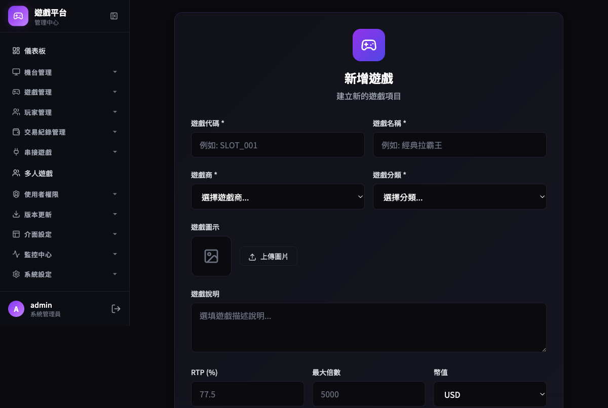

### [C16] 編輯遊戲

**操作流程**：

```
1. 在遊戲列表點擊「編輯」按鈕
2. 修改遊戲資料
3. 儲存變更
```

**可編輯欄位**：所有新增時的欄位均可編輯（遊戲代碼除外）

### [L09] 遊戲啟用/停用

**操作流程**：

```
1. 在遊戲列表點擊狀態開關
2. 確認變更
3. 系統自動更新並廣播至所有機台
```

**說明**：

- 停用後玩家無法進入該遊戲
- 正在遊戲中的玩家會收到提示並自動退出
- 可設定維護中狀態，顯示維護公告

### [L10] 遊戲版本管理

**操作流程**：

```
1. 選擇遊戲後點擊「版本管理」
2. 查看版本歷史
3. 上傳新版本
4. 設定版本為正式版
```

**版本欄位**：

| 欄位名稱 | 類型 | 說明                    |
| -------- | ---- | ----------------------- |
| 版本號   | 文字 | 格式：Major.Minor.Patch |
| 上架日期 | 日期 | 版本發布日期            |
| 狀態     | 標籤 | 測試中/正式版/已下架    |
| 更新內容 | 文字 | 版本變更說明            |

### [L27] 遊戲分類管理

**操作流程**：

```
1. 進入「遊戲分類」子頁籤
2. 新增/編輯/刪除分類
3. 設定分類排序
4. 設定分類圖示
```

### [C53] 遊戲商管理

**功能說明**：
根據遊戲供應商 API 進行動態調整，管理供應商連線與遊戲同步。

**操作流程**：

```
1. 進入「遊戲供應商」子頁籤
2. 查看供應商列表
3. 設定供應商參數
4. 同步遊戲列表
5. 監控 API 連線狀態
```

**供應商欄位**：

| 欄位名稱   | 類型     | 說明             |
| ---------- | -------- | ---------------- |
| 供應商名稱 | 文字     | 供應商顯示名稱   |
| API 端點   | URL      | 供應商 API 網址  |
| API 金鑰   | 加密文字 | 連線驗證用       |
| 連線狀態   | 標籤     | 線上/離線/異常   |
| 最後同步   | 日期時間 | 上次遊戲同步時間 |

---

## 3.3 多人遊戲操作

### [C57] 牌桌列表檢視

**功能說明**：
多人遊戲（真人百家樂、龍虎、骰寶等）由遊戲供應商 API 動態提供，牌桌資訊來自第三方系統。

**操作流程**：

```
1. 進入「多人遊戲」模組
2. 查看牌桌列表
3. 使用遊戲類型篩選
4. 點擊牌桌查看詳情
```

**牌桌欄位**：

| 欄位名稱 | 類型   | 說明                |
| -------- | ------ | ------------------- |
| 牌桌編號 | 文字   | 供應商提供的牌桌 ID |
| 遊戲類型 | 標籤   | 百家樂/龍虎/骰寶    |
| 供應商   | 文字   | 所屬遊戲供應商      |
| 狀態     | 標籤   | 開放/關閉/維護中    |
| 最低限注 | 數值   | 最低投注金額        |
| 最高限注 | 數值   | 最高投注金額        |
| 莊家抽水 | 百分比 | 抽水比例            |
| 在線人數 | 數值   | 當前在線玩家數      |

**畫面 Mockup**：
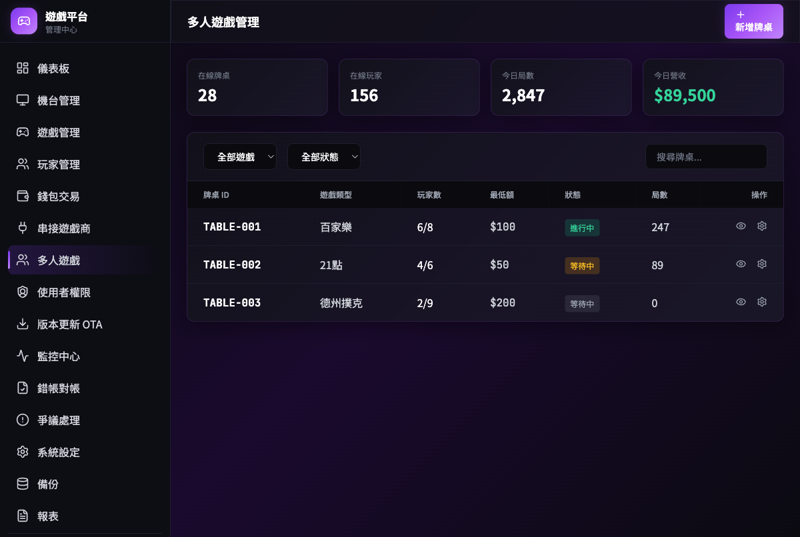

### [C58] 牌桌狀態監控

**操作流程**：

```
1. 選擇牌桌
2. 查看即時狀態
3. 監控投注情況
4. 查看異常告警
```

**監控資訊**：

| 監控項目 | 說明                 |
| -------- | -------------------- |
| 當前牌靴 | 牌靴編號、剩餘牌數   |
| 歷史結果 | 最近 20 局結果       |
| 即時投注 | 當前總投注額         |
| 異常狀態 | 連線異常、金額異常等 |

### [C59] 牌桌配置管理

**操作流程**：

```
1. 選擇牌桌
2. 點擊「配置」
3. 設定投注限額
4. 設定抽水比例
5. 儲存設定
```

**可配置項目**：

| 項目     | 類型   | 範圍      | 說明         |
| -------- | ------ | --------- | ------------ |
| 最低限注 | 數值   | 1-999999  | 最低投注金額 |
| 最高限注 | 數值   | 1-9999999 | 最高投注金額 |
| 莊家抽水 | 百分比 | 0-50%     | 莊家贏家抽成 |
| 單注上限 | 數值   | 1-999999  | 單筆投注上限 |
| 單局上限 | 數值   | 1-9999999 | 單局投注上限 |

### [C60] 牌局歷史查詢

**操作流程**：

```
1. 進入「牌局歷史」
2. 設定篩選條件
3. 查詢歷史記錄
4. 查看詳情或匯出
```

**篩選條件**：

| 條件     | 類型     | 說明             |
| -------- | -------- | ---------------- |
| 遊戲類型 | 多選     | 百家樂/龍虎/骰寶 |
| 牌桌     | 多選     | 特定牌桌         |
| 時間範圍 | 日期區間 | 查詢區間         |
| 結果     | 多選     | 莊/閒/和         |

### [C62] 牌靴管理

**功能說明**：
管理牌靴（ Shoe ）的副數、張數、換靴規則。

**操作流程**：

```
1. 選擇牌桌
2. 進入「牌靴管理」
3. 設定牌靴參數
4. 查看當前牌靴狀態
```

**設定欄位**：

| 欄位名稱           | 類型     | 說明          |
| ------------------ | -------- | ------------- |
| 牌靴副數           | 數字     | 1-8 副牌      |
| 剩餘多少張觸發換靴 | 數字     | 建議 20-40 張 |
| 換靴規則           | 下拉選單 | 自動/手動     |

### [C65] 異常狀態告警

**告警類型**：

| 告警類型 | 說明          | 處理方式            |
| -------- | ------------- | ------------------- |
| 連線中斷 | API 連線異常  | 自動重連/通知管理員 |
| 金額異常 | 投注/派彩異常 | 標記並人工處理      |
| 牌靴異常 | 牌數計算異常  | 強制換靴            |
| 荷官異常 | 荷官操作逾時  | 切換荷官            |

---

## 3.4 使用者權限操作

### [C70] 帳號新增/編輯

**操作流程**：

```
1. 進入「使用者管理」
2. 點擊「新增帳號」或「編輯」
3. 填寫帳號基本資料
4. 設定權限角色
5. 若為本地端操作人員，需設定/重置 4-6 位數 PIN 碼
6. 儲存變更
```

**輸入欄位**：

| 欄位名稱    | 類型     | 必填 | 說明                         |
| ----------- | -------- | ---- | ---------------------------- |
| 帳號        | 文字     | ✅   | 登入帳號，最長 50 字元       |
| 密碼        | 密碼     | ✅   | 初始密碼（集中式後台登入用） |
| 本地 PIN 碼 | 密碼數值 | ⚠️   | 供本地端登入，4-6位數字      |
| 姓名        | 文字     | ✅   | 使用者姓名                   |
| Email       | 文字     | ✅   | 通知用 Email                 |
| 電話        | 文字     | -    | 聯絡電話                     |
| 角色        | 下拉選單 | ✅   | 選擇權限角色                 |
| 狀態        | 開關     | ✅   | 啟用/停用                    |

### [C70] 帳號編輯/刪除

**操作流程**：

```
1. 在帳號列表點擊「編輯」
2. 修改帳號資料
3. 儲存變更
```

**刪除帳號**：

- 停用帳號：保留資料但禁止登入
- 刪除帳號：移除帳號資料（需確認）

### [C71] 角色權限設定

**操作流程**：

```
1. 進入「角色管理」
2. 新增/編輯角色
3. 設定功能權限
4. 儲存角色
```

**權限類型**：

| 權限 | 說明           |
| ---- | -------------- |
| 檢視 | 可查看功能畫面 |
| 新增 | 可新增資料     |
| 編輯 | 可修改資料     |
| 刪除 | 可刪除資料     |
| 匯出 | 可匯出資料     |
| 管理 | 可設定權限     |

**預設角色**：

| 角色       | 權限範圍              |
| ---------- | --------------------- |
| 系統管理員 | 全部功能              |
| 站長       | 本站點全部功能        |
| 客服       | 查詢/編輯（不含刪除） |
| 稽核       | 僅檢視/匯出           |

### 3.4.4 操作權限矩陣

#### 3.4.4.1 功能權限對照表

| 功能模組     | 系統管理員 | 站長 | 客服 | 稽核      | 行銷 |
| ------------ | ---------- | ---- | ---- | --------- | ---- |
| 儀表板       | 全部       | 全部 | 檢視 | 檢視      | 檢視 |
| 機台管理     | 全部       | 全部 | 檢視 | 檢視      | -    |
| 遊戲管理     | 全部       | 全部 | 檢視 | 檢視      | 檢視 |
| 玩家管理     | 全部       | 全部 | 編輯 | 檢視      | 檢視 |
| 交易紀錄管理 | 全部       | 全部 | 檢視 | 檢視/匯出 | -    |
| 串接遊戲     | 全部       | 全部 | 檢視 | 檢視      | -    |
| 多人遊戲     | 全部       | 全部 | 檢視 | 檢視      | -    |
| 使用者權限   | 全部       | 本身 | -    | -         | -    |
| 版本更新     | 全部       | 本身 | -    | -         | -    |
| 介面設定     | 全部       | 本身 | -    | -         | 編輯 |
| 監控中心     | 全部       | 全部 | 檢視 | -         | -    |
| 系統設定     | 全部       | 全部 | 檢視 | -         | -    |
| 同步對帳     | 全部       | 全部 | -    | 檢視/處理 | -    |

> **說明**：全部 = 檢視 + 新增 + 編輯 + 刪除 + 匯出

#### 3.4.4.2 權限顆粒度

| 權限層級 | 代碼 | 說明             |
| -------- | ---- | ---------------- |
| 無權限   | ❌   | 看不到此功能     |
| 檢視     | 👁   | 可查看畫面與資料 |
| 編輯     | ✏️ | 可新增/修改資料  |
| 刪除     | 🗑   | 可刪除資料       |
| 匯出     | 📥   | 可匯出資料       |
| 管理     | ⚙️ | 可設定權限       |

#### 3.4.4.3 權限制定原則

```
┌─────────────────────────────────────────────────────┐
│              權限制定流程                             │
├─────────────────────────────────────────────────────┤
│  1. 確認帳號用途                                     │
│     └── 內部人員 → 使用者權限模組                     │
│                                                     │
│  2. 選擇角色                                        │
│     └── 根據工作職責選擇預設角色                      │
│                                                     │
│  3. 客製化調整                                       │
│     └── 依需求增減特定權限                           │
│                                                     │
│  4. 審核確認                                        │
│     └── 主管審核後啟用                               │
└─────────────────────────────────────────────────────┘
```

**核心原則**：

- **最小權限** - 只給完成工作需要的最低權限
- **職責分離** - 稽核與操作分開
- **記錄所有** - 所有權限變更都留日誌

#### 3.4.4.4 動態角色自定義（進階）

系統支援動態角色自定義引擎，可細部勾選 API 權限：

**使用場景**：

- 審計員：僅開放交易查詢 API
- 查帳會計：僅開放報表匯出 API
- 維修外包：僅開放機台狀態查看 API

**自定義權限類型**：

- 功能模組權限
- API 端點權限
- 資料範圍權限（特定站點）
- 時間權限（上班時間才能操作）

### [C72] 操作日誌審計

**功能說明**：
記錄所有使用者的操作行為，供稽核與問題追蹤。

**操作流程**：

```
1. 進入「操作日誌」
2. 設定篩選條件
3. 查詢日誌記錄
4. 匯出日誌
```

**日誌欄位**：

| 欄位名稱 | 說明                  |
| -------- | --------------------- |
| 執行時間 | 操作時間              |
| 帳號     | 操作者帳號            |
| 功能     | 作業模組              |
| 動作     | 新增/編輯/刪除/登入等 |
| 來源 IP  | 客戶端 IP             |
| 詳細內容 | 變更前/後資料         |

---

## 3.5 介面設定操作

### [C77] 遊戲分類排序

**操作流程**：

```
1. 進入「分類排序」
2. 拖曳調整順序
3. 設定顯示/隱藏
4. 儲存排序
```

**功能**：

- 拖曳排序
- 隱藏/顯示分類
- 設定分類圖示

**畫面 Mockup**：
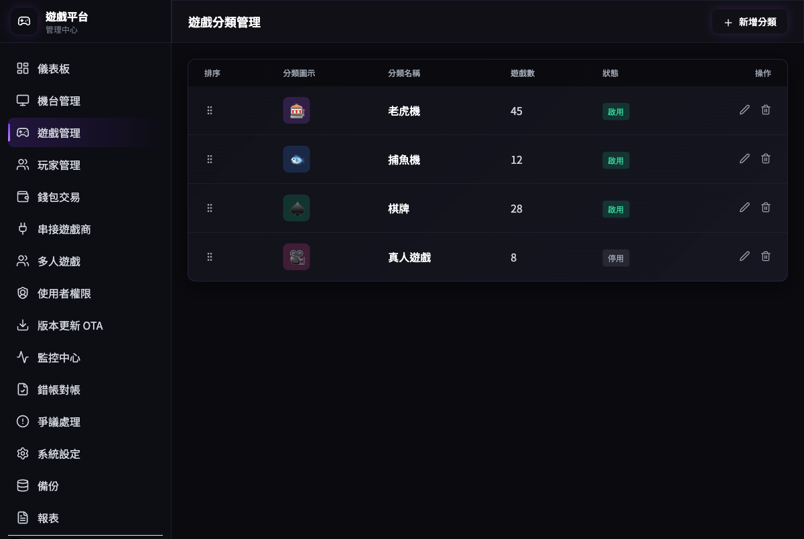

### [C80] 推薦遊戲設定

**操作流程**：

```
1. 進入「推薦遊戲」
2. 選擇要推薦的遊戲
3. 設定推薦位置
4. 設定顯示期間
5. 儲存設定
```

**推薦類型**：

| 類型     | 說明         |
| -------- | ------------ |
| 首頁推薦 | 大廳首頁顯示 |
| 熱門推薦 | 熱門遊戲區塊 |
| 新遊戲   | 最新上架遊戲 |
| 活動推薦 | 活動相關遊戲 |

### [C76] 公告管理

**操作流程**：

```
1. 進入「公告管理」
2. 新增/編輯公告
3. 設定發布時間
4. 選擇顯示位置
5. 儲存公告
```

**公告欄位**：

| 欄位名稱 | 類型     | 說明                  |
| -------- | -------- | --------------------- |
| 標題     | 文字     | 公告標題              |
| 內容     | 文字     | 公告內容（支援 HTML） |
| 類型     | 下拉選單 | 系統/活動/維護        |
| 顯示位置 | 多選     | 大廳/遊戲內/登入頁    |
| 開始時間 | 日期時間 | 顯示開始時間          |
| 結束時間 | 日期時間 | 顯示結束時間          |
| 狀態     | 開關     | 啟用/停用             |

**畫面 Mockup**：
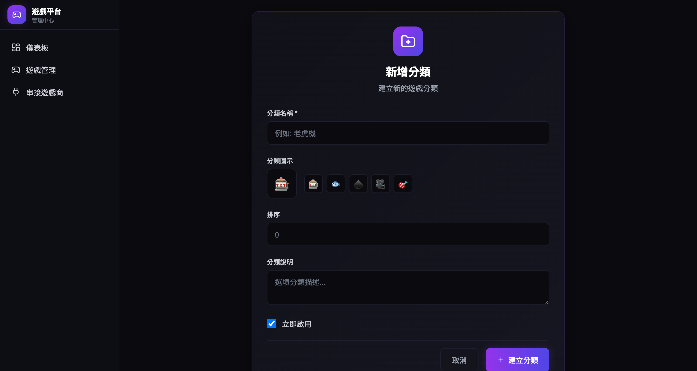

### [C81] 前端版面廣播模組

**功能說明**：

即時廣播訊息到所有在線客戶端，包含系統公告、遊戲通知、跑馬燈、彈出訊息等。支援單次發送、排程發送、目標篩選及效果追蹤。

**操作流程**：

```
1. 進入「廣播管理」
2. 選擇廣播類型
3. 編輯廣播內容
4. 選擇目標範圍
5. 設定發送時間（即時/排程）
6. 發送廣播
7. 追蹤廣播效果
```

#### 3.5.4.1 廣播類型說明

| 類型     | 代碼      | 顯示位置 | 顯示方式 | 適用場景           |
| -------- | --------- | -------- | -------- | ------------------ |
| 跑馬燈   | marquee   | 畫面頂部 | 滾動文字 | 重要公告、優惠活動 |
| 彈出視窗 | popup     | 螢幕中央 | 強制顯示 | 系統通知、活動提醒 |
| 系統訊息 | system    | 通知區域 | 一般訊息 | 一般性通知         |
| 遊戲通知 | game      | 遊戲內   | 遊戲邊緣 | 遊戲相關資訊       |
| 全域廣播 | broadcast | 所有頁面 | 頂部橫幅 | 緊急公告、維護通知 |

**內容格式支援**：

- 純文字
- 文字 + 表情符號
- 文字 + 圖片（URL）
- 文字 + 超連結

#### 3.5.4.2 目標篩選條件

| 篩選條件 | 類型     | 說明             |
| -------- | -------- | ---------------- |
| 站點範圍 | 多選     | 選擇目標站點     |
| 玩家等級 | 多選     | VIP 等級篩選     |
| 註冊時間 | 日期區間 | 限定玩家註冊時間 |
| 餘額範圍 | 數值區間 | 限定玩家餘額範圍 |
| 機台類型 | 多選     | 限定特定機台     |
| 遊戲類型 | 多選     | 限定特定遊戲     |

**預設目標選項**：

| 選項     | 說明                 |
| -------- | -------------------- |
| 全體玩家 | 發送給所有玩家       |
| 在線玩家 | 僅發送給當前在線玩家 |
| 指定玩家 | 選擇特定玩家發送     |
| 指定站點 | 選擇特定站點發送     |

#### 3.5.4.3 排程廣播

**排程類型**：

| 類型     | 說明               | 範例              |
| -------- | ------------------ | ----------------- |
| 立即發送 | 立即推送到客戶端   | 緊急公告          |
| 延遲發送 | 設定延遲時間後發送 | 5分鐘後提醒       |
| 定時發送 | 指定精確時間發送   | 每日下午3點       |
| 循環發送 | 設定循環週期發送   | 每小時提醒        |
| 條件觸發 | 滿足條件自動發送   | 餘額低於100元提醒 |

**排程參數**：

| 參數     | 類型     | 說明                 |
| -------- | -------- | -------------------- |
| 開始時間 | 日期時間 | 排程開始時間         |
| 結束時間 | 日期時間 | 排程結束時間         |
| 發送間隔 | 數字     | 循環發送間隔（分鐘） |
| 發送次數 | 數字     | 循環發送次數上限     |
| 時區     | 下拉選單 | 時區設定             |

#### 3.5.4.4 廣播效果追蹤

**追蹤指標**：

| 指標   | 說明             | 計算方式              |
| ------ | ---------------- | --------------------- |
| 送達率 | 訊息成功送達比例 | 成功送達數 / 發送總數 |
| 閱讀率 | 玩家閱讀訊息比例 | 閱讀數 / 送達數       |
| 點擊率 | 玩家點擊連結比例 | 點擊數 / 閱讀數       |
| 忽略率 | 玩家未閱讀比例   | 未閱讀數 / 送達數     |

**效果報表欄位**：

| 欄位     | 類型     | 說明         |
| -------- | -------- | ------------ |
| 廣播編號 | 文字     | 系統自動產生 |
| 廣播標題 | 文字     | 廣播訊息標題 |
| 類型     | 標籤     | 廣播類型     |
| 發送時間 | 日期時間 | 實際發送時間 |
| 目標數   | 數字     | 目標玩家數   |
| 送達數   | 數字     | 成功送達數   |
| 閱讀數   | 數字     | 已閱讀數     |
| 點擊數   | 數字     | 點擊連結數   |

**匯出功能**：

- 支援匯出效果報表為 CSV 或 Excel
- 支援篩選特定時間範圍

#### 3.5.4.5 輸入欄位總覽

| 欄位名稱 | 類型     | 必填 | 說明                  |
| -------- | -------- | ---- | --------------------- |
| 廣播標題 | 文字     | ✅   | 廣播訊息標題          |
| 廣播類型 | 下拉選單 | ✅   | 選擇廣播類型          |
| 廣播內容 | 文字     | ✅   | 訊息內容（支援 HTML） |
| 目標範圍 | 多選     | ✅   | 選擇目標玩家          |
| 篩選條件 | 複合     | -    | 進階篩選條件          |
| 發送時間 | 日期時間 | ✅   | 即時/排程選擇         |
| 顯示時長 | 數字     | -    | 訊息顯示秒數          |
| 排序權重 | 數字     | -    | 多則訊息排序優先級    |

---

## 3.6 機台管理操作

### [C101] 新增機台

**操作流程**：

```
1. 點擊「新增機台」按鈕
2. 填寫機台基本資料
3. 設定機台參數
4. 驗證機台連線
5. 完成新增
```

**輸入欄位**：

| 欄位名稱 | 類型     | 必填 | 說明                       |
| -------- | -------- | ---- | -------------------------- |
| 機台編號 | 文字     | ✅   | 唯一識別碼，格式：MCH-XXXX |
| 機台名稱 | 文字     | ✅   | 自訂名稱，最長 50 字元     |
| 機台型號 | 下拉選單 | ✅   | 選擇硬體型號               |
| 所屬站點 | 下拉選單 | ✅   | 選擇所屬營業站點           |
| IP 位址  | IP       | ✅   | 機台網路位置               |
| 連接埠   | 數字     | ✅   | 預設 8080                  |
| 遊戲類型 | 多選     | ✅   | 老虎機/捕魚/棋牌           |
| 備註     | 文字     | -    | 選填備註說明               |

**畫面 Mockup**：


---

### [C101] 編輯機台

**操作流程**：

```
1. 點擊機台列表中的編輯按鈕
2. 修改機台資料
3. 儲存變更
4. 系統記錄操作日誌
```

**可編輯欄位**：

| 欄位名稱 | 說明           |
| -------- | -------------- |
| 機台名稱 | 修改顯示名稱   |
| 所屬站點 | 變更所屬站點   |
| IP 位址  | 更新網路設定   |
| 機台狀態 | 線上/離線/維護 |
| 備註     | 更新備註資訊   |

---

### [C101] 刪除機台

**操作流程**：

```
1. 選取要刪除的機台
2. 點擊刪除按鈕
3. 確認刪除對話框
4. 執行軟刪除（保留資料）
```

**刪除規則**：

- 僅可刪除離線狀態機台
- 刪除前需確認無進行中交易
- 系統保留刪除紀錄 90 天

---

### [C12] 遠端指令

**支援指令**：

| 指令名稱 | 代碼       | 說明             |
| -------- | ---------- | ---------------- |
| 重新啟動 | restart    | 遠端重啟機台系統 |
| 關機     | shutdown   | 遠端關閉機台     |
| 開分     | cash_in    | 設定機台開分分數 |
| 洗分     | cash_out   | 設定機台洗分分數 |
| 強制同步 | force_sync | 立即同步資料     |

**畫面 Mockup**：


---

## 3.7 玩家管理操作

### [C102] 新增玩家

**操作流程**：

```
1. 點擊「新增玩家」按鈕
2. 填寫玩家基本資料
3. 設定玩家權限
4. 建立錢包帳戶
5. 完成註冊
```

**輸入欄位**：

| 欄位名稱 | 類型     | 必填 | 說明                  |
| -------- | -------- | ---- | --------------------- |
| 玩家帳號 | 文字     | ✅   | 唯一識別碼，6-20 字元 |
| 玩家暱稱 | 文字     | ✅   | 顯示名稱              |
| 手機號碼 | 電話     | ✅   | 驗證用                |
| 電子郵件 | Email    | -    | 選填                  |
| VIP 等級 | 下拉選單 | ✅   | 設定會員等級          |
| 備註     | 文字     | -    | 選填                  |

**畫面 Mockup**：


---

### [C41] 餘額調整

**操作流程**：

```
1. 搜尋並選取玩家
2. 點擊「調整餘額」按鈕
3. 選擇調整類型
4. 輸入金額與原因
5. 系統驗證與執行
6. 產生交易紀錄
```

**調整類型**：

| 類型 | 代碼     | 說明     |
| ---- | -------- | -------- |
| 儲值 | deposit  | 現金儲值入帳 |
| 提現 | withdraw | 現金提領 |
| 調整 | adjust   | 人工調整 |

**驗證機制**：

- 需輸入管理 PIN 碼
- 大於 $10,000 需主管覆核
- 產生數位簽章憑證

**畫面 Mockup**：
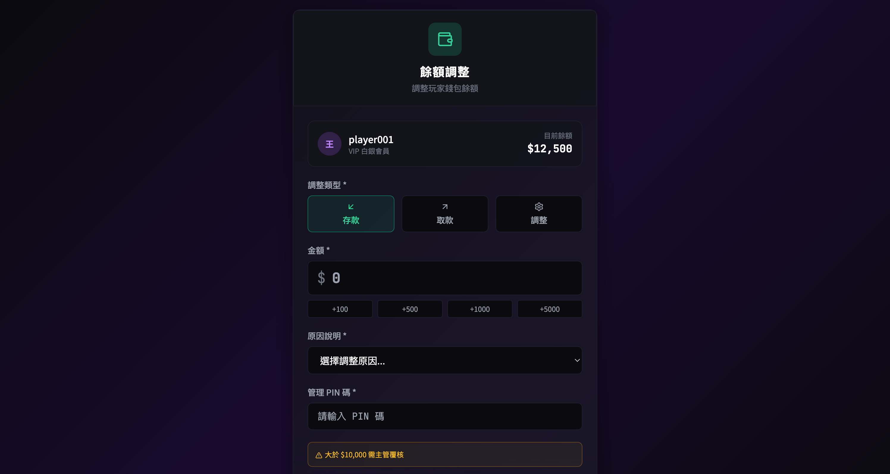

---

### [C102] 移除玩家

**操作流程**：

```
1. 搜尋目標玩家
2. 檢查帳戶狀態（餘額必須為 0）
3. 執行停用而非刪除
4. 保留交易紀錄
```

**停用規則**：

- 餘額必須為 0
- 無進行中交易
- 保留資料供查帳使用

---

## 3.8 交易紀錄管理操作

### [L15] 交易查詢

**操作流程**：

```
1. 進入交易列表頁面
2. 設定篩選條件
3. 執行查詢
4. 查看交易詳情
5. 匯出報表
```

**篩選條件**：

| 條件     | 類型       | 說明                |
| -------- | ---------- | ------------------- |
| 日期區間 | 日期picker | 起始日期 ~ 結束日期 |
| 玩家帳號 | 文字       | 精確或模糊搜尋      |
| 機台編號 | 文字       | 所屬機台            |
| 交易類型 | 多選       | 儲值/提現/調整/派彩 |
| 狀態     | 多選       | 成功/失敗/處理中    |
| 金額區間 | 數字範圍   | 最小 ~ 最大金額     |

**時間範圍快速篩選**：

- 今日
- 昨日
- 本週
- 上週
- 本月
- 上月
- 自訂區間

**畫面 Mockup**：
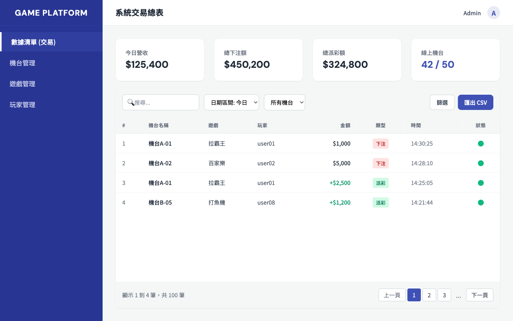

**畫面 Mockup**：
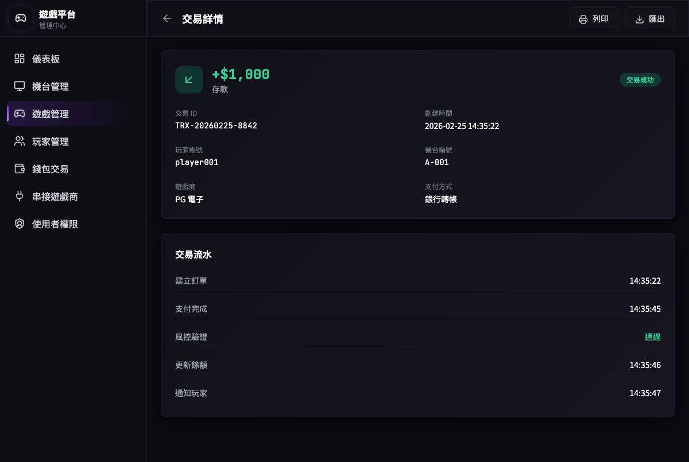

---

### [L18] 交易沖銷

**操作流程**：

```
1. 選取要沖銷的交易
2. 點擊「沖銷」按鈕
3. 填寫沖銷原因
4. 系統驗證沖銷資格
5. 執行沖銷
6. 產生反向交易
7. 記錄沖銷人員
```

**沖銷規則**：

- 僅可沖銷 24 小時內交易
- 需主管授權
- 自動產生沖銷憑證（PDF）

**輸入欄位**：

| 欄位名稱 | 類型     | 必填 | 說明         |
| -------- | -------- | ---- | ------------ |
| 沖銷原因 | 下拉選單 | ✅   | 選擇沖銷原因 |
| 詳細說明 | 文字     | ✅   | 補充說明     |
| 授權碼   | 數字     | ✅   | 主管授權碼   |

---

### [L19] 交易爭議處理

**操作流程**：

```
1. 建立爭議單
2. 調閱相關資料
3. 進行調查
4. 做出裁決
5. 執行補救措施
6. 結案存檔
```

**畫面 Mockup**：
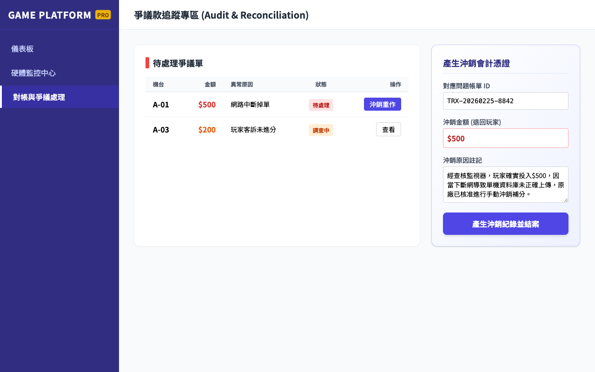

---

## 3.9 遊戲商管理操作

### [C103] 新增遊戲商

**操作流程**：

```
1. 點擊「新增遊戲商」按鈕
2. 填寫遊戲商基本資料
3. 設定 API 連線參數
4. 設定金流路由
5. 測試連線
6. 完成設定
```

**輸入欄位**：

| 欄位名稱   | 類型 | 必填 | 說明             |
| ---------- | ---- | ---- | ---------------- |
| 遊戲商代碼 | 文字 | ✅   | 唯一識別碼       |
| 遊戲商名稱 | 文字 | ✅   | 完整名稱         |
| 遊戲類型   | 多選 | ✅   | 老虎機/捕魚/棋牌 |
| API 網址   | URL  | ✅   | API 端點         |
| API 金鑰   | 密碼 | ✅   | 驗證用           |
| 清算帳戶   | 文字 | ✅   | 對帳用帳戶       |
| 備註       | 文字 | -    | 選填             |

**畫面 Mockup**：
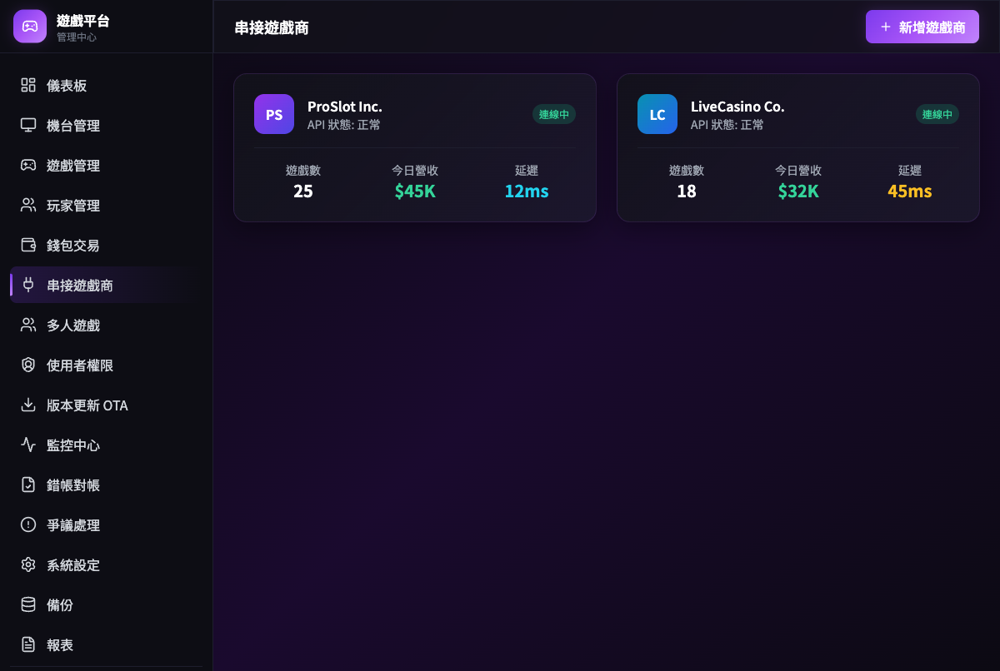

**畫面 Mockup**：
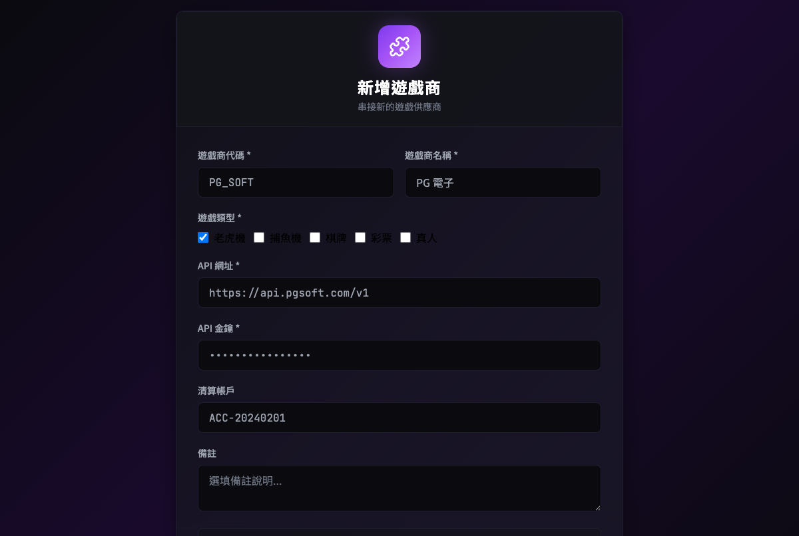

---

### [C104] 餘額查詢與轉帳

**操作流程**：

```
1. 選擇遊戲商
2. 查詢當前餘額
3. 執行轉入/轉出
4. 確認交易
5. 記錄日誌
```

**轉帳類型**：

| 類型 | 說明                 |
| ---- | -------------------- |
| 轉入 | 從中央錢包轉入遊戲商 |
| 轉出 | 從遊戲商轉回中央錢包 |
| 對帳 | 同步餘額資料         |

---

### [C103] 移除遊戲商

**操作流程**：

```
1. 停用遊戲商連線
2. 完成所有待處理交易
3. 執行下架
4. 保留歷史資料
```

---

## 3.10 OTA 更新操作

### [C105] 上傳新版本

**操作流程**：

```
1. 點擊「上傳版本」按鈕
2. 選擇版本檔案
3. 填寫版本資訊
4. 系統計算 SHA-256
5. 驗證檔案完整性
6. 完成上傳
```

**輸入欄位**：

| 欄位名稱 | 類型 | 必填 | 說明         |
| -------- | ---- | ---- | ------------ |
| 版本號碼 | 文字 | ✅   | 格式：v8.0.x |
| 版本說明 | 文字 | ✅   | 更新內容描述 |
| 檔案     | 檔案 | ✅   | .zip 格式    |
| 目標機型 | 多選 | ✅   | 適用機型     |
| 強制更新 | 開關 | -    | 是否強制更新 |

**檔案驗證**：

- 自動計算 MD5
- 自動計算 SHA-256
- 驗證檔案大小
- 檢查壓縮完整性

**畫面 Mockup**：


---

### [C74] 發布版本

**操作流程**：

```
1. 選擇要發布的版本
2. 選擇測試機台 (2-3台)
3. 開始測試派發
4. 監控 24 小時
5. 確認無異常
6. 正式派發 (全部/分批)
```

**派發模式**：

| 模式     | 說明               |
| -------- | ------------------ |
| 測試派發 | 僅派發至指定機台   |
| 全部派發 | 一次派發至所有機台 |
| 分批派發 | 按批次逐步派發     |
| 定時派發 | 設定時間自動派發   |

---

### [C73] 版本管理

**功能說明**：

- 版本列表檢視
- 派發進度監控
- 失敗自動還原
- 版本歷史記錄

---

## 3.11 監控中心操作

### [C79] 系統監控

**監控項目**：

| 項目       | 閾值                 | 告警等級 |
| ---------- | -------------------- | -------- |
| CPU 使用率 | >80% 警告, >90% 嚴重 | 黃/紅    |
| 記憶體使用 | >80% 警告            | 黃       |
| 硬碟空間   | <15% 警告            | 黃       |
| 網路延遲   | >100ms 警告          | 黃       |
| 溫度       | >60°C 警告          | 黃       |

**畫面 Mockup**：
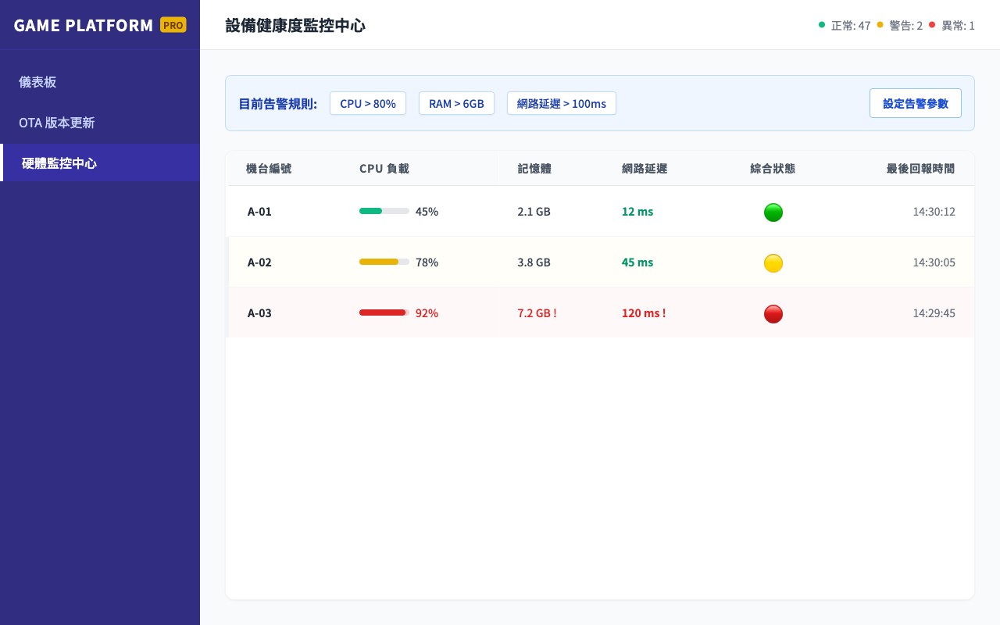

---

### [L38] 心跳檢測

**機制說明**：

- 機台每分鐘發送心跳
- 超過 3 分鐘無心跳視為離線
- 自動記錄離線時間
- 觸發告警通知

---

### [C82] 告警通知

**通知方式**：

- 系統訊息
- Email
- Telegram

---

## 3.12 錯帳對帳操作

### [L20] 錯帳類型

| 類型代碼           | 說明       |
| ------------------ | ---------- |
| missing_deposit    | 轉帳未到帳 |
| missing_withdrawal | 轉出未確認 |
| payout_error       | 派彩錯誤   |
| system_error       | 系統錯誤   |

### [L20] 錯帳處理流程

**操作流程**：

```
1. 偵測錯帳 (自動/人工)
2. 建立錯帳單
3. 調查原因
4. 選擇處理方式
5. 執行補發/退款/沖銷
6. 產生憑證 (PDF)
7. 結案
```

**處理方式**：

| 方式 | 說明         |
| ---- | ------------ |
| 補發 | 重新執行交易 |
| 退款 | 退還款項     |
| 沖銷 | 反向沖銷     |

**畫面 Mockup**：


---

### [C94] 錢包自動對帳

**對帳時間**：每日 UTC 00:00

**對帳項目**：

- 中央錢包 vs 遊戲商錢包
- 交易紀錄一致性
- 餘額驗證

**告警規則**：

- 錯帳金額 > $1000 發送通知

---

## 3.13 爭議對帳處理專區

### [L20] 功能說明

**什麼是爭議對帳處理專區？**

爭議對帳處理專區是專門處理交易爭議的區塊，當玩家對交易結果有異議時（例如：充值未到帳、派彩錯誤、重複扣款等），管理員可以在此建立爭議單、进行调查、做出裁決並執行補救措施。

**爭議類型**：

| 類型代碼            | 說明       | 嚴重程度 |
| ------------------- | ---------- | -------- |
| deposit_not_arrived | 充值未到帳 | 高       |
| duplicate_charge    | 重複扣款   | 高       |
| payout_error        | 派彩錯誤   | 高       |
| withdrawal_failed   | 提現失敗   | 中       |
| balance_discrepancy | 餘額不符   | 中       |
| system_error        | 系統錯誤   | 高       |
| fraud_suspicion     | 疑似洗錢   | 高       |

### [L20] 爭議單建立

**操作流程**：

```
1. 進入「爭議對帳處理專區」
2. 點擊「建立爭議單」
3. 選擇爭議類型
4. 填寫爭議詳情
5. 關聯相關交易
6. 提交爭議單
```

**輸入欄位**：

| 欄位名稱     | 類型     | 必填         | 說明                    |
| ------------ | -------- | ------------ | ----------------------- |
| 爭議單編號   | 文字     | 系統自動產生 | 格式：DSP-YYYYMMDD-XXXX |
| 爭議類型     | 下拉選單 | ✅           | 選擇爭議類型            |
| 玩家帳號     | 文字     | ✅           | 發生問題的玩家帳號      |
| 關聯交易編號 | 文字     | ✅           | 有問題的交易編號        |
| 問題描述     | 文字     | ✅           | 詳細描述問題情況        |
| 期望處理方式 | 下拉選單 | ✅           | 補發/退款/沖銷/其他     |
| 緊急程度     | 下拉選單 | ✅           | 一般/緊急/立即處理      |
| 附件上傳     | 檔案     | -            | 相關截圖或證據          |
| 負責人       | 文字     | 系統自動帶入 | 建立人帳號              |

**緊急程度說明**：

| 等級     | 回覆時間 | 說明             |
| -------- | -------- | ---------------- |
| 一般     | 24小時內 | 一般性問題       |
| 緊急     | 4小時內  | 影響玩家遊戲體驗 |
| 立即處理 | 1小時內  | 嚴重影響營運     |

### [L20] 調查流程

**操作流程**：

```
1. 審視爭議單內容
2. 調閱相關交易紀錄
3. 查詢系統日誌
4. 比對多方資料
5. 撰寫調查報告
```

**調查項目**：

| 調查項目     | 說明             | 資料來源   |
| ------------ | ---------------- | ---------- |
| 交易紀錄     | 調閱完整交易流水 | 交易資料庫 |
| 現金交易紀錄 | 核對現金收付記錄 | 現金日誌   |
| 玩家操作日誌 | 確認玩家操作時間 | 系統日誌   |
| 機台交易紀錄 | 核對機台本地資料 | 本地資料庫 |

**調查狀態**：

| 狀態   | 說明           |
| ------ | -------------- |
| 待處理 | 新建立待處理   |
| 调查中 | 正在調查中     |
| 待覆核 | 調查完成待覆核 |
| 裁決中 | 正在做出裁決   |
| 處理中 | 正在執行補救   |
| 已結案 | 處理完成       |
| 已駁回 | 駁回爭議       |

### [L20] 裁決與補救

**裁決選項**：

| 裁決結果    | 說明                            |
| ----------- | ------------------------------- |
| 成立-補發   | 確認問題，補發款項              |
| 成立-退款   | 確認問題，退還款項              |
| 成立-沖銷   | 確認問題，執行沖銷              |
|             | 成立-其他確認問題，其他補救方式 |
| 不成立-駁回 | 駁回爭議申請                    |
| 證據不足    | 需要更多證據                    |

**補救操作**：

| 操作類型 | 說明             | 需主管授權 |
| -------- | ---------------- | ---------- |
| 餘額調整 | 直接調整玩家餘額 | 是         |
| 補發交易 | 重新執行交易     | 是         |
| 沖銷交易 | 反向沖銷交易     | 是         |
| 派彩修正 | 修正派彩結果     | 是         |
| 優惠補償 | 發放優惠券/彩金  | 是         |

**裁決輸入欄位**：

| 欄位名稱 | 類型     | 必填 | 說明         |
| -------- | -------- | ---- | ------------ |
| 裁決結果 | 下拉選單 | ✅   | 選擇裁決結果 |
| 裁決理由 | 文字     | ✅   | 詳細裁決說明 |
| 補救金額 | 數字     | -    | 補救金額     |
| 補救方式 | 下拉選單 | -    | 選擇補救方式 |
| 授權碼   | 數字     | ✅   | 主管授權碼   |
| 備註     | 文字     | -    | 補充說明     |

### [L20] 歷史記錄

**歷史記錄功能**：

- 完整保留所有爭議單處理歷程
- 可追蹤每個狀態的變更時間
- 記錄所有操作人員
- 保留相關通聯記錄

**歷史記錄欄位**：

| 欄位       | 說明           |
| ---------- | -------------- |
| 爭議單編號 | 爭議單唯一識別 |
| 玩家帳號   | 發生問題的玩家 |
| 爭議類型   | 問題類型       |
| 建立時間   | 爭議單建立時間 |
| 處理時間   | 總處理時長     |
| 裁決結果   | 最終裁決       |
| 處理人     | 最後處理人員   |
| 結案時間   | 結案時間       |

**篩選與查詢**：

| 篩選條件 | 類型       | 說明         |
| -------- | ---------- | ------------ |
| 日期區間 | 日期picker | 建立日期範圍 |
| 爭議類型 | 多選       | 問題類型篩選 |
| 狀態     | 多選       | 爭議單狀態   |
| 緊急程度 | 多選       | 緊急程度     |
| 處理人   | 多選       | 負責人員     |
| 玩家帳號 | 文字       | 玩家帳號搜尋 |

**統計報表**：

| 指標         | 說明                   |
| ------------ | ---------------------- |
| 爭議總數     | 期間內建立的所有爭議單 |
| 爭議成立率   | 成立數 / 總數          |
| 平均處理時間 | 從建立到結案平均天數   |
| 熱門爭議類型 | 各類型數量排行         |
| 處理人績效   | 各處理人處理數量與時效 |

**匯出功能**：

- 支援匯出歷史記錄為 CSV 或 Excel
- 支援自訂欄位匯出

---

## 3.14 本地後台操作

> **📌 設計特點**：本地端採用行動端優先的觸控式操作介面，適合機台螢幕操作。包含漢堡選單（側邊欄）+ 底部導航欄設計。

### [L08] 儀表板

**功能說明**：
本地儀表板顯示本機 KPI 數據、快速操作按鈕、系統狀態等資訊。

**畫面 Mockup**：
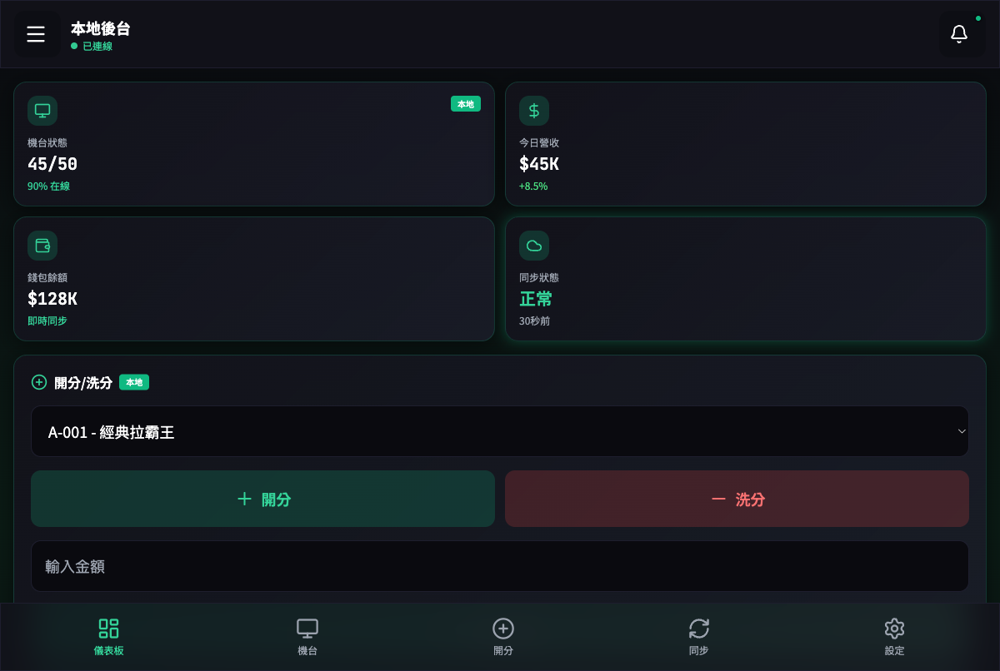

---

### [L02] 機台狀態

**功能說明**：
顯示本機硬體狀態（CPU、記憶體、硬碟）、網路狀態（延遲、IP）、遊戲狀態、系統資訊等。

**監控項目**：

| 項目         | 說明           |
| ------------ | -------------- |
| 硬體狀態     | CPU/記憶體/硬碟使用率 |
| 網路狀態     | 延遲、IP 位址   |
| 遊戲狀態     | 目前遊戲、版本   |
| 系統資訊     | 運行時間、同步狀態 |

**畫面 Mockup**：
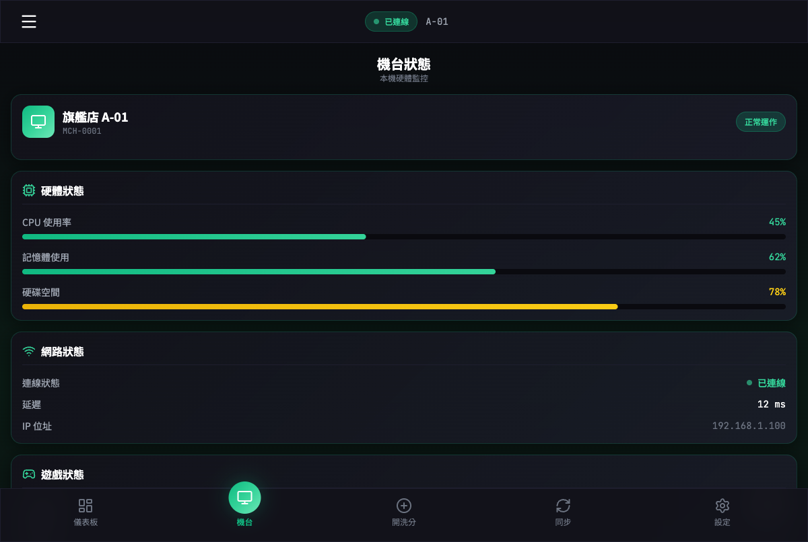

---

### [L08] 開分/洗分

**操作流程**：

```
1. 輸入 PIN 碼登入（識別操作人員）
2. 選擇機台
3. 輸入分數
4. 確認執行
5. 產生紀錄（並記錄操作人員 ID operatorId）
```

**畫面 Mockup**：
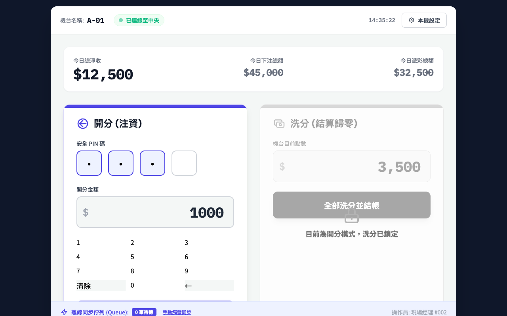

---

### [L34] 同步狀態

**功能說明**：
顯示中央伺服器連線狀態、同步歷史記錄、離線佇列、手動同步功能。

**同步類型**：

| 類型     | 說明             |
| -------- | ---------------- |
| 自動同步 | 背景定時同步     |
| 手動同步 | 立即同步         |
| 強制同步 | 忽略衝突強制同步 |

**同步機制**：

- 指數退避重試
- 衝突偵測與解決
- 離線交易暫存

**畫面 Mockup**：
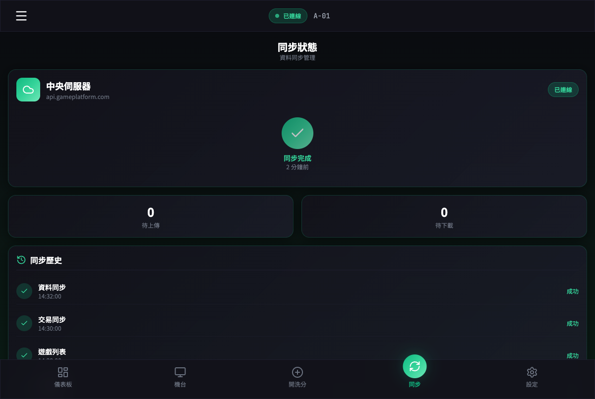

---

### [C87] 系統設定

**設定項目**：

| 項目     | 說明           |
| -------- | -------------- |
| 機台名稱 | 顯示名稱       |
| 連線設定 | 中央伺服器位址 |
| 同步間隔 | 資料同步頻率   |
| 警示閾值 | 各種告警設定   |
| 清除快取 | 清除本地快取   |

**畫面 Mockup**：
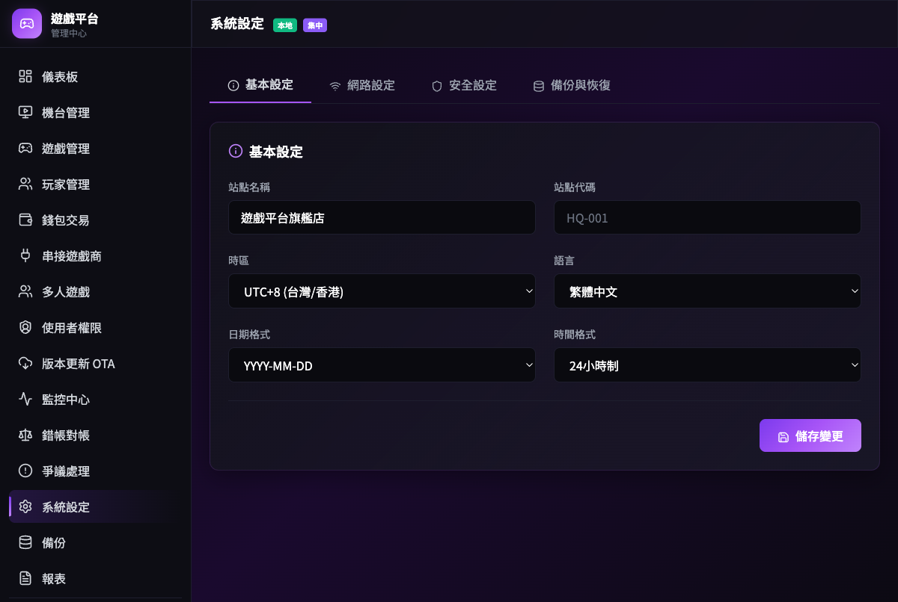

---

## 3.15 錢包管理操作

### [C106] 錢包總覽

**功能說明**：
錢包管理提供中央錢包的統一管理，包括餘額查詢、轉帳、對帳等功能。

**操作流程**：

```
1. 進入「錢包管理」模組
2. 查看中央錢包餘額
3. 檢視各遊戲商錢包餘額
4. 執行轉帳操作
5. 進行對帳
```

**錢包類型**：

| 類型       | 說明                     |
| ---------- | ------------------------ |
| 中央錢包   | 主帳戶，集中管理所有資金 |
| 遊戲商錢包 | 各遊戲供應商帳戶         |

**畫面 Mockup**：
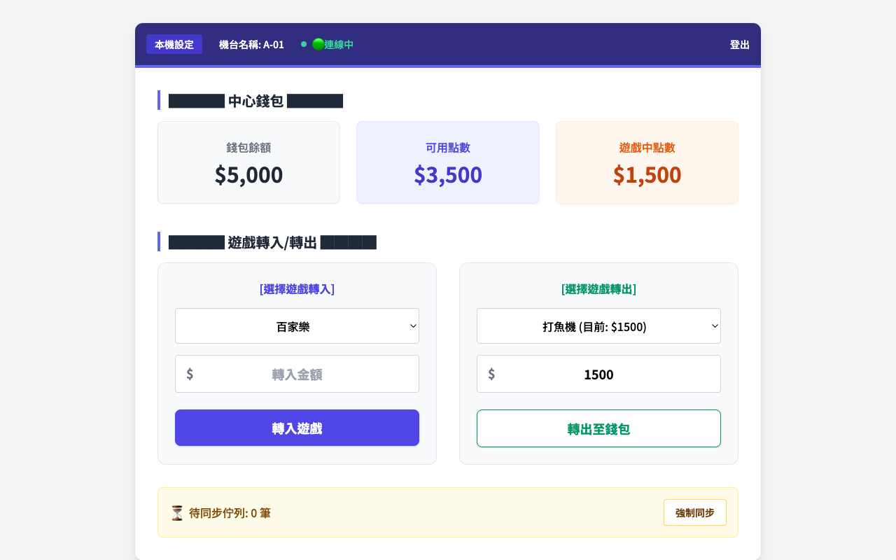

### [C106] 轉帳操作

**操作流程**：

```
1. 選擇來源錢包
2. 選擇目標錢包
3. 輸入轉帳金額
4. 確認轉帳
5. 記錄日誌
```

---

## 3.16 備份操作

### [L28] 資料備份

**操作流程**：

```
1. 進入「系統設定」模組
2. 選擇「備份與恢復」
3. 點擊「建立備份」
4. 選擇備份類型（完整/增量）
5. 執行備份
6. 下載備份檔案
```

**備份類型**：

| 類型     | 說明           |
| -------- | -------------- |
| 完整備份 | 備份所有資料   |
| 增量備份 | 僅備份變更資料 |
| 設定備份 | 仅备份系统设定 |

**畫面 Mockup**：
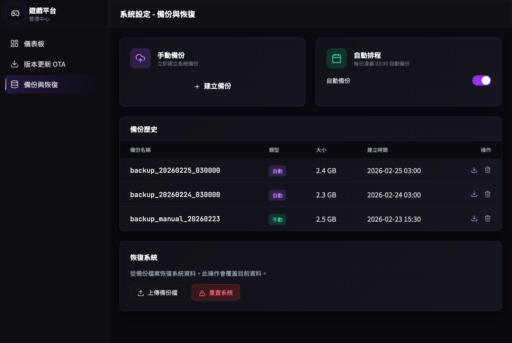

### [L28] 資料恢復

**操作流程**：

```
1. 選擇備份檔案
2. 驗證檔案完整性
3. 確認恢復
4. 執行資料覆蓋
5. 驗證資料一致性
```

---

## 3.17 報表操作

### [C47] 營收報表

**操作流程**：

```
1. 進入「報表」模組
2. 選擇「營收報表」
3. 設定時間範圍
4. 選擇篩選條件（可多選）
5. 產生報表
6. 匯出或列印
```

**篩選維度**（且可多選）：

| 維度 | 說明 | 範例 |
|------|------|------|
| **門市** | 按分店/門市篩選（可多選） | 台北門市A區、台中門市、高雄門市 |
| **機台** | 按機台篩選（可多選） | 機台編號、機台名稱 |
| **遊戲** | 按遊戲篩選（可多選） | 老虎機、捕魚機、棋牌 |
| **遊戲商** | 按遊戲供應商篩選（可多選） | RG電子、JDB電子、RT電子 |

**報表類型**：

| 類型   | 說明         |
| ------ | ------------ |
| 日報表 | 每日營收統計 |
| 週報表 | 每週營收統計 |
| 月報表 | 每月營收統計 |
| 年報表 | 每年營收統計 |

**營收欄位**：

| 欄位 | 說明 |
|------|------|
| 總營收 | 派彩 - 下注 |
| 下注總額 | 所有下注金額合計 |
| 派彩總額 | 所有派彩金額合計 |
| 遊戲局數 | 總遊戲次數 |
| 營收(RTP) | 派彩率 |

**畫面 Mockup**：
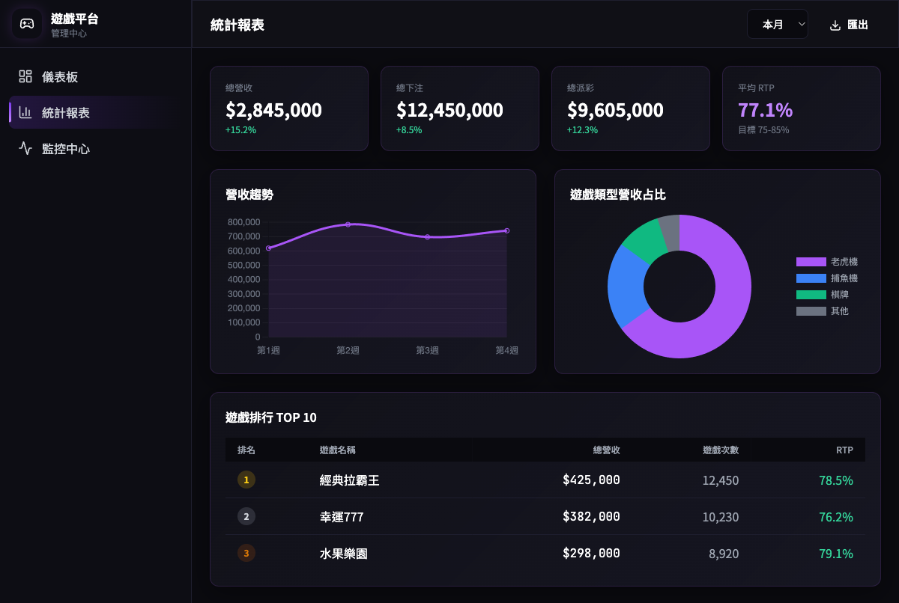

### [C48] 遊戲報表

**操作流程**：

```
1. 選擇「遊戲報表」
2. 設定遊戲類型
3. 選擇時間範圍
4. 檢視遊戲表現分析
5. 匯出報表
```

### [C49] 玩家報表

**操作流程**：

```
1. 選擇「玩家報表」
2. 設定玩家篩選條件
3. 檢視玩家統計分析
4. 分析玩家行為
5. 匯出報表
```

---

## 3.18 畫面 Mockup 對照

> **📌 更新說明**：本地端採用行動端優化設計，支援觸控操作，所有頁面提供 HTML 互動版本。

### 集中式後台 Mockup

| 功能       | Mockup 截圖                                                                         |
| ---------- | ---------------------------------------------------------------------------------- |
| 登入頁面   | 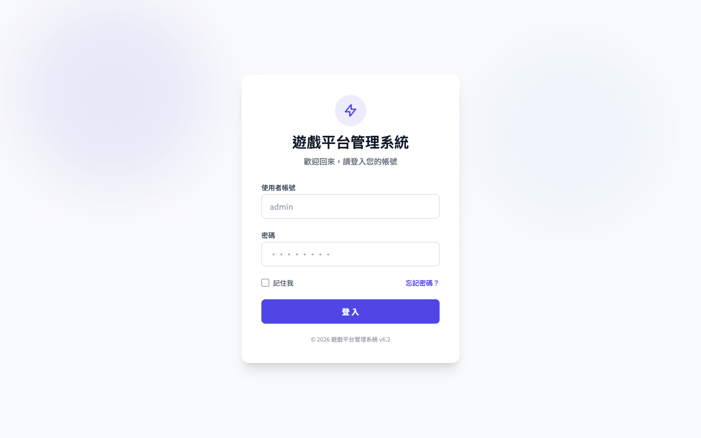 |
| 儀表板     |  |
| 機台列表   |  |
| 機台新增   | 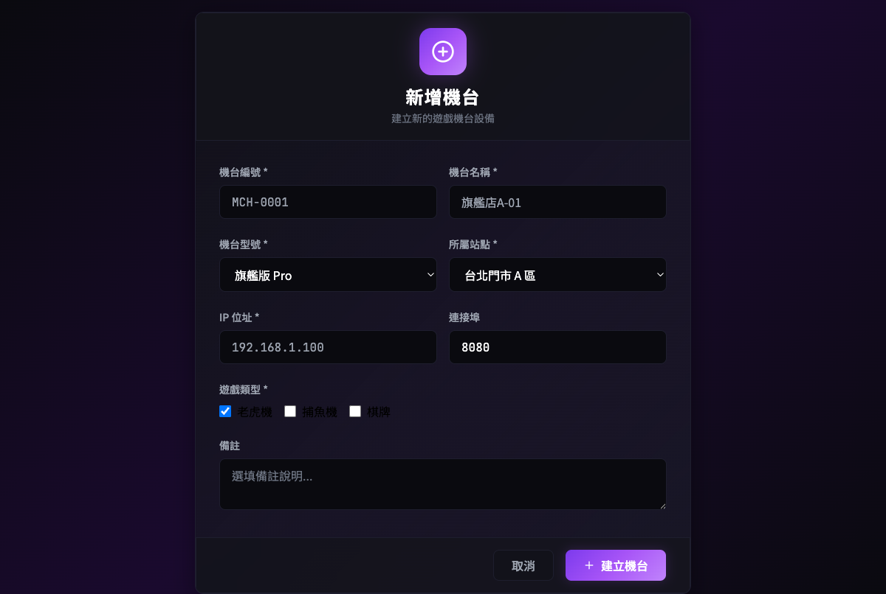 |
| 玩家列表   | 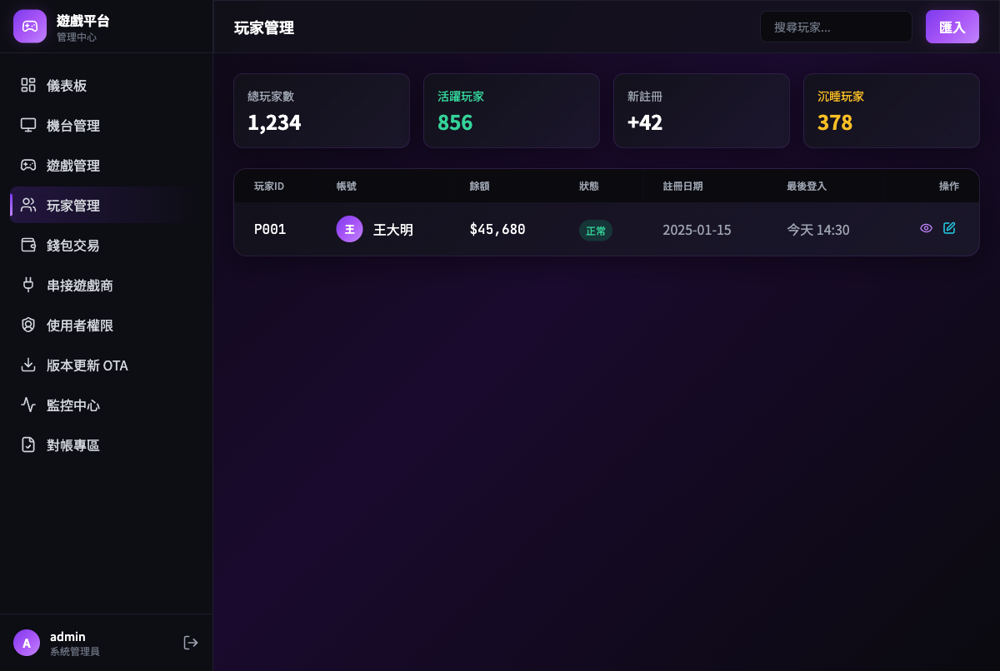 |
| 玩家新增   |  |
| 餘額調整   |  |
| 交易列表   |  |
| 交易詳情   |  |
| 遊戲新增   |  |
| 遊戲商列表 |  |
| 遊戲商新增 |  |
| 錢包管理   |  |
| 遊戲分類   |  |
| 分類新增   |  |
| 多人遊戲   |  |
| 報表       |  |
| 預備       |  |
| OTA 更新   |  |
| 監控中心   |  |
| 錯帳對帳   |  |
| 使用者權限 | 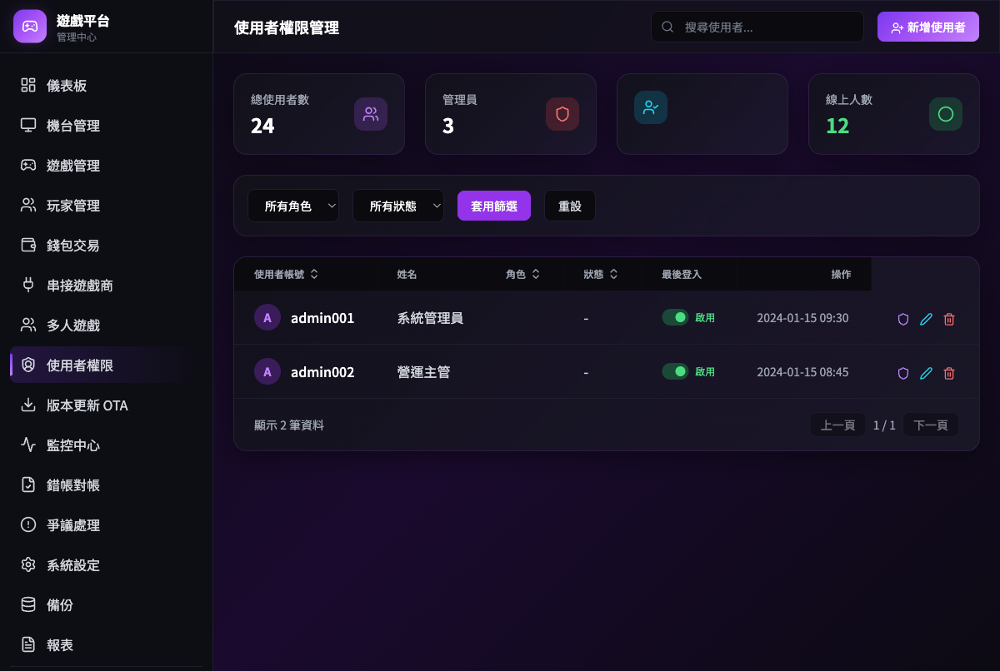 |
| 多帳號管理 |  |
| 系統設定   |  |

### 本地端後台 Mockup（行動端優化）

> **📌 設計特點**：採用行動端優先的觸控式操作介面，漢堡選單 + 底部導航欄，適合機台螢幕操作。

| 功能       | Mockup 截圖                                                                         |
| ---------- | ---------------------------------------------------------------------------------- |
| 本地表板   |  |
| 機台狀態   |  |
| 開分/洗分  |  |
| 同步狀態   |  |
| 本機設定   | 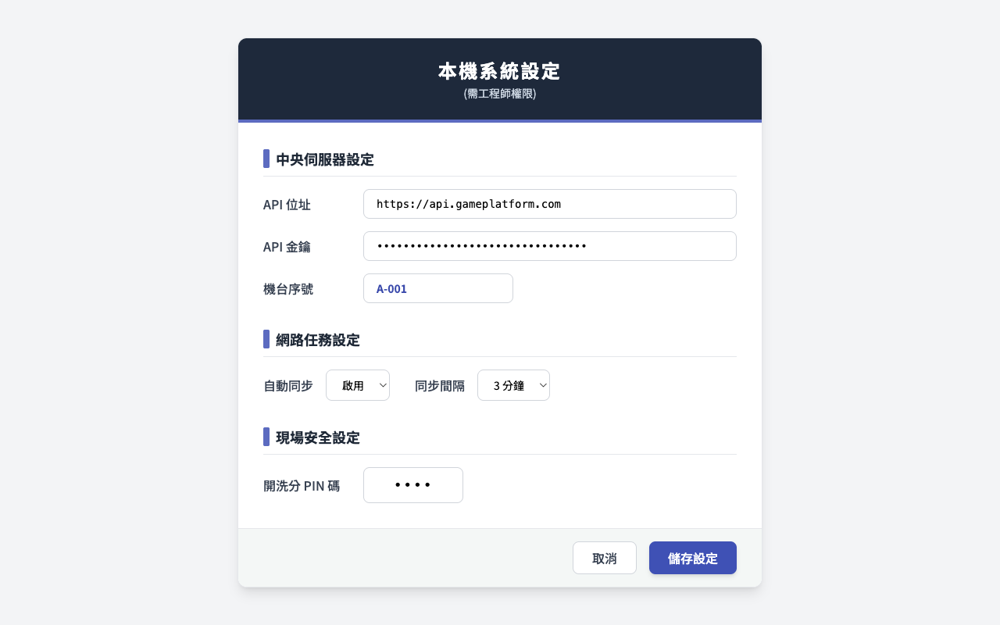 |

---

# 4. 附錄

## 4.1 術語對照表

| 術語 | 英文           | 說明                   |
| ---- | -------------- | ---------------------- |
| 標配 | Standard       | 預設包含的功能         |
| 選配 | Optional       | 額外付費或客製化的功能 |
| 風控 | Risk Control   | 風險控制機制           |
| 對帳 | Reconciliation | 驗證雙方資料一致性     |
| 同步 | Sync           | 資料同步               |
| 充值 | Deposit        | 玩家儲值               |
| 兌換 | Withdrawal     | 玩家提現               |
| 下注 | Bet            | 遊戲下注               |
| 派彩 | Payout         | 遊戲派獎               |

---

# 5. 版本歷史

| 版本 | 日期       | 變更說明                                    |
| ---- | ---------- | ------------------------------------------- |
| v8.0 | 2026-02-25 | 新增功能需求矩陣與流程圖 (= V8 旗艦版 + C#) |
| v8.1 | 2026-02-25 | 新增開發時程建議（遊戲串接 5家內 +2 週）    |
| v8.2 | 2026-02-25 | SA修正版工時評估（含測試時間與15% Buffer）  |
