# 功能需求矩陣與流程圖 (= V8 旗艦版 + C#)

## 版本資訊

| 屬性               | 內容              |
| ------------------ | ----------------- |
| **版本**     | v8.8              |
| **日期**     | 2026 年 3 月 14 日 |
| **文件類型** | 需求補充          |

---

# 1. 功能需求矩陣

> **📌 遊戲管理模組關係說明**
>
> | 模組                         | 說明                                            | 比喻       |
> | ---------------------------- | ----------------------------------------------- | ---------- |
> | **遊戲管理** (C16-C17) | 管理「遊戲本身」- 哪些遊戲可以玩、上架/下架     | 餐廳菜單   |
> | **串接遊戲** (C53-C56) | 管理「供應商 API」- 連接到供應商、單人/多人遊戲 | 餐廳供應商 |
> | **多人遊戲** (C57-C67) | 管理「真人牌桌」- 百家樂/龍虎/骰寶 牌桌管理     | 餐廳座位   |
>
> ⚠️ **多人遊戲斷線保護**：必須保持連線方可進行遊戲交易，不支援離線下注。
>
> - 串接遊戲管理連接到供應商後，供應商可能提供「單人遊戲」或「多人遊戲」
> - 多人遊戲的遊戲來自外部供應商（非系統自行決定）

## 1.1 系統功能需求矩陣 - 集中式後台 [CMxx]

> **說明**：集中式後台（中央後台）统一管理所有功能，可遠端控制本地機台。

| 功能代碼                      | 功能名稱               | 操作路徑                      | 文件路徑 / Mockup                                                                                                                                                  | 備註 |
| ----------------------------- | ---------------------- | ----------------------------- | ------------------------------------------------------------------------------------------------------------------------------------------------------------------ | ---- |
| **[CM01] 儀表板**       |                        |                               |                                                                                                                                                                    |      |
| [C01]                         | KPI 監控               | 儀表板                        | [[C01]KPI 監控.md](./feature_docs/central/[CM01]儀表板/[C01]KPI%20監控.md) / [mockup_dashboard.html](./mockup/central/mockup_dashboard.html)                                              |      |
| [C05]                         | 系統通知               | 儀表板                        | [[C05]系統通知.md](./feature_docs/central/[CM01]儀表板/[C05]系統通知.md) / [mockup_system_notifications.html](./mockup/central/mockup_system_notifications.html)                        |      |
| [C02]                         | 硬體/網路狀態          | 儀表板                        | [[C02]硬體網路狀態.md](./feature_docs/central/[CM01]儀表板/[C02]硬體網路狀態.md) / [mockup_hardware_status.html](./mockup/central/mockup_hardware_status.html)                              |      |
| **[CM02] 機台管理**     |                        |                               |                                                                                                                                                                    |      |
| [C101]                        | 機台編輯/刪除          | 機台管理/機台列表:編輯        | [[C101]機台編輯刪除.md](./feature_docs/central/[CM02]機台管理/[C101]機台編輯刪除.md) / [mockup_machine_settings.html](./mockup/central/mockup_machine_settings.html)                           |      |
| [C107]                        | 機台標籤管理           | 機台管理/標籤管理             | [[C107]機台 Tag 管理系統設計.md](./feature_docs/central/[CM02]機台管理/[C107]機台%20Tag%20管理系統設計.md) / [mockup_machine_tag_list.html](./mockup/central/mockup_machine_tag_list.html)                |      |
| [C108]                        | 遊戲機台註冊流程       | 機台管理/機台註冊             | [[C108]遊戲機台註冊流程.md](./feature_docs/central/[CM02]機台管理/[C108]遊戲機台註冊流程.md) / [mockup_machine_registration.html](./mockup/central/mockup_machine_registration.html) / [mockup_machine_key_generate.html](./mockup/central/mockup_machine_key_generate.html) / [mockup_machine_approval.html](./mockup/central/mockup_machine_approval.html)             |      |
| [C113]                        | 機台設定傳輸介面與格式 | 機台管理/機台設定             | [[C113]機台設定傳輸介面與格式.md](./feature_docs/central/[CM02]機台管理/[C113]機台設定傳輸介面與格式.md) / [mockup_machine_config_transfer.html](./mockup/central/mockup_machine_config_transfer.html) |      |
| [C12]                         | 遠端指令               | 機台管理/機台列表             | [[C12]遠端指令.md](./feature_docs/central/[CM02]機台管理/[C12]遠端指令.md) / [mockup_machine_remote_control.html](./mockup/central/mockup_machine_remote_control.html)                  |      |
| [C14]                         | 機台設定               | 機台管理/機台列表:機台設定    | [[C14]機台設定.md](./feature_docs/central/[CM02]機台管理/[C14]機台設定.md) / [mockup_machine_settings.html](./mockup/central/mockup_machine_settings.html)                              |      |
| [C15]                         | 測試模式               | 機台管理/機台列表             | [[C15]測試模式.md](./feature_docs/central/[CM02]機台管理/[C15]測試模式.md) / [mockup_test_mode.html](./mockup/central/mockup_test_mode.html)                                            |      |
| **[CM03] 遊戲管理**     |                        |                               |                                                                                                                                                                    |      |
| [C16]                         | 遊戲新增/編輯/刪除     | 遊戲管理/遊戲列表:新增/編輯   | [[C16]遊戲新增編輯刪除.md](./feature_docs/central/[CM03]遊戲管理/[C16]遊戲新增編輯刪除.md) / [mockup_mvp_game_add.html](./mockup/central/mockup_mvp_game_add.html)                              |      |
| [C21]                         | 遊戲啟用/停用          | 遊戲管理/遊戲列表             | [[C21]遊戲啟用停用.md](./feature_docs/central/[CM03]遊戲管理/[C21]遊戲啟用停用.md) / [mockup_game_toggle.html](./mockup/central/mockup_game_toggle.html)                                    |      |
| [C25]                         | 遊戲配置               | 遊戲管理/遊戲列表             | [[C25]遊戲配置.md](./feature_docs/central/[CM03]遊戲管理/[C25]遊戲配置.md) / [mockup_game_config.html](./mockup/central/mockup_game_config.html)                                        |      |
| [C28]                         | 遊戲測試               | 遊戲管理/遊戲列表             | [[C28]遊戲測試.md](./feature_docs/central/[CM03]遊戲管理/[C28]遊戲測試.md) / [mockup_game_test.html](./mockup/central/mockup_game_test.html)                                            |      |
| [C106]                        | 代理錢包管理           | 遊戲管理/代理錢包             | [[C106]代理錢包管理.md](./feature_docs/central/[CM03]遊戲管理/[C106]代理錢包管理.md) / [mockup_std_wallet.html](./mockup/central/mockup_std_wallet.html)                                     |      |
| **[CM04] 交易紀錄管理** |                        |                               |                                                                                                                                                                    |      |
| [C44]                         | 交易統計               | 交易紀錄管理/交易列表         | [[C44]交易統計.md](./feature_docs/central/[CM04]交易紀錄管理/[C44]交易統計.md) / [mockup_transaction_stats.html](./mockup/central/mockup_transaction_stats.html)                        |      |
| [C45]                         | 交易對帳               | 交易紀錄管理/對帳中心         | [[C45]交易對帳.md](./feature_docs/central/[CM04]交易紀錄管理/[C45]交易對帳.md) / [mockup_flg_reconciliation.html](./mockup/central/mockup_flg_reconciliation.html)                      |      |
| [C47]                         | 營收報表               | 交易紀錄管理/營收報表         | [[C47]營收報表.md](./feature_docs/central/[CM04]交易紀錄管理/[C47]營收報表.md) / [mockup_revenue_report.html](./mockup/central/mockup_revenue_report.html)                              |      |
| [C48]                         | 遊戲排行               | 交易紀錄管理/營收報表         | [[C48]遊戲排行.md](./feature_docs/central/[CM04]交易紀錄管理/[C48]遊戲排行.md) / [mockup_game_ranking.html](./mockup/central/mockup_game_ranking.html)                                  |      |
| [C51]                         | 交易導出               | 遊戲管理/交易紀錄:匯出        | [[C51]交易導出.md](./feature_docs/central/[CM04]交易紀錄管理/[C51]交易導出.md) / [mockup_transaction_export.html](./mockup/central/mockup_transaction_export.html)                      |      |
| **[CM05] 串接遊戲**     |                        |                               |                                                                                                                                                                    |      |
| [C53]                         | 遊戲商列表檢視         | 串接遊戲/遊戲商管理           | [[C53]遊戲商列表檢視.md](./feature_docs/central/[CM05]串接遊戲/[C53]遊戲商列表檢視.md) / [mockup_std_provider_list.html](./mockup/central/mockup_std_provider_list.html)                      |      |
| [C103]                        | 遊戲商新增/編輯/刪除   | 串接遊戲/遊戲商管理:新增/編輯 | [[C103]遊戲商新增編輯刪除.md](./feature_docs/central/[CM05]串接遊戲/[C103]遊戲商新增編輯刪除.md) / [mockup_std_provider_add.html](./mockup/central/mockup_std_provider_add.html)                   |      |
| [C104]                        | 遊戲商餘額歸集與轉帳   | 串接遊戲/遊戲商管理           | [[C104]遊戲商餘額歸集與轉帳.md](./feature_docs/central/[CM05]串接遊戲/[C104]遊戲商餘額歸集與轉帳.md) / [mockup_provider_balance.html](./mockup/central/mockup_provider_balance.html)                 |      |
| [C54]                         | API 連線狀態監控       | 串接遊戲/API 監控             | [[C54]API 連線狀態監控.md](./feature_docs/central/[CM05]串接遊戲/[C54]API%20連線狀態監控.md) / [mockup_api_status_monitor.html](./mockup/central/mockup_api_status_monitor.html)                  |      |
| [C55]                         | 遊戲同步管理           | 串接遊戲/遊戲同步             | [[C55]遊戲同步管理.md](./feature_docs/central/[CM05]串接遊戲/[C55]遊戲同步管理.md) / [mockup_game_sync.html](./mockup/central/mockup_game_sync.html)                                        |      |
| [C56]                         | API 日誌查詢           | 串接遊戲/API 日誌             | [[C56]API 日誌查詢.md](./feature_docs/central/[CM05]串接遊戲/[C56]API%20日誌查詢.md) / [mockup_api_log.html](./mockup/central/mockup_api_log.html)                                            |      |
| **[CM06] 多人遊戲**     |                        |                               |                                                                                                                                                                    |      |
| [C57]                         | 牌桌列表檢視           | 多人遊戲/牌桌管理             | [[C57]牌桌列表檢視.md](./feature_docs/central/[CM06]多人遊戲/[C57]牌桌列表檢視.md) / [mockup_std_multiplayer.html](./mockup/central/mockup_std_multiplayer.html)                            |      |
| [C58]                         | 牌桌狀態監控           | 多人遊戲/牌桌監控             | [[C58]牌桌狀態監控.md](./feature_docs/central/[CM06]多人遊戲/[C58]牌桌狀態監控.md) / [mockup_multiplayer_status.html](./mockup/central/mockup_multiplayer_status.html)                      |      |
| [C59]                         | 牌桌配置管理           | 多人遊戲/牌桌配置             | [[C59]牌桌配置管理.md](./feature_docs/central/[CM06]多人遊戲/[C59]牌桌配置管理.md) / [mockup_multiplayer_config.html](./mockup/central/mockup_multiplayer_config.html)                      |      |
| [C60]                         | 牌局歷史查詢           | 多人遊戲/牌局歷史             | [[C60]牌局歷史查詢.md](./feature_docs/central/[CM06]多人遊戲/[C60]牌局歷史查詢.md) / [mockup_multiplayer_history.html](./mockup/central/mockup_multiplayer_history.html)                    |      |
| [C61]                         | 遊戲類型篩選           | 多人遊戲/牌桌管理             | [[C61]遊戲類型篩選.md](./feature_docs/central/[CM06]多人遊戲/[C61]遊戲類型篩選.md) / [mockup_game_type_filter.html](./mockup/central/mockup_game_type_filter.html)                          |      |
| [C62]                         | 牌靴管理               | 多人遊戲/牌桌管理:牌靴        | [[C62]牌靴管理.md](./feature_docs/central/[CM06]多人遊戲/[C62]牌靴管理.md) / [mockup_multiplayer_shoe.html](./mockup/central/mockup_multiplayer_shoe.html)                              |      |
| [C63]                         | 投注額設定             | 多人遊戲/牌桌管理             | [[C63]投注額設定.md](./feature_docs/central/[CM06]多人遊戲/[C63]投注額設定.md) / [mockup_multiplayer_bet.html](./mockup/central/mockup_multiplayer_bet.html)                              |      |
| [C64]                         | 莊家抽水設定           | 多人遊戲/牌桌管理             | [[C64]莊家抽水設定.md](./feature_docs/central/[CM06]多人遊戲/[C64]莊家抽水設定.md) / [mockup_multiplayer_bet.html](./mockup/central/mockup_multiplayer_bet.html)                            |      |
| [C65]                         | 異常狀態告警           | 多人遊戲/牌桌監控             | [[C65]異常狀態告警.md](./feature_docs/central/[CM06]多人遊戲/[C65]異常狀態告警.md) / [mockup_multiplayer_alerts.html](./mockup/central/mockup_multiplayer_alerts.html)                      |      |
| [C66]                         | 荷官操作紀錄           | 多人遊戲/牌局歷史             | [[C66]荷官操作紀錄.md](./feature_docs/central/[CM06]多人遊戲/[C66]荷官操作紀錄.md) / [mockup_multiplayer_dealer.html](./mockup/central/mockup_multiplayer_dealer.html)                      |      |
| [C67]                         | 牌局歷史匯出           | 多人遊戲/牌局歷史             | [[C67]牌局歷史匯出.md](./feature_docs/central/[CM06]多人遊戲/[C67]牌局歷史匯出.md) / [mockup_multiplayer_history.html](./mockup/central/mockup_multiplayer_history.html)                    |      |
| **[CM07] 使用者權限**   |                        |                               |                                                                                                                                                                    |      |
| [C70]                         | 帳號新增/編輯/刪除     | 使用者權限/帳號管理:新增/編輯 | [[C70]帳號新增編輯刪除.md](./feature_docs/central/[CM07]使用者權限/[C70]帳號新增編輯刪除.md) / [mockup_user_edit.html](./mockup/central/mockup_user_edit.html)                                  |      |
| [C71]                         | 角色權限設定           | 使用者權限/角色管理           | [[C71]角色權限設定.md](./feature_docs/central/[CM07]使用者權限/[C71]角色權限設定.md) / [mockup_user_permission.html](./mockup/central/mockup_user_permission.html)                          |      |
| [C72]                         | 操作日誌審計           | 使用者權限/操作日誌           | [[C72]操作日誌審計.md](./feature_docs/central/[CM07]使用者權限/[C72]操作日誌審計.md) / [mockup_audit_log.html](./mockup/central/mockup_audit_log.html)                                      |      |
| **[CM08] 版本更新**     |                        |                               |                                                                                                                                                                    |      |
| [C73]+[C105]               | 版本管理 (整合)         | 版本更新/版本管理             | [[C73]版本列表管理.md](./feature_docs/central/[CM08]版本更新/[C73]版本列表管理.md) / [mockup_version_list.html](./mockup/central/mockup_version_list.html) (總覽/版本列表/上傳)                                            |      |
| [C74]                         | 任務下發           | 版本更新/任務下發             | [[C74]更新任務下發.md](./feature_docs/central/[CM08]版本更新/[C74]更新任務下發.md) / [mockup_ota_task_deploy.html](./mockup/central/mockup_ota_task_deploy.html)                            |      |
| [C75]                         | 更新進度監控           | 版本更新/更新進度             | [[C75]更新進度監控.md](./feature_docs/central/[CM08]版本更新/[C75]更新進度監控.md) / [mockup_update_progress.html](./mockup/central/mockup_update_progress.html)                            |      |
| **[CM09] 介面設定**     |                        |                               |                                                                                                                                                                    |      |
| [C77]                         | 遊戲分類排序           | 介面設定/遊戲分類             | [[C77]遊戲分類排序.md](./feature_docs/central/[CM09]介面設定/[C77]遊戲分類排序.md) / [mockup_std_category_add.html](./mockup/central/mockup_std_category_add.html)                          |      |
| [C80]                         | 推薦遊戲設定           | 介面設定/推薦遊戲             | [[C80]推薦遊戲設定.md](./feature_docs/central/[CM09]介面設定/[C80]推薦遊戲設定.md) / [mockup_recommended_games.html](./mockup/central/mockup_recommended_games.html)                        |      |
| [C76]                         | 公告管理               | 介面設定/公告管理             | [[C76]公告管理.md](./feature_docs/central/[CM09]介面設定/[C76]公告管理.md) / [mockup_announcement.html](./mockup/central/mockup_announcement.html)                                      |      |
| [C81]                         | 前端版面廣播模組       | 介面設定/版面廣播             | [[C81]前端版面廣播模組.md](./feature_docs/central/[CM09]介面設定/[C81]前端版面廣播模組.md) / [mockup_broadcast_management.html](./mockup/central/mockup_broadcast_management.html)              |      |
| [C78]                         | 前端大廳配置           | 介面設定/大廳配置             | [[C78]前端大廳配置.md](./feature_docs/central/[CM09]介面設定/[C78]前端大廳配置.md) / [mockup_lobby_settings.html](./mockup/central/mockup_lobby_settings.html)                              |      |
| **[CM10] 監控中心**     |                        |                               |                                                                                                                                                                    |      |
| [C79]                         | 系統監控               | 監控中心/系統監控             | [[C79]系統監控.md](./feature_docs/central/[CM10]監控中心/[C79]系統監控.md) / [mockup_system_monitor.html](./mockup/central/mockup_system_monitor.html)                                  |      |
| [C83]                         | 告警閾值設定           | 監控中心/告警設定             | [[C83]告警閾值設定.md](./feature_docs/central/[CM10]監控中心/[C83]告警閾值設定.md) / [mockup_alert_threshold.html](./mockup/central/mockup_alert_threshold.html)                            |      |
| [C82]                         | 告警通知               | 監控中心/告警管理             | [[C82]告警通知.md](./feature_docs/central/[CM10]監控中心/[C82]告警通知.md) / [mockup_alert_notifications.html](./mockup/central/mockup_alert_notifications.html)                        |      |
| [C86]                         | 日誌查詢               | 監控中心/日誌查詢             | [[C86]日誌查詢.md](./feature_docs/central/[CM10]監控中心/[C86]日誌查詢.md) / [mockup_log_query.html](./mockup/central/mockup_log_query.html)                                            |      |
| **[CM11] 系統設定**     |                        |                               |                                                                                                                                                                    |      |
| [C69]                         | 系統登入               | 系統設定/登入                 | [[C69]系統登入.md](./feature_docs/central/[CM07]使用者權限/[C69]系統登入.md) / [mockup_login.html](./mockup/central/mockup_login.html)                                              |      |
| [C96]                         | 安全設定               | 系統設定/安全設定             | [[C96]安全設定.md](./feature_docs/central/[CM11]系統設定/[C96]安全設定.md) / [mockup_security_settings.html](./mockup/central/mockup_security_settings.html)                          |      |
| [C97]                         | 備份與還原             | 系統設定/備份與還原           | [[C97]備份與還原.md](./feature_docs/central/[CM11]系統設定/[C97]備份與還原.md) / [mockup_std_backup.html](./mockup/central/mockup_std_backup.html)                |      |
| **[CM12] 同步與對帳**   |                        |                               |                                                                                                                                                                    |      |
| [C93]                         | 手動同步               | 對帳與同步中心                | [[C93]手動同步.md](./feature_docs/central/[CM12]對帳同步/[C93]手動同步.md) / [mockup_manual_sync.html](./mockup/central/mockup_manual_sync.html)                                        |      |
| [C94]                         | 對帳檢查               | 對帳與同步中心                | [[C94]對帳檢查.md](./feature_docs/central/[CM12]對帳同步/[C94]對帳檢查.md) / [mockup_reconciliation_check.html](./mockup/central/mockup_reconciliation_check.html)                      |      |
| [C95]                         | 同步日誌               | 對帳與同步中心                | [[C95]同步日誌.md](./feature_docs/central/[CM12]對帳同步/[C95]同步日誌.md) / [mockup_sync_logs.html](./mockup/central/mockup_sync_logs.html)                                            |      |

---

## 1.2 系統功能需求矩陣 - 本地後台 [LMxx]

> **說明**：本地後台（單機本地）為雲端快取端點，資料由集中式統一管理。本地無法直接修改核心資料，僅能檢視快取或暫存佇列。
>
> **本地端權限**：
>
> - ⚠️ 唯讀：資料來自雲端快取，僅供檢視
> - 📝 佇列：本地暫存，連線時上傳至雲端
> - ⚙️ 局部：僅本地網路參數等基本設定

| 功能代碼                      | 功能名稱           | 操作路徑                | 文件路徑 / Mockup                                                                                                                                                                      | 備註 |
| ----------------------------- | ------------------ | ----------------------- | -------------------------------------------------------------------------------------------------------------------------------------------------------------------------------------- | ---- |
| **[LM01] 儀表板**       |                    |                         |                                                                                                                                                                                        |      |
| [L01]                         | 營收趨勢圖 (週)    | 儀表板                  | [[L01]營收趨勢圖.md](./feature_docs/local/[LM01]儀表板/[L01]營收趨勢圖.md) / [mockup_local_dashboard.html](./mockup/local/mockup_local_dashboard.html)                                       |      |
| [L02]                         | 機台狀態圖         | 儀表板                  | [[L02]機台狀態圖.md](./feature_docs/local/[LM01]儀表板/[L02]機台狀態圖.md) / [mockup_local_dashboard.html](./mockup/local/mockup_local_dashboard.html)                                       |      |
| [L03]                         | 熱門遊戲排行       | 儀表板                  | [[L03]熱門遊戲排行.md](./feature_docs/local/[LM01]儀表板/[L03]熱門遊戲排行.md) / [mockup_local_dashboard.html](./mockup/local/mockup_local_dashboard.html)                                   |      |
| [L04]                         | 今日營收/下注/派彩 | 儀表板                  | [[L04]今日營收下注派彩.md](./feature_docs/local/[LM01]儀表板/[L04]今日營收下注派彩.md) / [mockup_local_dashboard.html](./mockup/local/mockup_local_dashboard.html)                           |      |
| [L08]                         | 快速操作按鈕       | 儀表板                  | [[L08]快速操作按鈕.md](./feature_docs/local/[LM01]儀表板/[L08]快速操作按鈕.md) / [mockup_local_dashboard.html](./mockup/local/mockup_local_dashboard.html)                                   |      |
| **[LM02] 機台管理**     |                    |                         |                                                                                                                                                                                        |      |
| [L05]                         | 本機資訊           | 機台管理/機台列表       | [[L05]本機資訊.md](./feature_docs/local/[LM02]機台管理/[L05]本機資訊.md) / [mockup_local_machine.html](./mockup/local/mockup_local_machine.html)                                             |      |
| [L06]                         | 本機狀態           | 機台管理/機台列表       | [[L06]本機狀態.md](./feature_docs/local/[LM02]機台管理/[L06]本機狀態.md) / [mockup_local_machine.html](./mockup/local/mockup_local_machine.html)                                             |      |
| [L38]                         | 心跳檢測與離線告警 | 機台管理/設備監控       | [[L38]心跳檢測與離線告警.md](./feature_docs/local/[LM02]機台管理/[L38]心跳檢測與離線告警.md) / [mockup_local_settings_integrated.html](./mockup/local/mockup_local_settings_integrated.html) |      |
| [L39]                         | 設備健康度儀表板   | 機台管理/設備健康度     | [[L39]設備健康度儀表板.md](./feature_docs/local/[LM02]機台管理/[L39]設備健康度儀表板.md) / [mockup_local_settings_integrated.html](./mockup/local/mockup_local_settings_integrated.html)     |      |
| [L40]                         | 網路延遲監控       | 機台管理/設備監控       | [[L40]網路延遲監控.md](./feature_docs/local/[LM02]機台管理/[L40]網路延遲監控.md) / [mockup_local_settings_integrated.html](./mockup/local/mockup_local_settings_integrated.html)             |      |
| [L41]                         | 硬體/軟體監控      | 機台管理/設備監控       | [[L41]硬體軟體監控.md](./feature_docs/local/[LM02]機台管理/[L41]硬體軟體監控.md) / [mockup_local_settings_integrated.html](./mockup/local/mockup_local_settings_integrated.html)             |      |
| **[LM03] 遊戲管理**     |                    |                         |                                                                                                                                                                                        |      |
| [L11]                         | 遊戲列表檢視       | 遊戲管理/遊戲列表       | [[L11]遊戲列表檢視.md](./feature_docs/local/[LM03]遊戲管理/[L11]遊戲列表檢視.md) / [mockup_local_game.html](./mockup/local/mockup_local_game.html)                                           |      |
| [L12]                         | 遊戲篩選           | 遊戲管理/遊戲列表       | [[L12]遊戲篩選.md](./feature_docs/local/[LM03]遊戲管理/[L12]遊戲篩選.md) / [mockup_local_game.html](./mockup/local/mockup_local_game.html)                                                   |      |
| [L13]                         | 遊戲搜尋           | 遊戲管理/遊戲列表       | [[L13]遊戲搜尋.md](./feature_docs/local/[LM03]遊戲管理/[L13]遊戲搜尋.md) / [mockup_local_game.html](./mockup/local/mockup_local_game.html)                                                   |      |
| [L14]                         | 遊戲詳情           | 遊戲管理/遊戲列表:詳情  | [[L14]遊戲詳情.md](./feature_docs/local/[LM03]遊戲管理/[L14]遊戲詳情.md) / [mockup_local_game.html](./mockup/local/mockup_local_game.html)                                                   |      |
| [L09]                         | 遊戲啟用/停用      | 遊戲管理/遊戲列表       | [[L09]遊戲啟用停用.md](./feature_docs/local/[LM03]遊戲管理/[L09]遊戲啟用停用.md) / [mockup_local_game.html](./mockup/local/mockup_local_game.html)                                           |      |
| [L10]                         | 遊戲版本管理       | 遊戲管理/遊戲列表       | [[L10]遊戲版本管理.md](./feature_docs/local/[LM03]遊戲管理/[L10]遊戲版本管理.md) / [mockup_local_game.html](./mockup/local/mockup_local_game.html)                                           |      |
| [L29]                         | 遊戲供應商管理     | 遊戲管理/供應商管理     | [[L29]遊戲供應商管理.md](./feature_docs/local/[LM03]遊戲管理/[L29]遊戲供應商管理.md) / [mockup_local_game.html](./mockup/local/mockup_local_game.html)                                       |      |
| [L30]                         | 遊戲大廳設定       | 遊戲管理/大廳設定       | [[L30]遊戲大廳設定.md](./feature_docs/local/[LM03]遊戲管理/[L30]遊戲大廳設定.md) / [mockup_local_game.html](./mockup/local/mockup_local_game.html)                                           |      |
| [L31]                         | 遊戲參數設定       | 遊戲管理/遊戲列表       | [[L31]遊戲參數設定.md](./feature_docs/local/[LM03]遊戲管理/[L31]遊戲參數設定.md) / [mockup_local_game.html](./mockup/local/mockup_local_game.html)                                           |      |
| [L32]                         | 遊戲顯示順序       | 遊戲管理/遊戲列表       | [[L32]遊戲顯示順序.md](./feature_docs/local/[LM03]遊戲管理/[L32]遊戲顯示順序.md) / [mockup_local_game.html](./mockup/local/mockup_local_game.html)                                           |      |
| [L33]                         | 遊戲狀態查詢       | 遊戲管理/遊戲列表       | [[L33]遊戲狀態查詢.md](./feature_docs/local/[LM03]遊戲管理/[L33]遊戲狀態查詢.md) / [mockup_local_game.html](./mockup/local/mockup_local_game.html)                                           |      |
| [L43]                         | 虛擬下注           | 遊戲管理/遊戲列表       | [[L43]虛擬下注.md](./feature_docs/local/[LM03]遊戲管理/[L43]虛擬下注.md) / [mockup_local_game.html](./mockup/local/mockup_local_game.html)                                                   |      |
| [L44]                         | 遊戲餘額查詢       | 遊戲管理/遊戲列表       | [[L44]遊戲餘額查詢.md](./feature_docs/local/[LM03]遊戲管理/[L44]遊戲餘額查詢.md) / [mockup_local_game.html](./mockup/local/mockup_local_game.html)                                           |      |
| **[LM04] 交易紀錄管理** |                    |                         |                                                                                                                                                                                        |      |
| [L16]                         | 交易詳情檢視 7日   | 交易紀錄管理/交易列表   | [[L16]交易詳情檢視.md](./feature_docs/local/[LM04]交易紀錄管理/[L16]交易詳情檢視.md) / [mockup_local_cash.html](./mockup/local/mockup_local_cash.html)                                       |      |
| [L18]                         | 交易操作回滾確認   | 交易紀錄管理/異常交易   | [[L18]交易操作回滾確認.md](./feature_docs/local/[LM04]交易紀錄管理/[L18]交易操作回滾確認.md) / [mockup_local_cash.html](./mockup/local/mockup_local_cash.html)                               |      |
| [L19]                         | 異常交易處理       | 交易紀錄管理/異常交易   | [[L19]異常交易處理.md](./feature_docs/local/[LM04]交易紀錄管理/[L19]異常交易處理.md) / [mockup_local_cash.html](./mockup/local/mockup_local_cash.html)                                       |      |
| [L20]                         | 爭議對帳處理專區   | 交易紀錄管理/對帳       | [[L20]爭議對帳處理專區.md](./feature_docs/local/[LM04]交易紀錄管理/[L20]爭議對帳處理專區.md) / [mockup_local_cash.html](./mockup/local/mockup_local_cash.html)                               |      |
| [L45]                         | 遊戲開分/洗分      | 交易紀錄管理/開洗分作業 | [[L45]遊戲開分洗分.md](./feature_docs/local/[LM04]交易紀錄管理/[L45]遊戲開分洗分.md) / [mockup_local_cash.html](./mockup/local/mockup_local_cash.html)                                       |      |
| [L46]                         | 遊戲派彩           | 交易紀錄管理/開洗分作業 | [[L46]遊戲派彩.md](./feature_docs/local/[LM04]交易紀錄管理/[L46]遊戲派彩.md) / [mockup_local_cash.html](./mockup/local/mockup_local_cash.html)                                               |      |
| **[LM05] 系統與維護**   |                    |                         |                                                                                                                                                                                        |      |
| [L07]                         | 機台配置接收       | 系統/基本設定           | [[L07]機台配置接收.md](./feature_docs/local/[LM05]系統/[L07]機台配置接收.md) / [mockup_local_settings_integrated.html](./mockup/local/mockup_local_settings_integrated.html)                 |      |
| [L47]                         | 基本設定           | 系統/基本設定           | [[L47]基本設定.md](./feature_docs/local/[LM05]系統/[L47]基本設定.md) / [mockup_local_settings_integrated.html](./mockup/local/mockup_local_settings_integrated.html)                         |      |
| [L28]                         | 備份與恢復         | 系統/基本設定           | [[L28]備份與恢復.md](./feature_docs/local/[LM05]系統/[L28]備份與恢復.md) / [mockup_local_settings_integrated.html](./mockup/local/mockup_local_settings_integrated.html)                     |      |
| [L34]                         | 同步狀態檢視       | 系統/對帳與同步         | [[L34]同步狀態檢視.md](./feature_docs/local/[LM12]對帳同步/[L34]同步狀態檢視.md) / [mockup_local_settings_integrated.html](./mockup/local/mockup_local_settings_integrated.html)             |      |
| [L35]                         | 雙向佇列與交易補償 | 系統/對帳與同步         | [[L35]雙向佇列與交易補償.md](./feature_docs/local/[LM12]對帳同步/[L35]雙向佇列與交易補償.md) / [mockup_local_settings_integrated.html](./mockup/local/mockup_local_settings_integrated.html) |      |
| [L36]                         | 指數退避重試機制   | 系統/系統維護           | [[L36]指數退避重試機制.md](./feature_docs/local/[LM12]對帳同步/[L36]指數退避重試機制.md) / [mockup_local_settings_integrated.html](./mockup/local/mockup_local_settings_integrated.html)     |      |
| [L37]                         | 衝突處理與人工審核 | 系統/對帳與同步         | [[L37]衝突處理與人工審核.md](./feature_docs/local/[LM12]對帳同步/[L37]衝突處理與人工審核.md) / [mockup_local_settings_integrated.html](./mockup/local/mockup_local_settings_integrated.html) |      |
| [L42]                         | 底層通訊與金鑰加密 | 系統/系統維護           | [[L42]底層通訊與金鑰加密.md](./feature_docs/local/[LM05]系統/[L42]底層通訊與金鑰加密.md) / [mockup_local_settings_integrated.html](./mockup/local/mockup_local_settings_integrated.html)     |      |
| [L51]                         | 本地機台註冊與登入 | 系統/基本設定           | [[L51]本地機台註冊與登入流程.md](./feature_docs/local/[LM05]系統/[L51]本地機台註冊與登入流程.md) / [mockup_local_register.html](./mockup/local/mockup_local_register.html)                   |      |
| [L52]                         | 機台雙軌制PIN登入  | 系統/基本設定           | [[L52]本地機台雙軌制PIN登入流程.md](./feature_docs/local/[LM05]系統/[L52]本地機台雙軌制PIN登入流程.md) / [mockup_local_login.html](./mockup/local/mockup_local_login.html)                   |      |

## 1.2 部署與基礎設施 - 功能需求矩陣（可選）

| 功能項目                       | 備註 |
| ------------------------------ | ---- |
| [D01] 雲端部署（集中式後台）   |      |
| [D02] 本地部署（單機本地後台） |      |
| [D04] Docker 容器化部署        |      |
| [D05] PostgreSQL 主從複製      |      |
| [D10] API 監控與告警           |      |

---

## 1.3 系統功能操作矩陣 (CRUD 總覽)

| 功能模組     | 新增 | 移除 | 更新 | 查詢 | 篩選 | 匯出 |
| ------------ | ---- | ---- | ---- | ---- | ---- | ---- |
| 儀表板       | -    | -    | -    | ✅   | ✅   | ✅   |
| 遊戲管理     | ✅   | ✅   | ✅   | ✅   | ✅   | ✅   |
| 多人遊戲     | ✅   | ✅   | ✅   | ✅   | ✅   | ✅   |
| 機台管理     | ✅   | ✅   | ✅   | ✅   | ✅   | ✅   |
| 交易紀錄管理 | ✅   | -    | ✅   | ✅   | ✅   | ✅   |
| 遊戲商管理   | ✅   | ✅   | ✅   | ✅   | -    | ✅   |
| 版本更新     | ✅   | -    | ✅   | ✅   | ✅   | -    |
| 介面設定     | ✅   | ✅   | ✅   | ✅   | ✅   | -    |
| 監控中心     | -    | -    | -    | ✅   | ✅   | -    |
| 系統設定     | ✅   | -    | ✅   | ✅   | ✅   | -    |
| 同步與對帳   | -    | -    | ✅   | ✅   | ✅   | ✅   |
| 使用者權限   | ✅   | ✅   | ✅   | ✅   | ✅   | ✅   |

---

# 2. 系統流程圖

本章節匯整系統核心業務的運作流程，分為「交易與遊戲」、「機台管理與註冊維護」、「系統同步與維護」三大類。所有圖表統一使用 Mermaid 依「集中式後台 (Central)」與「單機本地後台 (Local)」之互動繪製。

---

## 2.1 交易與遊戲流程

### 2.1.1 機台開分與洗分流程 (充值與兌換) [L45 / L46]

整合現場管理員透過本地機台申請，並交由集中式後台處理風控與金流串接的完整流程。

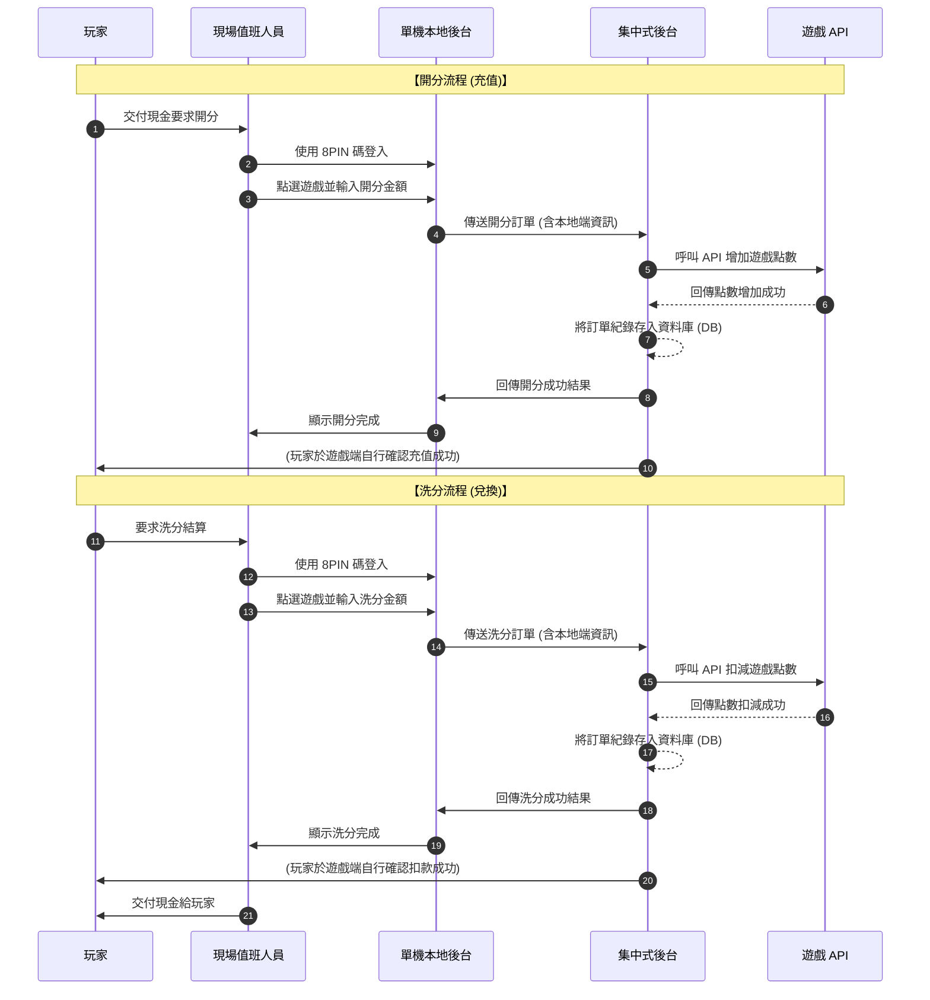

### 2.1.2 遊戲下注與派彩流程 (匿名機台模式) [L43-L46]

本流程說明未登入玩家的機台如何透過本地快取進行下注，並於背景非同步將紀錄上傳至集中式後台。

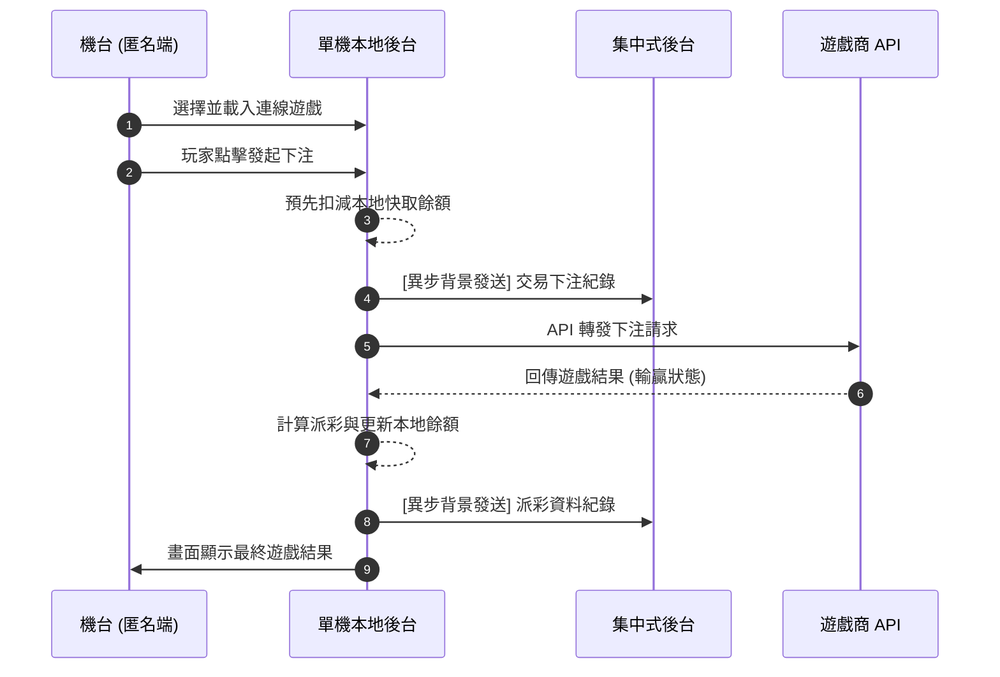

---

## 2.2 機台管理與註冊維護流程

### 2.2.1 新機台註冊與綁定 (Device Pairing) [C108 / L51]

機台首次架設時由安裝人員註冊綁定雲端，並經由管理員審核、版本更新與設定同步後，正式啟用並核發永久通訊金鑰。

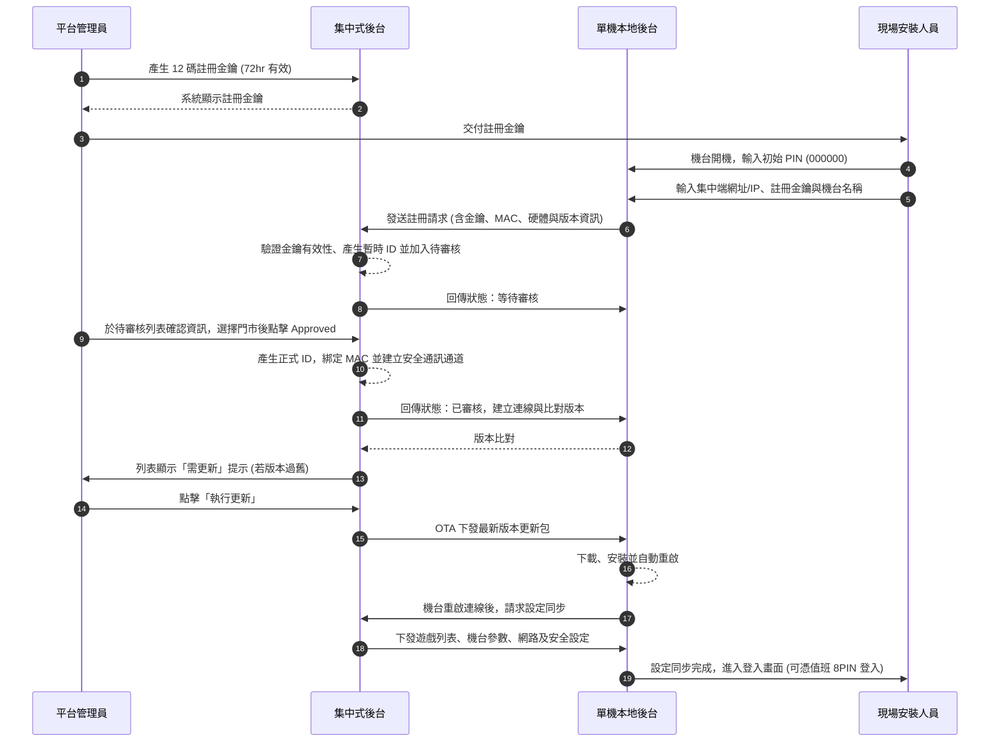

### 2.2.2 機台遠端遙控、配置接收與測試切換 [C12 / C14 / C15 / L07]

集中端直接接管與覆寫本地機台之配置與重啟作業；並可切換「正式」與「測試」模式。

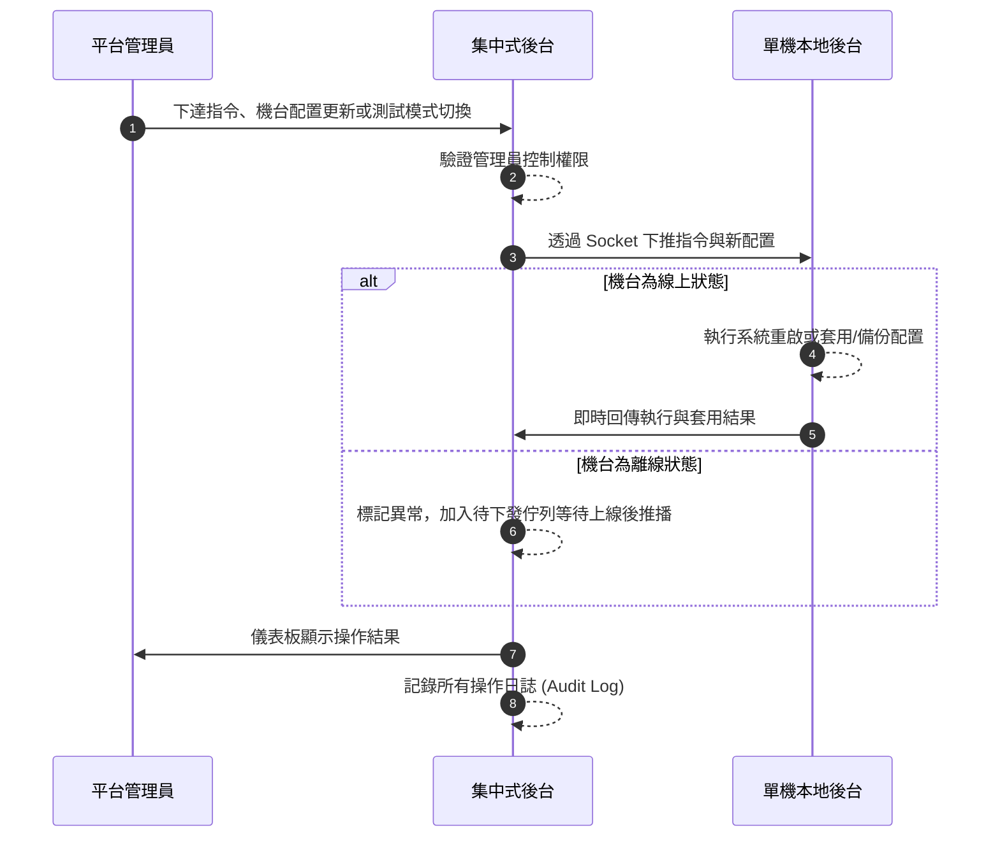

---

## 2.3 系統同步與維護流程

### 2.3.1 設備監控與告警通知 [C82 / L06 / L38]

本地狀態中斷（心跳失敗）、過度網路連線延遲或硬體異常時，即時通報集中端的流程。

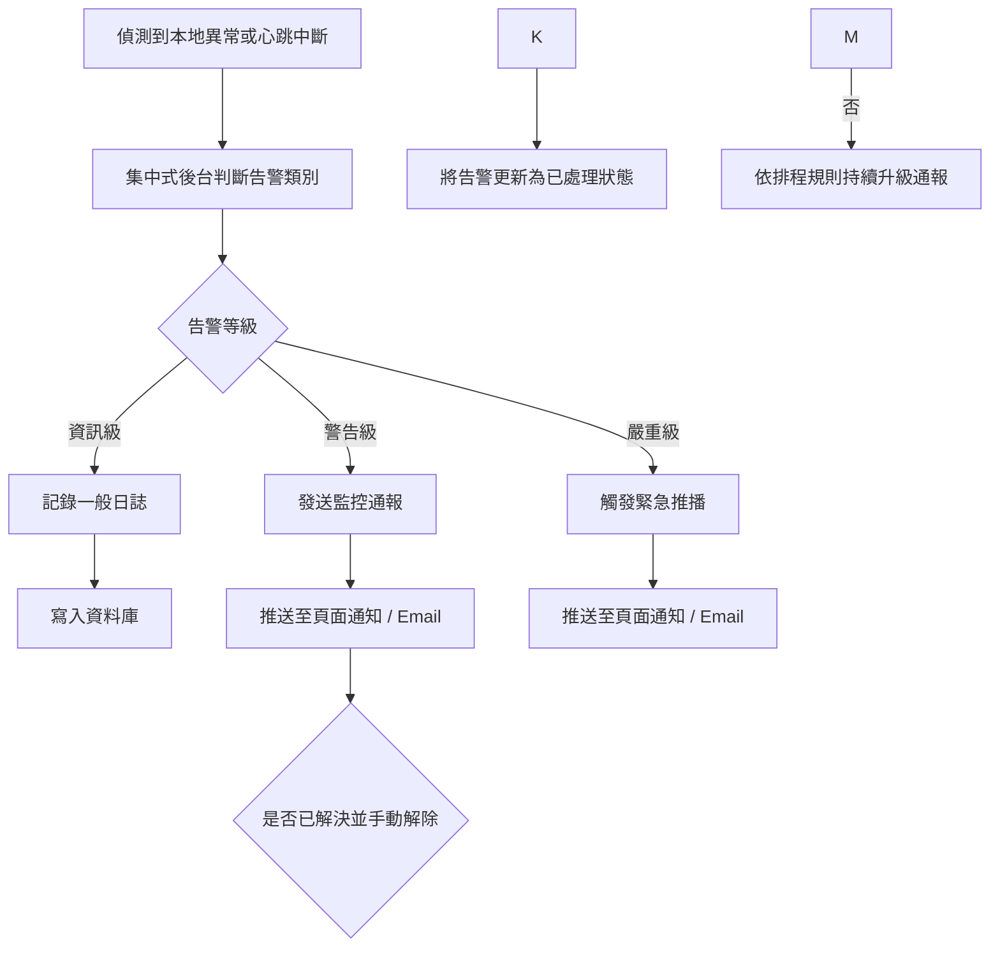

### 2.3.2 雙向資料同步與對帳流程 [L34-L37 / C93-C95]

保障「單機本地後台因斷線恢復後，交易不會遺失」，由資料庫同步交易數據。

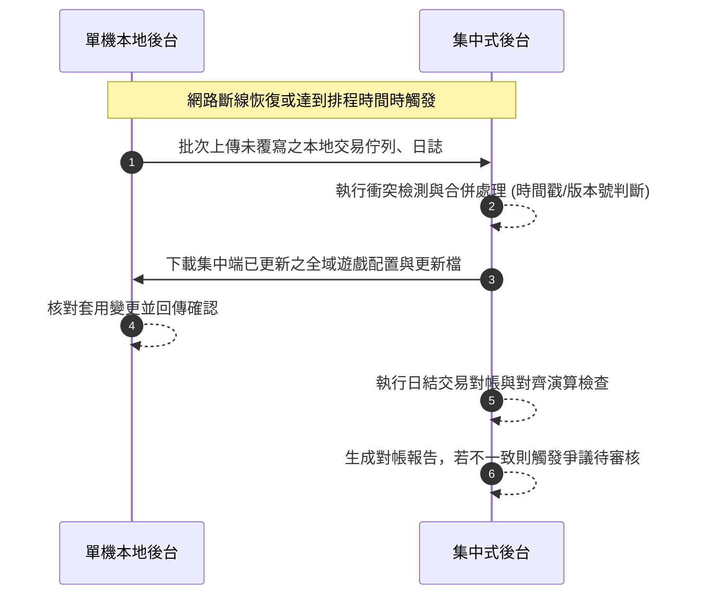

### 2.3.3 遊戲供應商同步與介面更新 [C103 / L29]

由管理員負責配置供應商金鑰，拉取供遊戲商的連線列表並配送給旗下各本地端機台。

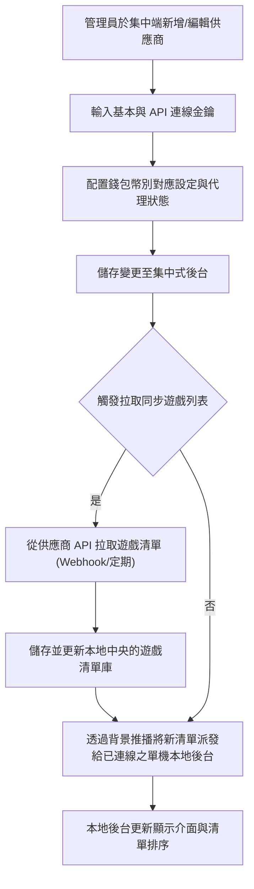

---

#### 心跳機制說明

- **預設間隔**：30 秒 (固定)
- **可配置範圍**：無 (目前固定為 30 秒)
- **建議最大值**：30 秒
- **離線判定**：連續 6 次心跳失敗（約 3 分鐘）

---

## 2.7 集中端流程圖 [CMxx]

> 以下流程圖來自 `feature_docs/central/` 目錄的詳細功能文件。

### [C11] 開分洗分

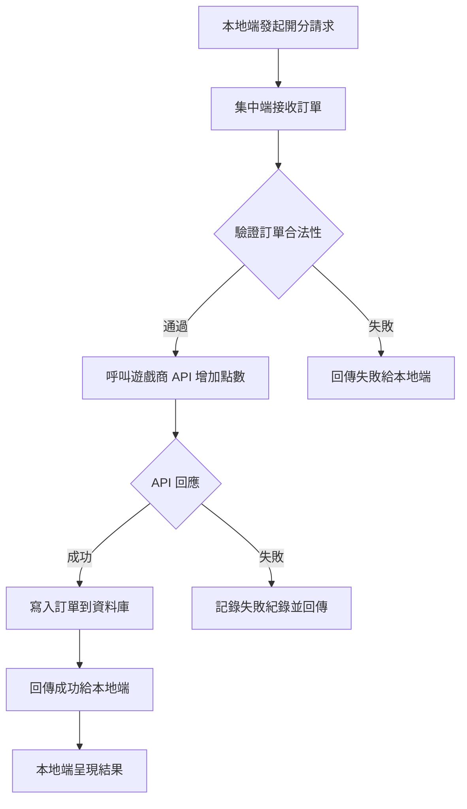

### [C14] 機台設定

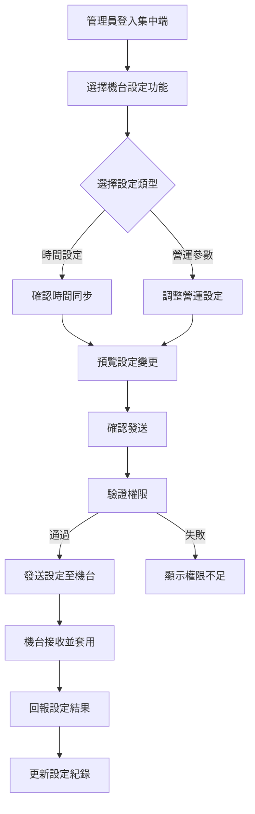

### [C15] 測試模式

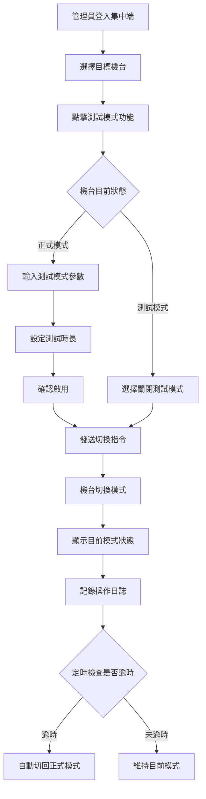

## 2.8 本地端流程圖 [LMxx]

> 以下流程圖來自 `feature_docs/local/` 目錄的詳細功能文件。

### [L05] 本機資訊

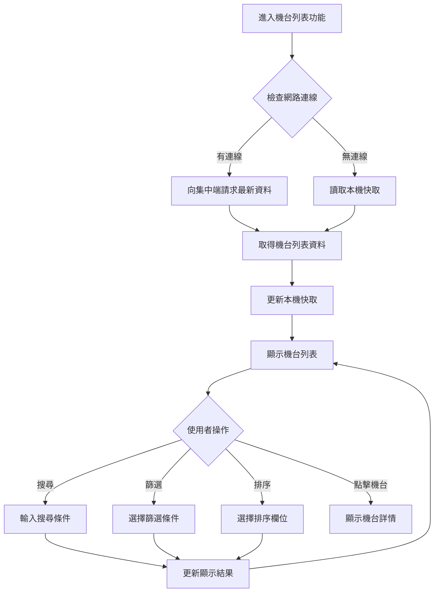

### [L06] 本機狀態

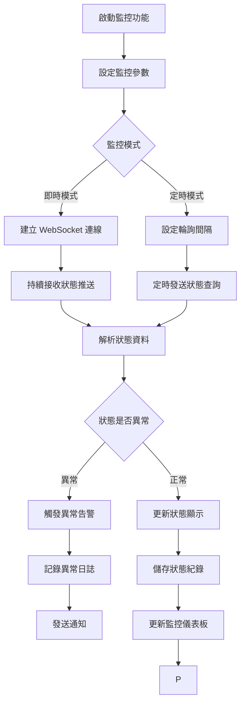

### [L07] 機台配置接收

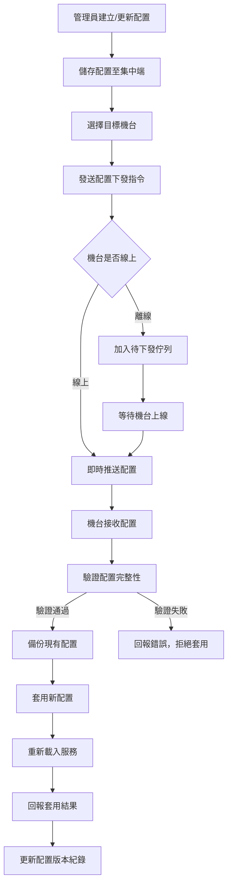

### [L45] 遊戲開分/洗分

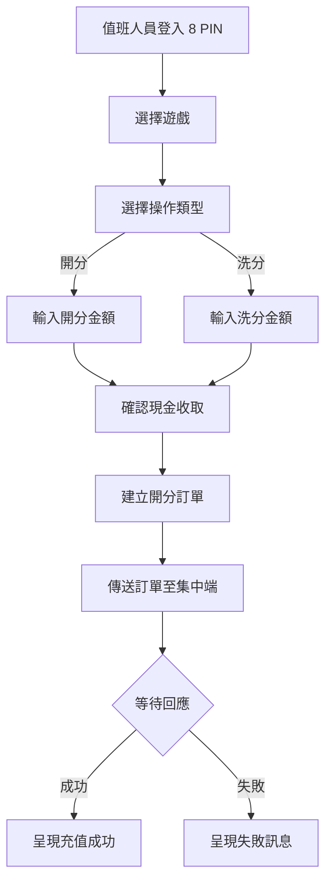

### [L29] 遊戲供應商管理

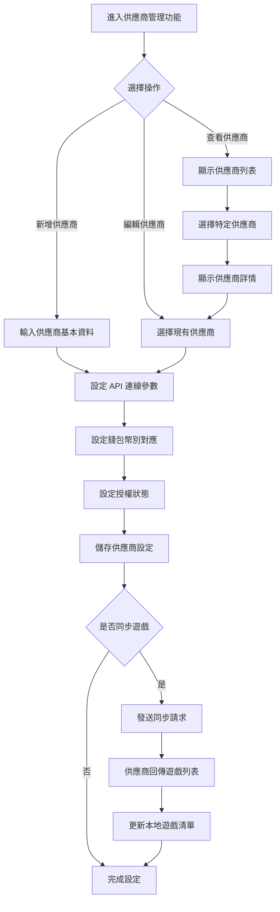

### [L46] 遊戲派彩

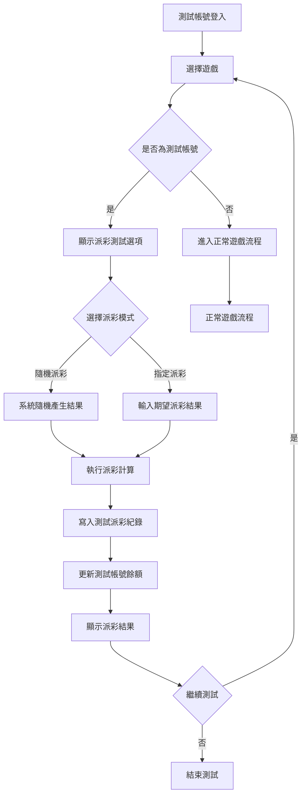

---

## 附錄：功能矩陣欄位說明

### 欄位定義

| 欄位               | 說明                                     | 圖示                                                          |
| ------------------ | ---------------------------------------- | ------------------------------------------------------------- |
| **中央後台** | 功能是否在中央後台（集中式後台）中提供   | ✅ = 有此功能 ❌ = 無此功能                                   |
| **遠端控制** | 功能是否支援從中央後台遠端控制本地機台   | ✅ = 可遠端控制 ❌ = 不可遠端控制 - = 不適用                  |
| **本機設定** | 功能是否可在本地機台直接設定（不連線時） | ✅ = 完全支援 ❌ = 不支援 ⚙️ = 部分支援/本地設定 - = 不適用 |

### 圖示說明

| 圖示 | 含義                                                          |
| ---- | ------------------------------------------------------------- |
| ✅   | **支援** - 功能完全支援此模式                           |
| ❌   | **不支援** - 功能不支援此模式                           |
| ⚙️ | **部分支援** - 功能部分支援（如本地可檢視但需雲端啟用） |
| -    | **不適用** - 此模式不適用於該功能                       |

### 範例說明

| 功能                 | 中央後台 | 遠端控制 | 本機設定 | 說明                       |
| -------------------- | :------: | :------: | :------: | -------------------------- |
| 遊戲開分/洗分 (L45)  |    ✅    |    ✅    |    ❌    | 測試帳號開洗分功能         |
| 機台設定 (C14)       |    ✅    |    ✅    |    ✅    | 中央可設定，也可本地設定   |
| 遊戲配置 (C25)       |    ✅    |    ✅    |   ⚙️   | 中央可配置，本地僅部分設定 |
| 機台編輯/刪除 (C101) |    ✅    |    ❌    |    ❌    | 僅中央後台可編輯/刪除機台  |

### 設計原則

1. **中央後台為主** - 大部分功能集中在中央後台統一管理
2. **遠端控制** - 需要即時連線的操作（如開洗分）支援遠端
3. **本機設定** - 網路不穩定時，部分功能可在本地運作

---

*本說明補充於 v8.3 版本*

---

## 版本歷程

| 版本 | 日期 | 說明 |
| --- | --- | --- |
| v8.2 | 2026-03-05 | 初版建立 |
| v8.3 | 2026-03-13 | 合併 Central 與 Local 設定頁面、新增 C96/C97 安全設定與備份還原、修正 Mockup 路徑、對齊 1.1 與 1.2 文件路徑格式 |
